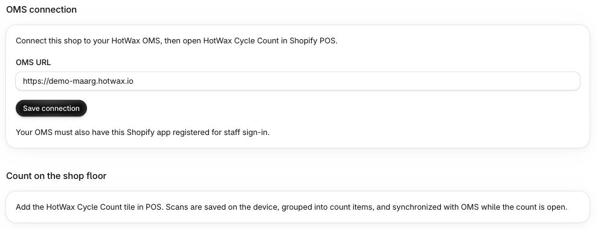

# Introduction

The Cycle Count App is designed to help organizations maintain accurate inventory by tracking, verifying, and reconciling stock levels. It supports different types of counts, including Directed Cycle Counts for selected items, and Hard Counts for comprehensive facility-wide inventory verification.

The app provides distinct views for Admins and Store Associates:

* Admin View: Allows reviewing, approving, or rejecting counts, managing variance thresholds, and helping maintain inventory accuracy across the system.

* [Store View](../../../store-operations/cycle-count/README.md): Step-by-step instructions for store associates to perform cycle counts in-store.

With built-in features like bulk actions, variance alerts, and timestamped tracking, the Cycle Count App keeps inventory accurate across your network.

For a business-process overview of inventory management and cycle counting, see [Inventory management](../../../learn-hotwax-oms/business-processes/inventory-management.md).

## Navigate on a phone or tablet

When the side menu is hidden, use the menu button at the top left of `Assigned`, `Draft bulk`, `Pending review`, `Closed`, `Store permissions`, or `Settings`. The button opens app navigation. On Assigned and Pending review, the separate filter button at the right opens page filters. Menu entries depend on your permissions.

## Open Cycle Count from Shopify POS

### Check the installed app's OMS connection

For shops using the installed `HotWax Cycle Count` app, open it from Shopify Admin's app navigation. The `OMS connection` section shows the shop's OMS URL. Confirm the intended instance with your administrator before changing it. The OMS must also have the Shopify app registered for staff sign-in.

<figure><figcaption>
The demo shop points to demo-maarg. This setup screen identifies the connection; staff access and the POS location still need to be checked in the counting workflow.
</figcaption></figure>

Add the HotWax Cycle Count tile in Shopify POS and open the counting workflow there. After an approved connection change, reopen the app in POS to use it.

### Confirm facility access

In embedded mode, the app selects the HotWax facility mapped to the current Shopify POS location from the facilities your account can access. It does not grant access to another facility. If `Unable to login. User is not associated with this location. Please contact the administrator.` appears, ask the administrator to check your facility association and the Shopify-location mapping.

## Cycle count workflow

1. [Plan your count with a preview](../../../store-operations/cycle-count/plan-cycle-count.md)
2. [Create sessions and complete your count](../../../store-operations/cycle-count/start-complete-session.md)
3. [Review counts at the store before submitting for review](../../../store-operations/cycle-count/count-progress-review.md)
4. [Review and approve variances at head office](./pending-review.md)
5. [Go back and review old counts and export](./closed.md)
