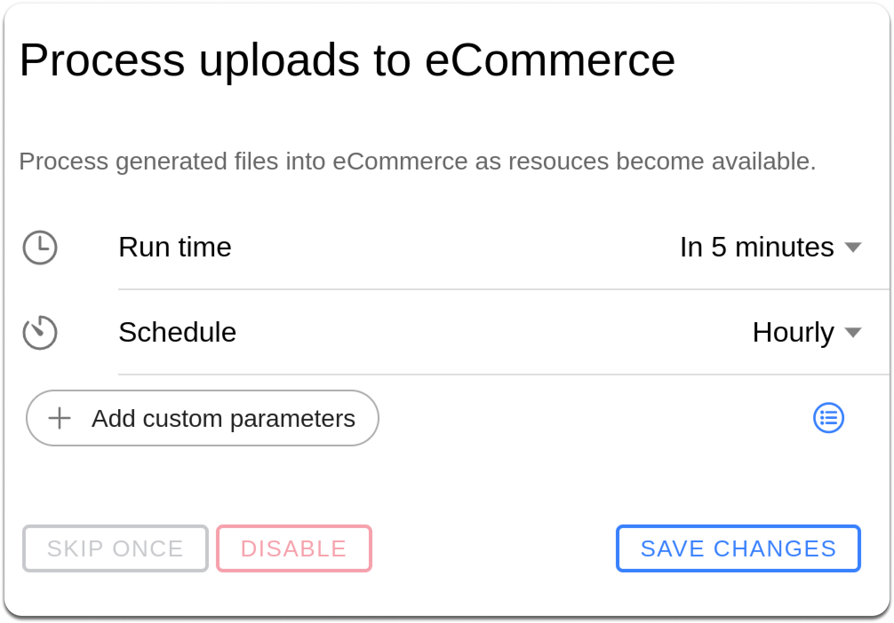

# Troubleshoot inventory synchronization errors

Inventory synchronization issues can occur at multiple stages, leading to discrepancies in stock levels across platforms. Accurate inventory synchronization is crucial to prevent underselling or overselling for retailers. This document aims to provide detailed steps to diagnose and resolve issues related to inventory synchronization between ERP systems, HotWax Commerce, and Shopify.

## Scenario 1: Partial File Processing Due to Connection Failure

During the process of importing an inventory file via SFTP, connection failures may occur, resulting in only a portion of the file being processed. This incomplete processing can lead to an invalid file status, causing discrepancies in inventory levels.

### Steps to Diagnose and Resolve

1. **Navigate to Your SFTP File Path**
   * Access your SFTP server using your preferred SFTP client such as Filezilla.
2. **Check the File with Import Date and Time**
   * Locate the file by its import date and time to identify the specific file that was partially processed.
3. **If the File is Failed, Reimport the File**
   * If the file is placed in the failed folder, re-upload the file to the SFTP server.
   * Ensure a stable connection during the reimport process to avoid partial processing.

## Scenario 2: Incorrect SFTP Location

The inventory file might be placed in an incorrect SFTP path, preventing HotWax Commerce from accessing and processing the file. This misplacement can result from user error or misconfiguration in the SFTP client or ERP system.

### Steps to Diagnose and Resolve

1. **Check the File Path and Location**
   * Verify the SFTP file path where the inventory file should be located.
2. **Consult the User Manual**
   * Refer to [Set up SFTP](../../../learn-netsuite/netsuite-deployment/sdf-bundle/setup-sftp.md) for detailed instructions on setting up the correct file path.

## Scenario 3: Shopify rejects or delays an inventory update

An outbound inventory batch can fail when Shopify rejects the request, throttles the connection, or the target is unavailable.

### Diagnose and resolve the failure

1. Open the Company App.
2. Select `Shopify`, open the affected connection, then select `Inventory sync`.
3. Open `Batches pending delivery` or `Event history`.
4. Open the affected batch.
5. Record its System Message identifier, Shopify target, status, and delivery errors.
6. Confirm the connection's Shopify write access and the target location.
7. Check Shopify status information when the error indicates an outage or throttle.
8. Correct the cause, then select `Resend` once.

Resend uses the batch's original payload and idempotency key. Do not keep retrying without correcting the recorded error.

## Scenario 4: A HotWax Commerce inventory job is not running

The job to investigate depends on whether the stale Shopify target represents one physical facility or an aggregate inventory channel.

### Diagnose and resolve the schedule

1. Open the Company App.
2. Select `Shopify`, open the connection, then select `Inventory sync`.
3. For a physical Shopify location, review `Reset physical location QOH`.
4. For an aggregate Shopify location, review the channel's publisher and `Reset aggregate ATP` job.
5. Confirm whether each required job is `Active`, `Paused`, or `Not configured`.
6. Open the job and review its scope, schedule, parameters, latest run, and result.
7. Use `Set up` when the dashboard offers it for a missing publisher or reset job. The new job starts paused; activate only the schedule approved for that target.
8. Select `Run now` only after you confirm that the job targets the affected connection or channel and an earlier run is not active.

Depending on the installed connector and publishing model, the active path can include `Update Recent Inventory Changes`, `Hard Sync`, or `Process Uploads to eCommerce`. If the Company dashboard does not identify the active path, confirm the installed connector model, then use [Troubleshoot job runs and schedules](../../workflow/job-management/troubleshooting/job-runs-and-schedules.md) in Job Manager.

See [Monitor Shopify inventory sync](../../../system-admin/administration/company/manage-shopify-inventory-sync.md) for the complete event, job, and reconciliation workflow.

<figure><figcaption>
Review the Process uploads to eCommerce schedule when the deployed connector uses this Job Manager path.
</figcaption></figure>

## Scenario 5: Shopify write access is missing

Outbound inventory fails when the selected Shopify connection cannot write inventory.

### Diagnose and resolve access

1. Open the Company App.
2. Select `Shopify` and open the affected connection.
3. Select `Access scopes`.
4. Under `Connection access`, confirm `SHOP_RW_ACCESS`. Do not select `SHOP_READ_WRITE_ACCESS`; it has the same description but does not satisfy the current inventory service gate.
5. Under `Granted OAuth scopes`, refresh the Shopify scopes and confirm `write_inventory` for the approved connection profile.
6. Resolve a missing connection-access value in HotWax Commerce or a missing OAuth scope through the approved Shopify connection flow.
7. Return to `Inventory sync` and retry only the affected batch or reset.

Do not place access tokens or credentials in screenshots, tickets, or documentation.

[Watch the Shopify access-scope walkthrough](https://youtu.be/oL_BYAXZQZw).
