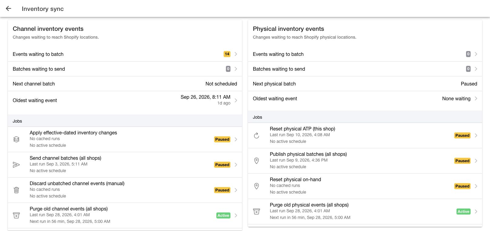

# Troubleshoot inventory synchronization errors

Inventory synchronization issues can occur at multiple stages, leading to discrepancies in stock levels across platforms. Accurate inventory synchronization is crucial to prevent underselling or overselling for retailers. This document aims to provide detailed steps to diagnose and resolve issues related to inventory synchronization between ERP systems, HotWax Commerce, and Shopify.

## Scenario 1: An inventory file did not finish importing into OMS

Inbound file processing and outbound Shopify publication are separate. Locate the configured import and establish its outcome before retrying anything.

1. Confirm the expected inventory source, import configuration, file name, and timestamp.
2. Review its Data Manager file history, processing state, record counts, and errors.
3. Verify which records changed inventory in OMS. A failed or lost response does not prove no records were applied.
4. Correct the cause and use a supported, scoped recovery. Do not re-upload an entire file merely because a folder or status says failed.
5. After verifying the OMS quantities, investigate the matching channel or physical-location event path for Shopify delivery.

Follow [Troubleshoot file imports](../../workflow/job-management/troubleshooting/file-imports.md) and [inventory import methods](../inventory-upload/import-methods.md). These are inbound inventory procedures, not Shopify event publishers.

## Scenario 2: The inventory file is in the wrong SFTP location

Confirm the source system's approved path and file-name pattern with the integration owner. Compare them with the configured OMS retrieval job and import configuration. Keep the investigation read-only until the expected file and any prior processing are established.

For NetSuite SFTP setup, see [Set up SFTP](../../../learn-netsuite/netsuite-deployment/sdf-bundle/setup-sftp.md). A file's presence on SFTP does not establish successful import or Shopify delivery.

## Scenario 3: Shopify rejects or delays an inventory update

An outbound inventory batch can fail when Shopify rejects the request, throttles the connection, or the target is unavailable.

### Diagnose and resolve the failure

1. Open the Company App.
2. Select `Shopify`, open the affected connection, then select `Inventory sync`.
3. Review `Channel inventory events` or `Physical inventory events` for the affected target, then open its waiting-batch row or `Event history`.
4. Open the affected batch.
5. Record its System Message identifier, Shopify target, status, and delivery errors.
6. Confirm the connection's Shopify write access and the target location.
7. Check Shopify status information when the error indicates an outage or throttle.
8. Correct the cause, then use the approved recovery process before selecting `Resend`.

Resend uses the batch's original payload and idempotency key; it does not recalculate current inventory. Do not keep retrying without correcting the recorded error. Verify the resulting batch state and Shopify quantity.

## Scenario 4: Shopify inventory events are not reaching the target

The physical-location and channel paths have separate event queues and publishers. A completed inbound inventory import does not prove either outbound path ran.

1. Open Company > `Shopify` > the connection > `Inventory sync`.
2. Confirm the affected target's physical mapping or aggregate channel.
3. Check the appropriate event-source and capture controls. Changes made while capture is off are not available for later replay.
4. For a physical location, inspect `Physical inventory events` and `Publish physical batches (all shops)`. For a channel, inspect `Channel inventory events` and its `Send channel batches` publisher.
5. Review waiting events, batches, publisher state, schedule, parameters, and latest run.
6. For batches that remain in flight, have the integration owner verify sender coverage for the affected message type and inspect its result.
7. Correct the cause. Use `Reset physical ATP (this shop)` or the channel's `Reset channel ATP` when available-inventory reconciliation is required; `Reset physical on-hand` is a separate quantity reconciliation.
8. Review the approved recovery's scope and outcome, then verify Shopify at the mapped location.

Supported missing jobs created with `Set up` start paused. Do not activate an arbitrary schedule or duplicate publisher. Keep manual discard jobs paused and unscheduled.

<figure><figcaption>
Investigate the event path for the affected Shopify target. The sandbox's paused jobs and waiting events are examples.
</figcaption></figure>

See [Monitor Shopify inventory sync](../../../system-admin/administration/company/manage-shopify-inventory-sync.md) for the complete event, job, sender, and reconciliation workflow.

## Scenario 5: Shopify write access is missing

Outbound inventory fails when the selected Shopify connection cannot write inventory.

### Diagnose and resolve access

1. Open the Company App.
2. Select `Shopify` and open the affected connection.
3. Select `Access scopes`.
4. Under `Connection access`, confirm `SHOP_RW_ACCESS`. Do not select `SHOP_READ_WRITE_ACCESS`; it has the same description but does not satisfy the current inventory service gate.
5. Under `Granted OAuth scopes`, refresh the Shopify scopes and confirm `write_inventory` for the approved connection profile.
6. Resolve a missing connection-access value in HotWax Commerce or a missing OAuth scope through the approved Shopify connection flow.
7. Return to `Inventory sync` and retry only the affected batch or reset.

Do not place access tokens or credentials in screenshots, tickets, or documentation.

[Watch the Shopify access-scope walkthrough](https://youtu.be/oL_BYAXZQZw).
