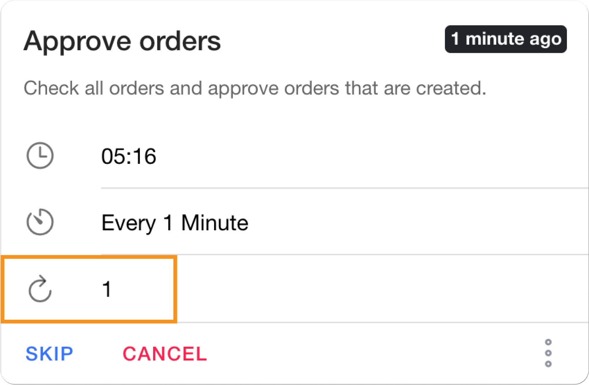

# Job queueing

Pipeline page

Provides a holistic view of all jobs, including their status, scheduled time, and execution details.

**Characteristics**

**Chronological sequence for prioritized execution**

Jobs are displayed in chronological sequence, ensuring that jobs with the closest expiration time are prioritized for execution.

**Timeline Visualization for Clear Execution Scheduling**

A highlighted time frame clearly depicts the job's runtime and scheduled frequency, providing a visual representation of the job's execution timeline.

**On-the-fly Editing for Dynamic Job Management**

Users can seamlessly skip, cancel, edit, or reschedule any pending jobs before they start running. This flexibility allows users to adapt to changing requirements and optimize job execution based on real-time needs.

**Customized Job Configurations for Tailored Execution**

Scheduled job parameters can be modified directly from the Job Pipeline page, enabling users to tailor job execution to specific needs. This flexibility allows for optimization of job performance and resource utilization.

**Detailed Job History for Analysis and Troubleshooting**

Comprehensive historical job data is readily accessible for analysis and troubleshooting purposes. Users can identify patterns, optimize job performance, and resolve recurring issues by examining historical job execution details.

<figure><figcaption></figcaption></figure>

### Segmentation



Displays all the jobs queued for execution.

<figure><figcaption></figcaption></figure>

<figure><figcaption></figcaption></figure>



Displays all the jobs running in the system.

<figure><figcaption></figcaption></figure>



Displays all the historical jobs. Historical jobs can be filtered by their status.

<figure><figcaption></figcaption></figure>



####

### **Search**

Easily locate specific jobs by name or category.



###

### Filters

Quickly find jobs by applying filters based on category and status.

<figure><figcaption></figcaption></figure>

### **Pin job**

Keep frequently accessed jobs readily available for quick access. Pinned jobs will be visible in the footer.



### **Recurrence**

Displays the number of counts the job is retried once failed.

<figure><figcaption></figcaption></figure>
