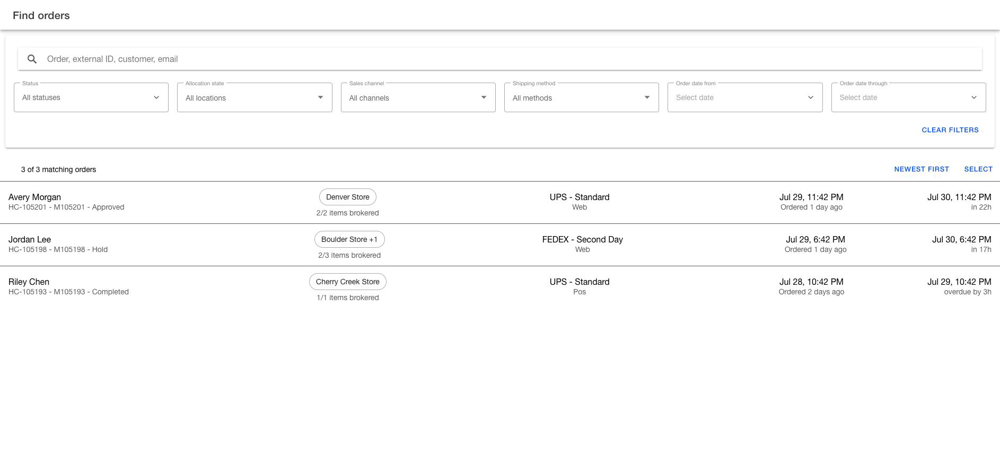

# Find orders

Use `Find orders` when you need to open a known order, investigate orders that share the same condition, or apply the same permitted action to several orders.

The page searches orders for the Product Store selected in the Order Manager menu. Before you search, open the menu and confirm the `Product Store` or `Select store` value.

## Find a specific order

1. Enter the most specific value available in the search box.
2. Wait for the matching list to update automatically.
3. Compare the customer, order identity, status, allocation, and delivery information.
4. Select the order row to open [Order details](view-order-details.md).

Start with an order ID, order name, or external ID when one is available. These values are more precise than a customer name.

<figure><figcaption>
Use the filter bar and row details to identify the correct order.
</figcaption></figure>

You can also search using:

* Customer name, party ID, email, or phone
* Product name or product identifier
* Shipment ID
* Order note
* Sales channel or Product Store name

If the search returns too many orders, keep the search value and add filters.

## Narrow the order list

Use filters to investigate orders that share a status, allocation condition, channel, shipping method, or order date.

| Filter | What it does | When to use it |
| --- | --- | --- |
| `Status` | Includes orders in one or more selected order statuses. Select `All statuses` to remove the status restriction. | Use this when you know the order's current lifecycle status or need to review several statuses together. |
| `Allocation state` | Includes orders with items in the selected allocation condition. | Use this to separate physically allocated work from orders waiting for routing, unfillable orders, or archived orders. |
| `Sales channel` | Includes orders from one configured channel. | Use this to isolate orders from a marketplace, web channel, or other configured source. |
| `Shipping method` | Includes orders that use one configured shipping method. | Use this when investigating carrier or service-level work. |
| `Order date from` | Includes orders placed on or after the selected date. | Use this as the start of an order-date range. |
| `Order date through` | Includes orders placed on or before the selected date. | Use this as the end of an order-date range. |
| `Newest first` or `Oldest first` | Sorts the matching orders by order date. | Use `Oldest first` to work through aging orders. Use `Newest first` to review recent activity. |

The order-date request uses UTC day boundaries, while rows display dates in your configured user time zone. Around midnight, a displayed date can appear just outside the selected range. Widen the range by one day and open the order when you need to verify a boundary case.

The `Allocation state` options mean:

* `All locations` does not restrict results by allocation.
* `Allocated` finds orders with items assigned to a physical fulfillment location.
* `Awaiting brokering` finds orders with unassigned or rejected items waiting to be routed or rerouted.
* `Unfillable` finds orders with items that could not be assigned to a fulfillment location.
* `Archived` finds orders with items moved out of the active fulfillment flow.


Allocation is evaluated at the item level. A split order can appear when at least one item matches the selected allocation state. Open the order to review every ship group before taking action.


Select `Clear filters` to remove the search text and filters and return the sort order to `Newest first`.

## Read an order row

Use each column to decide whether you found the correct order and whether it needs attention.

| Row information | How to read it |
| --- | --- |
| Customer and order identity | The first column shows the customer name. The next line combines the order name, order ID, and status. |
| Allocation | When any physical facility is present, the chip prefers a physical facility and then uses the facility with the most item records available to the row. `+1`, `+2`, or another value counts additional physical facilities in a mixed allocation. These counts represent item records, not product units. The line below compares brokered item records with the total represented in the result. |
| Fulfillment context | The row shows the carrier and shipping method when available. The sales channel appears below them. |
| Order date | The row shows the order date and time and how long ago the order was placed. |
| Delivery or shipping date | The row uses the first available value from estimated delivery, promised, ship-before, or ship-by dates and shows the time remaining or overdue. It can therefore represent a shipping deadline rather than delivery. `No estimated delivery date` means none of those dates is available in the result. |

Treat the allocation column as a quick indicator. Open `Order details` to review the complete ship group and item breakdown before changing the order.

The header shows how many matching orders are loaded and the total number of matches. Scroll to load more results.

## Select orders for a bulk action

`Select` appears only when your account has access to at least one bulk action.

1. Search and filter until the list contains only the group you intend to work on.
2. Scroll until every intended order is loaded.
3. Select `Select`.
4. Select individual rows, or use the header checkbox to select all currently loaded rows.
5. Confirm the selected count in the footer.
6. Choose one available action.

The header checkbox does not select matching orders that have not loaded yet. Changing the search or filters can also remove orders from the current selection.

Select `Done` to leave select mode without taking an action.

### Cancel open items

Use `Cancel open items` only after confirming that the remaining open items in every selected order should be canceled.

1. Select the intended orders.
2. Select `Cancel open items`.
3. Review the number of selected orders in the confirmation message.
4. Select `Confirm` to continue or `Dismiss` to return without canceling.

The action skips items that are already canceled or completed. The cancellation cannot be undone.

After the action finishes, the page refreshes the search results. Open the affected orders and confirm the expected items are canceled. If the page reports a failure, verify each selected order before retrying because another order in the selection may already have changed.

### Edit the shipping method

Use `Edit shipping method` when every selected order should receive the same carrier and shipping method.

1. Select the intended orders.
2. Select `Edit shipping method`.
3. Select a `Carrier`.
4. Select a `Shipping method` available for that carrier.
5. Select the save action.

Changing the carrier clears the previous shipping-method selection. The save action remains unavailable until both values are selected.

The page refreshes the results after processing the requests, but it does not display a result for each order. Open every affected order and confirm its shipping method before considering the bulk change complete.

### Add a task

Use `Add task` when the same manual-hold or customer-request reason applies to every ship group in every selected order. Use the dedicated Fraud, Bad address, or Swap workflow for those exception types.

1. Select the intended orders.
2. Select `Add task`.
3. Enter a required `Task Name`.
4. Select `Manual hold` or `Customer request` as the required `Task Purpose`.
5. Enter a required `Description` with enough detail for the next operator.
6. Select the save action.

The bulk flow creates the task for every ship group in the selected orders. It does not provide a ship group picker. Use the action only when that scope is correct.

After the success message appears, open the relevant order or task queue and confirm the tasks were created. If task creation fails, review the selected orders before retrying the entire group.

## Resolve search problems

* `Order search failed` means the search request did not complete. Retry the search or select `Clear filters` before trying again.
* `No matching orders` means the search completed but no order matched the current search and filters. Remove one restriction at a time to identify which condition excluded the order.
* A loaded count lower than the total means more results are available. Scroll to continue loading before using the header checkbox.
