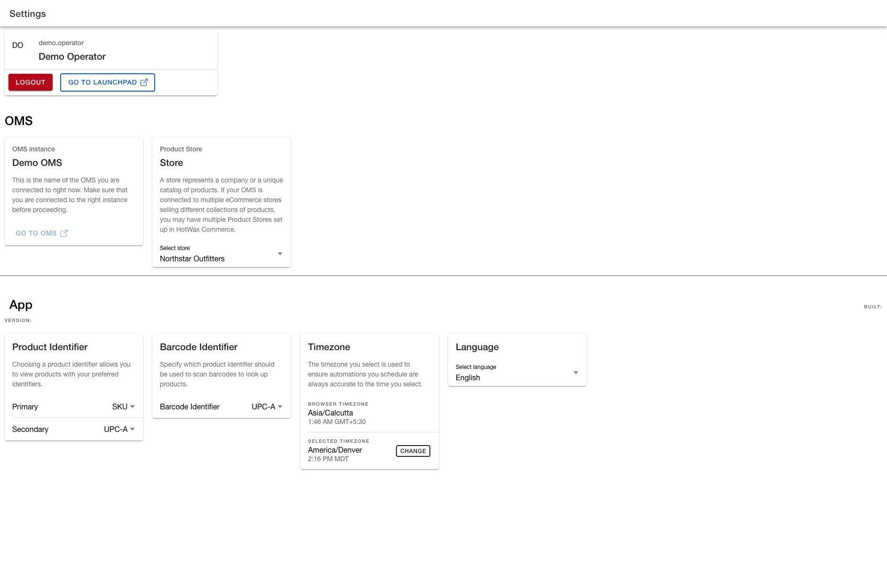

# Configure Order Manager settings

Use `Settings` to confirm your Order Management System (OMS) connection and app version, change the active Product Store, and manage identifiers and personal preferences.

Most controls apply a change as soon as you select a value. The page does not have a global `Save` action. Review the scope of a setting before changing it.

## Understand each setting's scope before changing it

| Setting or action | Scope | How it takes effect |
| --- | --- | --- |
| `Logout` | Current session | Ends the session immediately. |
| `OMS instance` and `Offline` | Current connection | Read-only connection context. |
| `Product Store` | Current user's active store | Changes the local working store immediately. Reloading verifies the local selection, not whether the server preference saved. |
| `Product Identifier` | Selected Product Store | Saves each `Primary` or `Secondary` selection immediately and can affect other operators using that store. |
| `Barcode Identifier` | Selected Product Store | Saves the selection immediately and can affect barcode scanning for other operators using that store. |
| `Timezone` | Current user profile | Saves when you select the save action in the time zone dialog. |
| `Language` | Current session | Changes the interface immediately, but the next session can return to the browser language. |
| `Version` and `Built` | Installed Order Manager app | Read-only release information when values are available. |

## Open Settings

1. Open the Order Manager menu.
2. Select `Settings`.
3. Confirm the user, OMS instance, and Product Store before changing a setting.

The page is available to signed-in users, but individual controls and updates can still depend on your permissions.

<figure><figcaption>
Confirm the working context before changing store or personal settings.
</figcaption></figure>

## Review your account and system connection

The account card shows the user currently signed in.

* Select `Go to Launchpad` to leave Order Manager and open Launchpad in the same browser tab.
* Select `Logout` only when you are ready to end the current session.


`Logout` does not ask for confirmation. Selecting it ends the session immediately.


The `OMS instance` card identifies the OMS currently configured for Order Manager. Confirm it before investigating an order or changing a store-level setting.

`Offline` means that Order Manager could not identify an OMS or could not receive a response during its connection check. Treat this badge as a connectivity indicator, not a complete health check:

* The absence of `Offline` does not prove that every OMS request, permission, or credential is working.
* An OMS can return an error response without the page showing `Offline`.
* Confirm the page or action you need before concluding that the connection is healthy.

`Go to OMS` can be hidden or disabled depending on the deployment and your OMS-view access.

## Change the active Product Store

The active Product Store controls store-scoped data and actions throughout Order Manager.

1. In the `Product Store` card, open `Select store`.
2. Select the store you intend to work with.
3. Wait for store-scoped data to refresh.
4. Reload Order Manager.
5. Return to `Settings` and confirm that the same Product Store remains selected.

The selection changes in the current app and can remain after reload even if saving it as your server-side user preference fails. The page does not show a preference-save error in that case. Treat the selected value as the current local working context, not proof that the server preference changed.


Confirm the Product Store again before changing `Product Identifier` or `Barcode Identifier`. Those are settings for the selected store, not personal display preferences.


**Outcome:** Order Manager uses the intended Product Store in the current browser. The page does not confirm whether the server preference was saved.

## Set the product identifiers

`Product Identifier` controls the primary and secondary values used to identify products in supported Order Manager workflows.

You need administrator access to change these controls. If `Primary` and `Secondary` are disabled, ask an administrator to review your access.

1. Confirm the active Product Store.
2. In `Product Identifier`, select the `Primary` identifier.
3. Wait for the success or failure message.
4. Select the `Secondary` identifier, or select `None`.
5. Wait for the success or failure message.
6. Review `Preview Product Identifier` when a sample product is available.

The Primary identifier must have a value; it does not offer `None`. The Secondary identifier is optional.

Each selection saves immediately for the selected Product Store. A success message confirms the update. If the page reports a failure, the app could not confirm the update. Reload `Settings` and read the stored selection before retrying.

The preview shows one sample product. Select the shuffle action to preview another sample. Shuffling changes only the preview, not either identifier setting. When no sample product is available, the preview is absent, but you can still change the identifiers.

These preferences can change the identifiers displayed while creating an order, adding a product or order item, reviewing [Order details](view-order-details.md), and working in Fraud or Swap. They do not rename the product or change its source identifier data.

**Outcome:** The success message confirms that the selected Product Store has the intended primary and optional secondary display identifiers.

## Set the barcode identifier

`Barcode Identifier` determines which product identifier [Create order](create-order.md) uses to look up a scanned barcode.

1. Confirm the active Product Store.
2. In `Barcode Identifier`, open the selector.
3. Select the identifier encoded by the barcodes your team scans.
4. Wait for the success or failure message.
5. Test a known product in the intended scanning workflow.

The selection saves immediately for the selected Product Store. The control is not disabled based on an Order Manager permission, but the OMS can still reject an update that your account is not allowed to make. A failure message means the app could not confirm the update. Reload `Settings` and read the stored selection before retrying; ask an administrator to review your Product Store access if it did not change.


`Product Identifier` controls how products are displayed in supported workflows. `Barcode Identifier` controls which identifier a barcode scan uses for product lookup. Changing one does not automatically change the other.


**Outcome:** A known barcode finds the intended product with the saved identifier in `Create order`.

## Change your time zone

The `Timezone` card compares your browser time zone with the time zone selected for your user profile.

1. Review `Browser TimeZone` and `Selected TimeZone`.
2. Select `Change`.
3. Enter a time zone name or ID in `Search time zones`.
4. Press Enter to run the search.
5. Select the intended time zone.
6. Select the save action in the lower-right corner.
7. Confirm the success message and the updated `Selected TimeZone`.

Typing in the search field does not filter the list until you press Enter.

If `No time zone found` appears:

1. Confirm that you pressed Enter.
2. Search by a broader city, region, or time zone ID.
3. Reload `Settings` when a known valid time zone still returns no result.

The same empty state can appear when the available time zones did not load. Reopening only the dialog does not retry that request. If the problem continues after reloading `Settings`, retry later or ask support to check the time zone service.

A failed save displays a failure message and leaves the dialog open. Close the dialog to keep the previous time zone, or correct the selection and retry.

**Outcome:** The success message and `Selected TimeZone` confirm the time zone saved to your user profile.

## Change the display language

1. In `Language`, open `Select language`.
2. Select `English` or `Español`.
3. Review the page in the selected language.

The language changes immediately for the current session. It does not update your server-side user profile, and a new session can return to the browser's language.

Some Order Manager text can remain in English when a translation is not available. Use the control to choose the available interface language, not as confirmation that every label is translated.

**Outcome:** Order Manager uses the selected language for the current session without changing the user profile on the server.

## Record the app version for support

The `App` section can show:

* `Version`, which identifies the app release or revision
* `Built`, which shows when that app version was built

The current build can show only the labels without values. When values appear, include both along with the OMS instance and selected Product Store in a support request. When they are blank, report that they are blank rather than treating the labels as version information.
