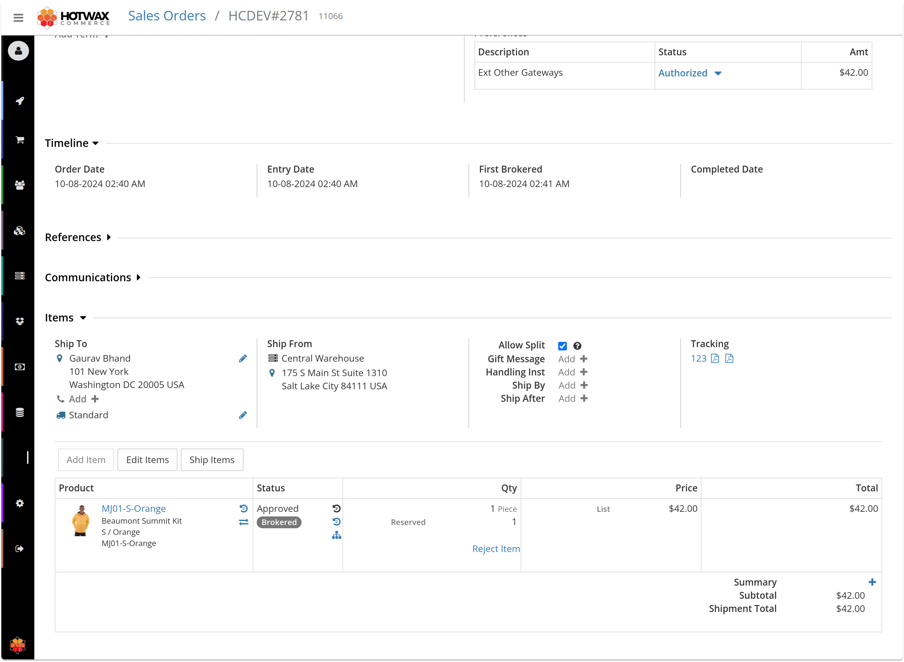

# View order details

Use the order details page to inspect one order, review its timeline, confirm customer and payment information, and act on items, ship groups, holds, and communications.

Open an order from `Find order` or one of the Order Manager queues.

## Header

The header shows the order name, HotWax order ID, and current order status. A timeline appears below the header so you can review status changes and facility changes without leaving the page.

## Detail cards

The order detail cards summarize the order context.

| Card | Shows |
| --- | --- |
| Customer | Customer name, email, phone, and billing address. |
| Order identifications | Order name, external ID, HotWax order ID, and additional order identifiers. |
| Order payment preference | Payment method, amount, and payment status. |
| Source | Product store and sales channel. |

## Items

Use the `Items` segment to review order items. Items are grouped by product so users can see quantity, status, price, product image, SKU, and external ID together.

You can select all items or select individual item groups when preparing item-level actions. Use `Add items` when the workflow requires an order item to be added manually.

## Ship groups

Use the `Ship groups` segment to review fulfillment group information. Ship groups are the operational split between items, facilities, shipment details, and fulfillment progress.

## Holds

Use the `Holds` segment to review hold work associated with the order. Holds are useful when an order is blocked by address review, fraud review, substitute review, inventory unavailability, or another manual task.

## Communications

Use the `Comms` segment to review or add communication records for the order. Communications help support and operations teams keep customer-facing updates and internal notes attached to the order.

<figure><figcaption>
Order details
</figcaption></figure>

## Screenshot gaps

The screenshot on this page should be replaced with a current Order Manager screenshot from test OMS. Use an order with realistic products, statuses, ship groups, payments, and customer data that is safe for documentation.
