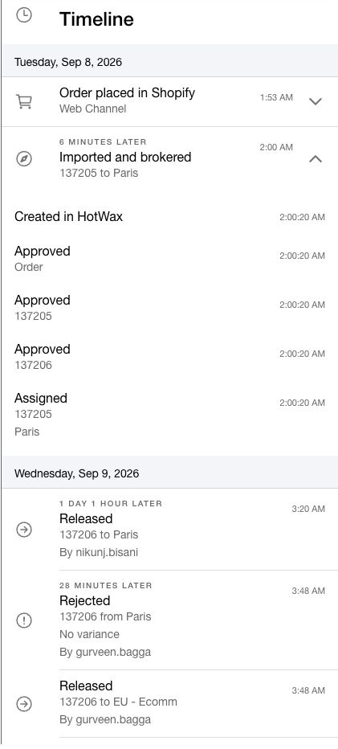
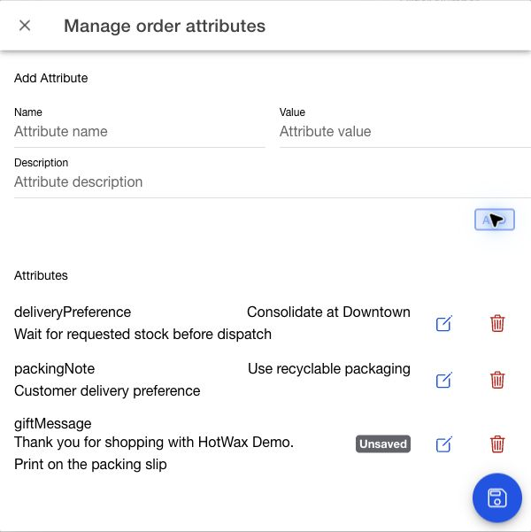
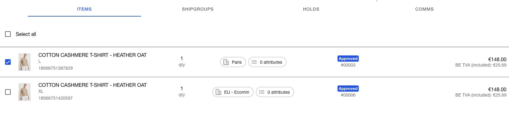
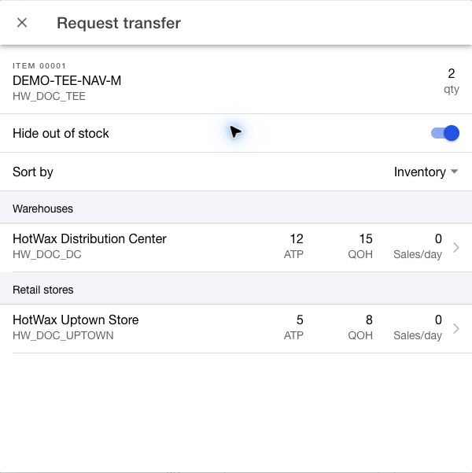
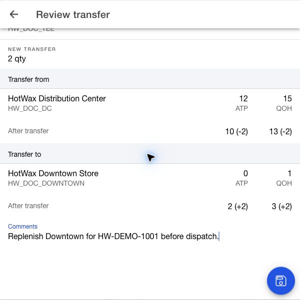
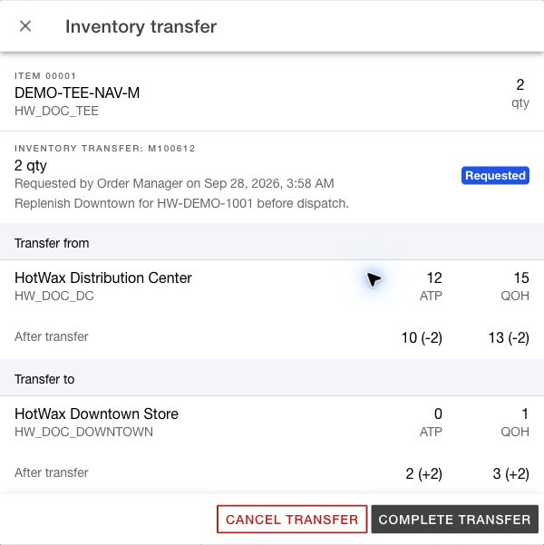

# Order details

Open an order from `Find orders`, a workflow queue, or a task queue. Use this page to understand the order's history, investigate a problem, and change only the item or ship group that needs attention.

Many actions depend on the order status, item status, facility type, selected rows, and your permissions. The `Items` footer shows only valid actions, while other controls can remain visible until a request is validated.

## Confirm that you opened the right order

The page heading shows the order name, HotWax order ID, and current status. Review these values before changing the order, especially when several orders have similar customer names.

The timeline groups related records into business transactions, arranged under day headings. Review creation or import, approval, first brokering, facility moves, picking, packing, shipping, returns, exchanges, and cancellation when those records exist. A cancellation that moved items to parking appears as one cancellation transaction rather than an unrelated rejection. Select a linked order or return to open that record.


Expand a timeline row with a chevron to inspect its contributing records or individual steps. `Some history couldn't load` means the history is incomplete; select `Retry`. `Showing the latest 200 facility moves` means older facility moves are outside the loaded history. `No history recorded` means no events are available to display. None of these states proves that the order never changed.


<figure><figcaption>
Expand a business transaction to inspect the records behind it.
</figcaption></figure>

Use the header cards to confirm the business context:

| Card | How to use it |
| --- | --- |
| `Customer` | Confirm the placing customer and the contact information attached to the order. Open `View details` to work with [Customer details](view-customer-details.md). |
| `Source` | Confirm the product store, sales channel, point-of-sale facility, and linked source order or return when the order is an exchange. |
| `Order identifications` | Compare the external order number, HotWax order ID, order name, and any additional identifiers. Open the Shopify link when it is available. |
| `Attributes` | Review order metadata and select `Manage` to add, edit, or remove order attributes. |
| `Fraud risk` | Review the recommendation, risk level, and fact counts when a risk assessment exists. |

### Add missing customer information

Use `Add` beside a missing email, phone, billing address, or locale when the customer profile needs that information.

1. Select `Add` beside the missing value.
2. Enter the requested information.
3. Save the change.
4. Wait for the order to reload and confirm that the value appears.

An email address and locale cannot be blank. A phone number is required when adding a phone; country and area codes are optional. A billing address requires Address line 1, City, Postal code, Country, and State or Province when the selected country uses states.

Email, phone, and billing-address changes update the customer profile. A locale change updates the order.

### Manage order identifications

Use `Manage` in `Order identifications` when an external system identifier is missing or incorrect.

1. Select `Manage`.
2. Add an unused identification type, edit an existing value, or remove an identification.
3. Save the change and confirm the success message.

System-sourced identifiers are locked unless your account has Order Manager administrator permission. Creating a new identification type requires a name. You can enter its Type ID or leave it blank to generate one from the name; either way, the ID cannot exceed 20 characters.

Removing an identification takes effect immediately and does not ask for confirmation.

### Manage order attributes

Use `Manage` in the `Attributes` card to maintain order-level metadata. This is separate from the attributes on an individual item.

1. Select `Manage` to open `Manage order attributes`.
2. Enter a required `Name`, optional `Value`, and optional `Description`, then select `Add` to stage a new row.
3. Use the edit action to change an existing value, or the delete action to stage its removal.
4. Review rows marked `Unsaved`.
5. Select the save icon and verify the reloaded `Attributes` card.

Names must be unique. Names that differ only in letter case are treated as duplicates. Changes are staged until you save; closing without saving discards the draft. If some writes succeed before a failure, keep the dialog open, review the remaining changes, and retry the save. Closing after a partial save reloads the committed changes.

<figure><figcaption>
Added attributes remain Unsaved until you select the save icon.
</figcaption></figure>

### Review a fraud assessment

When fact chips appear in `Fraud risk`, select them to open the assessment. Review the provider, assessment date, risk level, fact description, and sentiment. The assessment is read-only. Use the [Fraud queue](fraud-orders.md) or the `Holds` segment to resolve an open fraud-review task.

## Review and change order items

**Goal:** Confirm what was ordered and correct an item before fulfillment progresses.

**Use this flow when:** You need to add an item, change an item's facility, maintain item attributes, or request stock for an item.

### Read an item group

The `Items` segment groups matching item rows into an expandable product row. The collapsed row shows the configured product identifiers, total ordered quantity, facility summary, status, base amount, and adjustments. A `+N` facility label means units are split across additional facilities.

Expand the row to review each underlying item, including its sequence ID, external ID, facility, attributes, status, ship group number, amount, and adjustments.

Only checkboxes select items. Selecting a product name does not select that item; selecting an expandable group heading opens or closes the group. The group checkbox selects its underlying items without opening the group.

Rows use the same product, details, status, and amount columns, with quantity beside the product. `Select all` can include completed or canceled item rows on an active order, but actions count and process only eligible selected items. Completed and canceled orders hide item-selection controls and item actions.

Product identifiers and features follow your Settings preferences. A missing product image keeps its image space so that adjacent rows remain aligned.

<figure><figcaption>
Use the checkbox to select an item; the product and its details remain aligned across rows.
</figcaption></figure>

### Add an item

**Use this flow when:** A valid catalog item was omitted from an active order.

1. Select `Add items` in the `Items` footer.
2. If the order has more than one ship group, choose the destination ship group.
3. Search for the product.
4. Select `Add` beside the correct result.
5. Add other distinct products when needed, then close the dialog.
6. Confirm that the order reloads and the new item appears in the intended ship group.

Each selection adds a quantity of one. The dialog remains open so you can add different products, but it prevents adding the same result twice during that session. To add another unit of the same product, close and reopen `Add items`, add it again, and verify the resulting item rows.

`Add items` is not available on completed or canceled orders. A failed addition can mean insufficient inventory or an invalid product; read the error before trying another product.

### Change an item's facility

**Use this flow when:** An approved, active item must be rejected from its current allocation and released to another facility.

1. Expand the item group.
2. Select the enabled facility value on the item.
3. Search for and select a destination facility.
4. Review its available quantity, available-to-promise quantity, quantity on hand, safety stock, and order-capacity information.
5. Confirm the destination.
6. After the order reloads, verify the item's facility and status.

Facilities with available inventory appear first, but the list can still show and allow selection of a facility with zero displayed availability. Selecting a facility does not guarantee allocation; confirm the reloaded item's facility and status.


Order Manager first rejects one unit from the current allocation and then releases it to the selected facility. If the release fails after the rejection succeeds, the item can remain rejected. Inspect the reloaded item before retrying.


### Add, review, or remove item attributes

1. Expand the item group.
2. Select the attribute count, including a count of zero.
3. To add an attribute, enter its required name and optional value and description.
4. To remove an attribute, select its delete action.
5. Close the dialog and confirm that the order reloads.

Deleting an item attribute takes effect immediately and does not ask for confirmation.

### Reconcile payments and totals

The payment card groups payment preferences by status and shows the method, status, creation date, amount, and section total. A linked exchange payment can open its related return.

Use these two values for different questions:

* `Net` adds authorized, settled, and received amounts, then subtracts refunds. It excludes canceled, declined, and not-received payments.
* `Payment received` in the totals card adds authorized, settled, and received amounts but does not subtract refunds.

The totals card shows the item subtotal, grouped adjustments, grand total, and payment received. Do not treat `Payment received` as the post-refund balance; use `Net` for that comparison.

## Work with a ship group

**Goal:** Correct the routing or fulfillment information for one ship group without changing unrelated groups.

**Use this flow when:** An order needs brokering, release, parking, pullback, a task, another item, or updated delivery information.

Each card identifies the ship group, facility, items, status, progress, and the `Brokered`, `Pick`, `Pack`, and `Ship` milestones when they apply. These dates use the same history as the main timeline. `Pending` means the page has no recorded time for that milestone. Completed counter-sale groups omit milestones that do not apply.

A collapsed card previews its first three items. Select `+N more` or expand the card to see the rest; the preview is not the complete item list.

An open-hold warning shows how many tasks apply to the group. Order Tasks do not replace the order or ship group status, and more than one task can apply. The internal `Broker ship group` and `Release` actions can remain available, while applicable open tasks can still keep that scope outside downstream picking. Select `View details` before changing the group.

The `Release` action on this page allocates selected items from a virtual ship group to a physical facility. It is an internal planning action, not the downstream picking release controlled by the active pick profile.

Expand the card to select items, review inventory, change carrier and shipping method, edit the shipping address, and work with the group actions.

### Review inventory for a ship group item

1. Expand the ship group.
2. Select the cube action beside the item.
3. Compare the displayed inventory count for each facility.
4. Close the dialog when you finish.

This view is read-only. A missing count appears as zero, so verify unexpected inventory through the retailer's inventory process before making an allocation decision. A physical ship group can also show the straight-line distance from its facility to the shipping address.

### Add or update fulfillment information

Use the option chips to add:

* `Gift options`
* `Shipping dates`, including `Ship after` and `Ship by`
* `Delivery dates`, including estimated ship and delivery dates
* `Instruction`

After a value exists, select its displayed row to edit it. The gift message also has a separate delete action.

Save one change at a time and confirm the success message. These values guide downstream fulfillment; they do not move the order to another lifecycle status.

### Change the carrier and shipping method

1. Expand the ship group.
2. Select the carrier.
3. Select a shipping method configured for that carrier.
4. Wait for the success message and page reload.
5. Reopen the group and confirm both values.

Changing the carrier clears the prior shipping-method selection. The change is saved only after you select the new shipping method.

### Edit the shipping address

1. Expand the ship group.
2. Open the shipping-address options and select `Edit`.
3. Enter Address line 1, optional Address line 2, City, Postal code, and Country.
4. Select State or Province after selecting the country.
5. Save the address and confirm the success message.

Changing the country clears the previous state selection. The order must have an associated customer party for the address update to succeed. Reopen the group and verify the saved address before releasing the order.

### Choose the correct ship group action

| Action | When to use it | What it changes |
| --- | --- | --- |
| `Broker ship group` | An approved, active order has a ship group in a virtual facility that should be evaluated by a routing group. | Submits the whole ship group for brokering. |
| `Park Items` | Selected items in a virtual group should be moved to another virtual parking facility instead of being released now. | Moves only the selected items to the chosen parking facility. |
| `Release` | An approved, active order has pre-fulfillment items in a virtual group that should be allocated directly to a physical facility. | Releases only the selected items to the chosen facility. |
| `Pull back` | Active items assigned to a physical facility should be rejected from that allocation for later routing or review. | Rejects only the selected items using the reason you choose. |
| `Add Task` | An operator must record a manual or customer-request hold for this group. | Creates one task for this ship group. |
| `Add Items` | A catalog item must be added directly to this active ship group. | Adds one unit of each product selected in the dialog. |


Select the intended eligible items before using `Park Items`, `Release`, or `Pull back`. The app filters out terminal items for parking and pullback, and only pre-fulfillment items are released. A ship-group action can use the whole group when no item selection is present; use checkboxes when you intend to act on a subset.


#### Broker a ship group

1. Select `Broker ship group`.
2. Choose the routing group that should evaluate the order.
3. Submit the request.
4. Confirm the success message and inspect the reloaded facility and status.

Use this action only for a virtual ship group on an approved order that is not completed or canceled, and only when the chosen routing group is appropriate for the retailer's routing policy.

#### Park selected items

1. Expand the virtual ship group.
2. Select the items to park.
3. Select `Park Items`.
4. Choose the virtual parking facility.
5. Save the change and inspect the reloaded item locations.

The action is disabled until at least one active item is selected. It does not apply to unselected items in the group.

#### Release selected items

1. Expand the virtual ship group.
2. Select the items to release.
3. Select `Release`.
4. Choose the physical destination facility.
5. Submit the request and inspect each selected item after the order reloads.

Release is available for a virtual group on an approved, active order when at least one selected item is still in a pre-fulfillment state. The selected facility is the intended allocation target; verify the reloaded item to confirm that allocation succeeded.

#### Pull back selected items

1. Expand the physical ship group.
2. Select the items to reject from the facility.
3. Select `Pull back`.
4. Choose the rejection reason.
5. Confirm the action and inspect the reloaded item status. Unselected items remain at the facility.

`Pull back` applies to active items in a physical ship group. It does not select a new facility. Continue with the retailer's routing or exception process after verifying the rejection.

#### Add a task to one ship group

1. Select `Add Task` on the intended ship group.
2. Enter a task name.
3. Choose the manual-hold or customer-request option under `Task Purpose`.
4. Enter the task description.
5. Save the task.
6. Open `Holds` and confirm that the task appears.

Task name, purpose, and description are required.

#### Add an item to one ship group

1. Select `Add Items` on the intended group.
2. Search for the catalog product.
3. Select `Add`.
4. Close the dialog and verify that the item appears in this group.

This action is not available on completed or canceled orders.

## Request and review inventory transfers

Use an inventory transfer when stock must move from another physical facility to the facility fulfilling an order item. This moves inventory; it does not change the item's fulfillment facility or create a transfer-order shipping workflow.

### Request stock for an item

1. In `Items`, select the intended item checkboxes.
2. Select `Request transfer for N items` in the footer, or select `Request transfer` for eligible items on an expanded physical ship group.
3. Review the item and its destination facility in `Request transfer`.
4. Use `Hide out of stock` and `Sort by` to compare eligible sources under `Warehouses` and `Retail stores`. Sort options are `Inventory`, `Sales velocity`, and `Alphabetical`.
5. Compare available-to-promise inventory (ATP), quantity on hand (QOH), `Sales/day`, and distance when available.
6. Select a source, then review `Transfer from`, `Transfer to`, the projected stock after the move, and any comment.
7. Select the save icon and confirm that the item now shows its transfer chip.

The requested quantity is the item's remaining open quantity, after canceled and fulfilled units are removed. It is not editable in this dialog. The destination and virtual facilities are excluded from source choices. Sales velocity uses completed order items whose order dates fall in the last 30 days; distance is shown only when location data is available.

<figure><figcaption>
Compare eligible warehouse and retail sources before choosing where stock should come from.
</figcaption></figure>

For several selected items, the app opens one request dialog at a time. Closing a dialog stops the remaining requests; earlier saved requests remain. An item with an open transfer is excluded from another request. Review its existing transfer before trying again.

Requesting and managing transfers requires transfer-creation or Order Manager administrator permission.

<figure><figcaption>
Review the source, destination, projected stock, and comment before saving the request.
</figcaption></figure>

### Review or complete an existing transfer

1. Select the item's `Transfer from`, `Transferred from`, or `Transfer cancelled` chip.
2. Confirm the inventory transfer ID, quantity, requested date, source, comment, status, and reason.
3. Compare the source and destination ATP and QOH. An open transfer also shows projected values under `After transfer`; a dash means stock data is unavailable.
4. Review `Earlier transfers` when more than one transfer exists.
5. For an open transfer, use `Complete transfer` or `Cancel transfer` only after the appropriate inventory decision has been made, then confirm the action.
6. Verify the refreshed transfer status and stock.

`Complete transfer` executes the inventory move in OMS. `Cancel transfer` cancels the open request. Completed or canceled transfers do not offer these actions. A projected value is not confirmation that stock has moved.

<figure><figcaption>
Open the saved transfer to review its ID, quantity, status, comment, and available actions.
</figcaption></figure>

## Review and resolve holds

The `Holds` segment contains the same bad-address, substitute, fraud, and general task cards used in the dedicated queues. Use the linked guide for the task type:

* [Bad address](bad-address-orders.md)
* [Swap](swap-orders.md)
* [Fraud](fraud-orders.md)
* [Hold](hold-orders.md)

Complete the corrective work before resolving a task. A standalone `Resolve task` action changes only the task record. `Save and release hold` for Bad address and `Release updated order` for Swap apply their documented correction and then complete the task.

Resolve only the task whose corrective work is complete. Other tasks on the same order or ship group remain open and can continue to prevent downstream release.

### Create a hold task

When no holds exist, select `Create hold task` in the empty state. When tasks already exist, use the same action in the `Holds` footer.

1. Select one or more ship groups. All groups are initially selected when the order has more than one.
2. Confirm the generated task name or edit it.
3. Choose the manual-hold or customer-request option under `Task Purpose`.
4. Enter the required description.
5. Save the task.

Order Manager creates one task for each selected ship group. Open `Holds` after the reload and verify the number and scope of the new tasks.

## Review communications

Select `Comms` to review communication events recorded against the order. Each row shows the event ID, sender party ID, recipient party ID, content, and entry date. This segment is read-only and does not send, reply to, edit, or delete communications.

If expected communications are missing, switch to another segment and return to `Comms` to retry. The empty view does not distinguish an order with no events from a failed request.

## Use whole-order actions

The footer in `Items` shows actions valid for the current order and eligible selection. `Add items` and `Request transfer` are located here rather than on each row.

### Change the order status

Available status actions come from the current status and configured transition rules. Common actions include `Approve order`, `Hold order`, `Cancel order`, and `Complete order`.

`Hold order` changes the order status. It does not create an Order Task or record a task purpose, owner, description, or resolution path.

1. Confirm the action label and scope. A whole-order action can remain visible while items are selected; selecting items does not narrow that action to the selection.
2. Select the available status action.
3. Confirm the action when prompted.
4. Verify the order and item statuses after the page reloads.

Canceling the whole order cancels every item that is not already canceled or completed. A cancellation cannot be undone. This OMS action does not currently propagate cancellation back to Shopify; use it only within the approved cancellation process and verify both systems.

### Clone the order

**Use this flow when:** A new Shopify order should start from the original customer's items and shipping address.

1. Select `Clone order`.
2. Review the item count, currency, and shipping destination.
3. Choose `Carry over original prices`, `Use current product prices`, or `Free`.
4. Edit the order note when needed.
5. Confirm or select the Shopify shop.
6. Confirm that the customer has an email address. Add it in the customer summary card when it is missing.
7. Wait for the Shopify shop and customer to resolve in the dialog.
8. Submit the clone and wait for the new Shopify order name in the success message.

The clone cannot be submitted until a Shopify shop and customer are available. When the order does not have a stored Shopify customer ID, Order Manager tries to match the customer by email and can create the Shopify customer during submission.

The clone includes all original item rows and ordered quantities, including completed or canceled rows, plus customer information and the shipping address. It does not copy payment capture, holds, fulfillment history, or status history. Taxes, discounts, and shipping are recalculated.

The page remains on the original order. The clone appears in Order Manager only after it synchronizes back from Shopify. Do not submit a second clone while waiting for that synchronization. Open the new order after it appears and confirm every item and quantity.

## Recover from page or action failures

* `Loading order...` means the main order record is still loading.
* `Order failed to load` means the request failed.
* `Order not found` means the record is unavailable or the link is stale.

After a failed state-changing action, reload the order and inspect the affected item, ship group, and task before retrying. A correction or status update can succeed even when the final message reports a failure.
