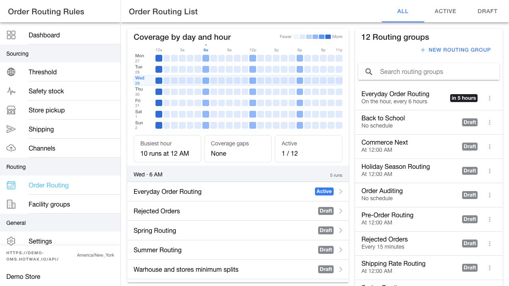

# Manage routing groups

A routing group controls when a set of routings runs. Use the `Order Routing List` page to review schedule coverage and manage every routing group for the selected product store.

## Review schedule coverage

The `Coverage by day and hour` grid shows scheduled routing groups in the selected `All`, `Active`, or `Draft` segment.

1. Select `Active` when you want to review active schedule coverage.
2. Review `Busiest hour` to find the hour with the most scheduled runs.
3. Review `Coverage gaps` to find hours without a scheduled run.
4. Select a cell in the grid to see which routing groups run during that day and hour.
5. Select a routing group in the drill-down to open its detail page.


The search field narrows the routing group list but does not change the grid. Use the `All`, `Active`, or `Draft` segment to change the groups represented in the grid.


## Find a routing group

Use the controls above the list to narrow the results:

* Select `All`, `Active`, or `Draft`.
* Search by routing group name.
* Review the schedule and `Next run` value before opening a group.

<figure><figcaption>
Review schedule coverage before you add or change a routing group.
</figcaption></figure>

## Create a routing group

1. Click `New routing group`.
2. Enter a name that describes the group and its schedule, such as `Everyday order routing`.
3. Click `Save` in the dialog to add a local draft to the list.
4. Select the draft and configure its description, routings, and routing rules.
5. Click the page-level `Save` to persist the new routing group.
6. Add its schedule, then change the routing group to `Active` when the saved configuration is ready.

A new routing group starts in `Draft` status and has no schedule.

Quick actions remain disabled until you persist the new group.

## Use routing group actions

Open the actions menu for a routing group to use the actions available for its current status.

| Action | Result |
| --- | --- |
| `Run now` | Creates a copy of the scheduled job and runs it immediately. The action does not replace the existing schedule. |
| `Activate` | Changes a draft group to active status. Add and review its schedule first. |
| `Move to Draft` | Stops future scheduled runs until you activate the group again. |


`Run now`, `Activate`, and `Move to Draft` update the live routing group immediately. Open the group and save or discard pending configuration changes before you use these actions.


## Open a routing group

Select a routing group to open the full configuration workspace. See [Configure a routing group](routing-group-details.md).
