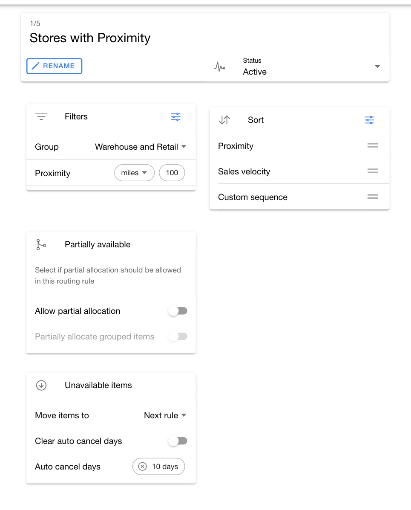

# Configure routing rules

A routing rule defines which fulfillment facilities are eligible, how the routing engine ranks them, and what happens to items that remain unavailable. Add rules in a sequence that starts with your preferred fulfillment strategy and gradually broadens the search.

## Add a routing rule

1. Open a routing group and select a routing.
2. Click `Add routing rule`.
3. Enter a name that describes the facility strategy, such as `Nearby warehouses`.
4. Configure the rule, then click the page-level `Save`.

A new routing rule starts in `Draft` status. Change it to `Active` after you complete its filters, sort options, and unavailable-item action.

## Sequence routing rules

Drag routing rules to change their position. The routing engine attempts active rules from top to bottom.

A common sequence starts with nearby warehouses, expands to nearby stores and warehouses, removes the distance limit, and allows partial allocation only in the final rule.

## Manage a routing rule

Select a routing rule to manage it:

* Click `Rename` to change its name.
* Change `Status` to `Active` when the rule is ready for use.
* Change `Status` to `Draft` while you revise it.
* Change `Status` to `Archived` to remove it from the active sequence.
* Open `Archived` below the routing rule list to review or restore archived rules.

These actions update the working copy. Click the page-level `Save` after you finish.

## Filter eligible facilities

Select a routing rule, then use `Filters` to control which facilities can supply inventory.

| Filter | How HotWax evaluates it | Impact |
| --- | --- | --- |
| `Group` | Matches facilities against active members of one brokering facility group. When saved with a negative comparison, the excluded option removes members of that group. | Limits the eligible fulfillment network before HotWax checks inventory. |
| `Proximity` | Calculates straight-line distance between the coordinates on the facility's primary address and the order's shipping address. HotWax converts the result to miles or kilometers before applying the entered limit. | Removes facilities outside the radius. If either address lacks coordinates, HotWax currently treats the distance as zero, which can make the facility appear eligible and nearest. |
| `Safety stock` | Compares the facility's available balance before this allocation with the entered value by using `greater` or `greater than or equal to`. The available balance already subtracts the product-facility minimum stock. If routing substitutes are configured, HotWax can add their available inventory to this balance. | Acts as a pre-allocation threshold. It does not reserve the entered quantity after routing, so an allocation can leave the balance below this value. |
| `Week of Supply` | Supplies the number of weeks used in the Week of Supply score. The value does not remove a facility by itself. | Affects ranking only when you also add the `Week of Supply` sort. |
| `Turn off the facility order limit check` | Bypasses the facility's current daily order count and maximum-order-limit comparison. | Allows the rule to allocate to a facility even when the normal capacity limit would block it. |
| `Shipment threshold check` | Compares every proposed split allocation and unavailable remainder with the entered merchandise subtotal. A complete allocation from one facility bypasses the check. | Rejects the complete allocation proposal when any checked portion is below the threshold. |

Filters shown in your environment depend on the routing services and enumeration configuration deployed with HotWax Commerce.


Some deployments show `All items available anywhere` in the filter chooser. The current detail editor does not provide a value control for this option, so a newly selected row defaults to no effect. Do not use it until your deployment includes the matching editor support.



A routing rule without a facility filter can consider every facility that is enabled for online fulfillment.


## Sort eligible facilities

Use `Sort` to rank facilities that pass the filters.

| Sort option | How HotWax calculates the order | Impact |
| --- | --- | --- |
| `Proximity` | Sorts the calculated straight-line distance from lowest to highest. | Tries the nearest facility first. A facility with missing address coordinates can sort as distance zero. |
| `Inventory balance` | For products in the order, totals the facility's last inventory count when that count is above the product-facility minimum stock. The saved sort is descending. | Tries the facility with the highest qualifying total first. |
| `Sales velocity` | Sorts the product-facility sales velocity from lowest to highest and places missing values last. | Tries slower-moving facilities before faster-moving facilities. |
| `Week of Supply` | Calculates `current inventory / (sales velocity / configured weeks) * 100`, sorts the score from highest to lowest, and places missing scores last. | Tries facilities with deeper inventory coverage first. |
| `Custom sequence` | Sorts by the active facility-group member sequence from lowest to highest. This option requires an included `Group` filter. | Follows the facility order maintained in that brokering group. |
| `Broken style` | When this deployment option is present, keeps facilities with an incomplete style assortment and ranks those with fewer available variants first. | Limits this rule to facilities with an incomplete assortment and tries the lowest available-variant count first. |

Available sort options depend on your deployment. See [Route by weeks of supply](weeks-of-supply-routing.md) before you use the Week of Supply sort.

If you add more than one sort option, drag them into the required priority order.

If you do not add a sort option, the routing engine ranks facilities by the number of order items available above the configured threshold, then by availability percentage, and then by facility ID.

## Configure partial allocation

Use the `Partially available` settings to control order splitting:

* Turn off `Allow partial allocation` when every approved item and quantity in the ship group must be available at one facility. If no single facility can fill the complete ship group, HotWax applies the unavailable-item action.
* Turn on `Allow partial allocation` when the rule can allocate available items or quantities across more than one facility.
* Turn on `Partially allocate grouped items` when items in a brokering item group can also split. When this option is off, all items in the group must remain together.

When the selected routing uses a `Promise date` filter, the app requires partial allocation because the routing processes matching items rather than the complete order.

Allowing partial allocation can increase the number of shipments. Review your [additional routing settings](additional-settings.md) before you enable it.

## Configure unavailable-item actions

Use the `Unavailable items` settings to decide what happens after a rule cannot allocate an item.

| Setting | Result |
| --- | --- |
| `Move items to` → `Next rule` | Passes only the unavailable items to the next active routing rule. Items allocated by the current rule do not run through the later rule. |
| `Move items to` → `Queue` | Moves unavailable items to the selected virtual queue and stops later routing rules for those items. |
| `Clear auto cancel days` | Removes a previously applied auto-cancel date when HotWax processes the unavailable items. |
| `Auto cancel days` | Sets the auto-cancel date to the routing server's current date and time plus the selected number of days. |

Use `Next rule` on intermediate rules. On the final rule, move remaining items to the queue used by your exception or retry process.

<figure><figcaption>
Review facility eligibility, ranking, split behavior, and the fallback action in one routing rule.
</figcaption></figure>


Click the page-level `Save` after you add, reorder, rename, archive, change status, or edit a routing rule. These changes remain in the working copy until you save the routing group.


## Build a fallback sequence

The following pattern broadens facility eligibility while limiting splits:

| Sequence | Facility strategy | Sort | Unavailable-item action |
| --- | --- | --- | --- |
| 1 | Preferred warehouses within a short distance | `Proximity` | `Next rule` |
| 2 | All fulfillment facilities within the same distance | `Proximity` | `Next rule` |
| 3 | All fulfillment facilities within a wider distance | `Proximity` | `Next rule` |
| 4 | All online fulfillment facilities | `Proximity` | `Next rule` |
| 5 | All online fulfillment facilities with partial allocation | `Proximity` | Exception queue |

Adjust the distances, facility groups, split policy, and final queue to match your service-level and cost requirements.
