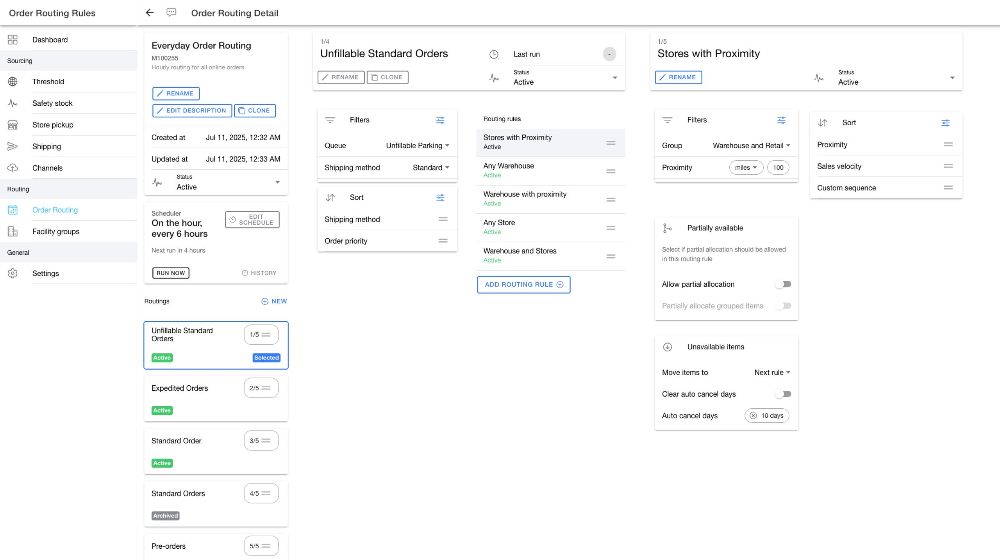
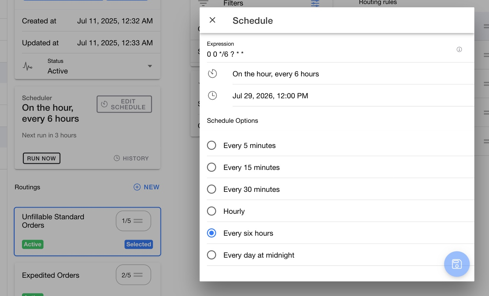

# Configure a routing group

Open `Order Routing`, then select a routing group. The detail page combines group settings, routings, routing rules, and optional testing tools in one workspace.

<figure><figcaption>
Configure the complete routing group from one workspace.
</figcaption></figure>

## Edit routing group details

Use the controls in the routing group card to maintain its identity:

* Click `Rename` to change the group name.
* Click `Edit description` to explain the group's purpose.
* Click `Clone` to create a separate routing group from the current configuration.

Use a description that identifies the orders, fulfillment strategy, and expected schedule. This context helps another user understand the group before changing it.

## Save configuration changes

Changes to the group name, description, routings, and routing rules stay in a working copy until you click `Save`.

1. Review the edited sections in all three columns.
2. Click `Save` to write the complete routing group configuration.
3. Click the discard control to restore the last saved configuration.

The app asks you to stay or discard if you try to leave with unsaved changes.


Routing group `Status`, schedule, `Run now`, and group cloning are immediate actions. They are not part of the configuration working copy. The app disables these actions while you have unsaved changes.


## Set the routing group status

Use `Status` to switch between:

* `Draft`: The scheduler does not start future runs for the group.
* `Active`: The scheduler can run the group according to its saved schedule.

Keep a group in `Draft` while you build and review its routings and routing rules.

## Add or edit a schedule

1. Click `Add schedule` or `Edit schedule` in the `Scheduler` card.
2. Select a schedule option or enter a valid Quartz cron expression.
3. Review the readable schedule and next execution time.
4. Save the schedule.

<figure><figcaption>
Choose a preset interval or enter a Quartz cron expression, then review the next execution time.
</figcaption></figure>

The default schedule options are:

| Schedule option | Quartz cron expression |
| --- | --- |
| Every 5 minutes | `0 */5 * ? * *` |
| Every 15 minutes | `0 */15 * ? * *` |
| Every 30 minutes | `0 */30 * ? * *` |
| Hourly | `0 0 * ? * *` |
| Every six hours | `0 0 */6 ? * *` |
| Every day at midnight | `0 0 0 * * ?` |

The schedule editor previews the Quartz expression in your HotWax Commerce user profile time zone. The saved routing job currently runs in the default time zone of the HotWax Commerce server. These time zones can differ. After you save, review `Next run` and `History`, and confirm the server time zone with your system administrator before you rely on an hour-specific schedule.

## Run a routing group now

Click `Run now` when you need an immediate routing attempt outside the normal schedule. Confirm the action after you read the warning.

`Run now` creates and runs a copy of the scheduled job. It does not replace the group's existing schedule, and you may not be able to reverse the routing action.

## Review run history

Click `History` in the `Scheduler` card to review recent runs. Use the start and completion information to confirm that the group ran at the expected time before you troubleshoot its routing results.

## Continue configuring the group

* [Configure routings](routing-rules.md)
* [Configure routing rules](inventory-rules.md)
* [Test a routing group](test-drive.md)
