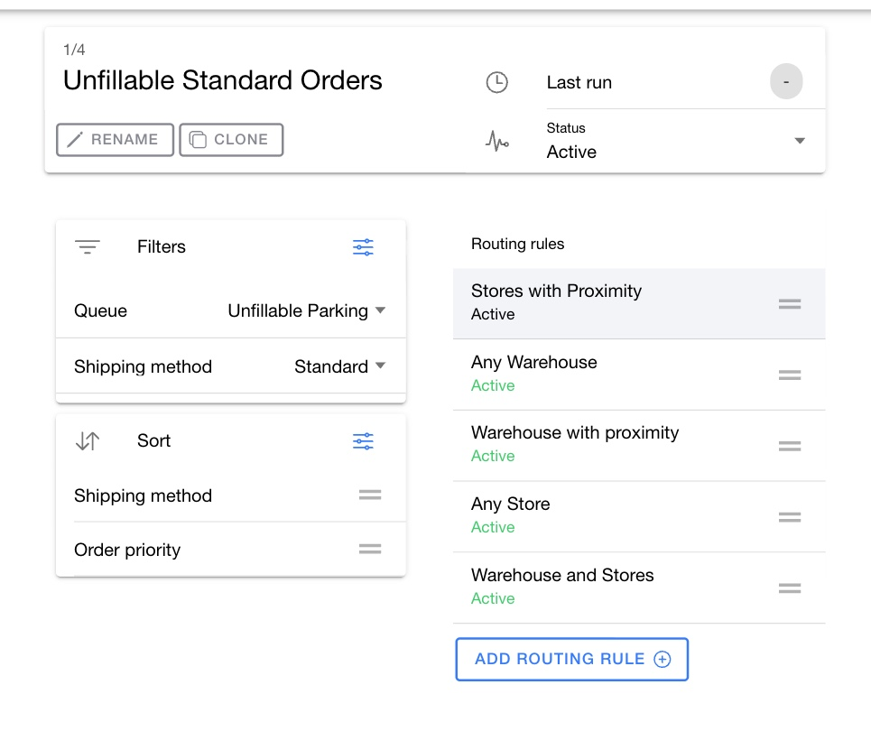

# Configure routings

A routing selects a set of orders within a routing group and controls the order in which the routing engine attempts them. Add separate routings when order types need different selection or facility strategies but can run on the same group schedule.

For example, one routing group can contain a routing for same-day orders and another for standard orders. Both run on the group's schedule, but each can use different order filters, order sorting, and routing rules.

## Add a routing

1. Open a routing group.
2. Click `New` next to `Routings`.
3. Enter a routing name.
4. Click `Save` in the dialog.
5. Configure the routing, then click the page-level `Save`.

A new routing starts in `Draft` status.

## Sequence routings

Drag a routing to change its position in the `Routings` column. The routing engine evaluates active routings in this sequence.

Place a narrow, high-priority routing before a broad routing. For example, place a same-day routing before a standard routing so urgent orders are considered first.

## Filter orders

Select a routing, then use `Filters` to define which orders it attempts.

| Filter | How HotWax evaluates it | Impact |
| --- | --- | --- |
| `Product Category` | Matches approved order items through product-category membership. | Selects ship groups that contain an item in an included category or omits matches from an excluded category. Without a promise-date filter, the complete matching ship group remains the routing unit. |
| `Queue` | Compares the selected virtual-facility IDs with the queue on the order item ship group. | Limits a routing to the selected parking or processing flows. |
| `Shipping method` | Compares the selected method IDs with the shipping method on the order item ship group. | Controls eligibility. It does not rank the speed of the method unless you also add the `Shipping method` sort. |
| `Order priority` | Compares the selected value with the priority stored on the order. | Selects an exact priority value. The filter does not calculate or change order priority. |
| `Promise date` | Converts the selected duration to an end-of-day cutoff in the routing server's time zone and selects items promised on or before that cutoff. `Already passed` uses the current day, `Upcoming duration` adds the entered days, and `Passed duration` subtracts them. | Changes routing from ship-group processing to item-level processing and requires partial allocation. |
| `Sales Channel` | Compares the selected channel IDs with the sales channel stored on the order. | Separates orders imported from different channels. |
| `Origin Facility Group` | Matches the order's origin facility with active members of the selected facility group. | Selects orders created for a source location in that group. |

Use the exclusion option when it is shorter and safer to omit one value than to maintain a long inclusion list.

HotWax applies every filter row together. A ship group must pass all configured rows. Multiple values within one filter make up that filter's selected set.


Do not use the excluded `Promise date` option. The routing service does not translate it to the promised-date field. Some app versions can also save a new exclusion without its negative comparison. Test every exclusion with a known matching order before you activate the routing.



A routing without order filters attempts orders from all parkings. Add an explicit `Queue` filter when the routing must apply to one parking or processing flow.


## Sort orders

Use `Sort` to control the sequence in which matching orders are attempted.

| Sort option | How HotWax orders the results | Impact |
| --- | --- | --- |
| `Ship by date` | Sorts the stored ship-before date from earliest to latest. | Attempts the orders with the earliest shipping deadline first. |
| `Ship after date` | Sorts the stored ship-after date from earliest to latest. | Attempts orders that are already eligible to ship before orders with a later start date. |
| `Order date` | Sorts the order date from oldest to newest. | Attempts older orders first. |
| `Shipping method` | Sorts by the `Delivery days` value configured for the carrier and shipping method, from the smallest value to the largest. | Attempts faster configured services first. A method without `Delivery days` can sort before a method with a value. |
| `Order priority` | Sorts the raw priority value stored on the order. The setting does not define a custom High, Medium, and Low ranking. | Use this sort only when the stored values already sort in the required order. Use separate routings and priority filters when you need an explicit business sequence. |

If you add more than one sort option, drag them into the required priority order.

If you do not add a sort option, the routing engine sequences matching orders by order date.

<figure><figcaption>
Select a routing to review which orders it includes and the sequence in which they are attempted.
</figcaption></figure>

## Manage a routing

Select a routing to use its management actions:

* Click `Rename` to change its name.
* Click `Clone` to add a copy to the current routing group.
* Review `Last run` to see the most recent routing attempt.
* Change `Status` to `Active` when the routing is ready for use.
* Change `Status` to `Draft` while you revise it.
* Change `Status` to `Archive` to remove it from the active sequence. Open `Archived` to review or restore archived routings.


Click the page-level `Save` after you add, reorder, clone, rename, archive, or edit a routing. These changes remain in the working copy until you save the routing group.


## Add facility selection logic

After you select the orders, add one or more [routing rules](inventory-rules.md) to choose and sequence eligible fulfillment facilities.
