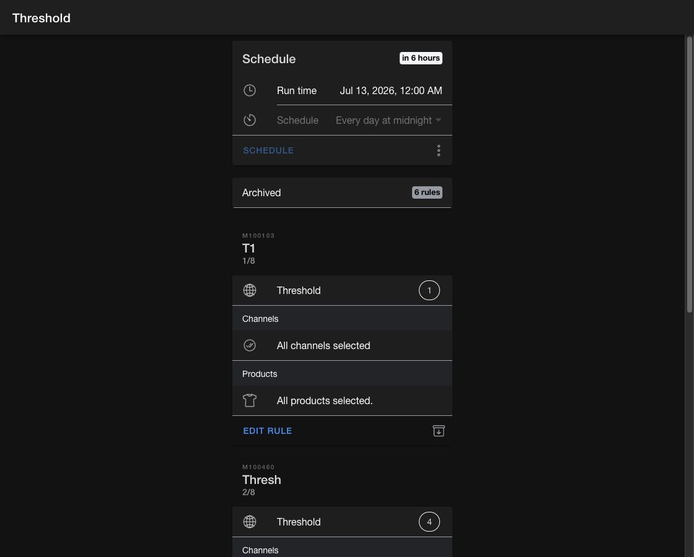

# Sourcing and inventory availability

Use the sourcing tools in the **Order Routing App** to control the inventory that can be promised to online customers.

The app calculates available to promise (ATP) from quantity on hand (QOH), reservations, and the inventory controls that apply to the product and facility. Threshold and safety stock rules reduce sellable inventory. Store pickup and shipping rules control where a product can be fulfilled. Inventory channels determine which facilities contribute inventory to each sales channel.

## Choose the right tool

| Page | Use it to |
| --- | --- |
| `Inventory channels` | Group facilities for a sales channel, link a configuration facility, and schedule inventory publication |
| `Threshold` | Hold back a network-level quantity for selected products and channels |
| `Safety stock` | Reserve a quantity at selected facility groups |
| `Store pickup` | Allow or suppress pickup for product and facility or product and channel combinations |
| `Shipping` | Allow or suppress shipping for product and facility or product and channel combinations |
| `Inventory` | Search a product at a facility and review ATP, QOH, safety stock, pickup, and brokering settings |

<figure><figcaption>
Each sourcing page shows its schedule, archived rules, and active rule sequence.
</figcaption></figure>

## Before you create rules

Confirm the following setup:

* Select the correct product store from the app menu.
* Create the required [inventory channels](inventory-channels.md) before adding channel-level rules.
* Create facility groups for locations that share the same sourcing policy.
* Sync product tags and features if rules need to target part of the catalog.

Rules are evaluated in their displayed sequence. Put broader rules before more specific rules when the specific rule should refine the result. Use the reorder action on a rule page to change the sequence, then save the new order.

Continue with [sourcing concepts](concepts.md) or open a rule guide from the table above.
