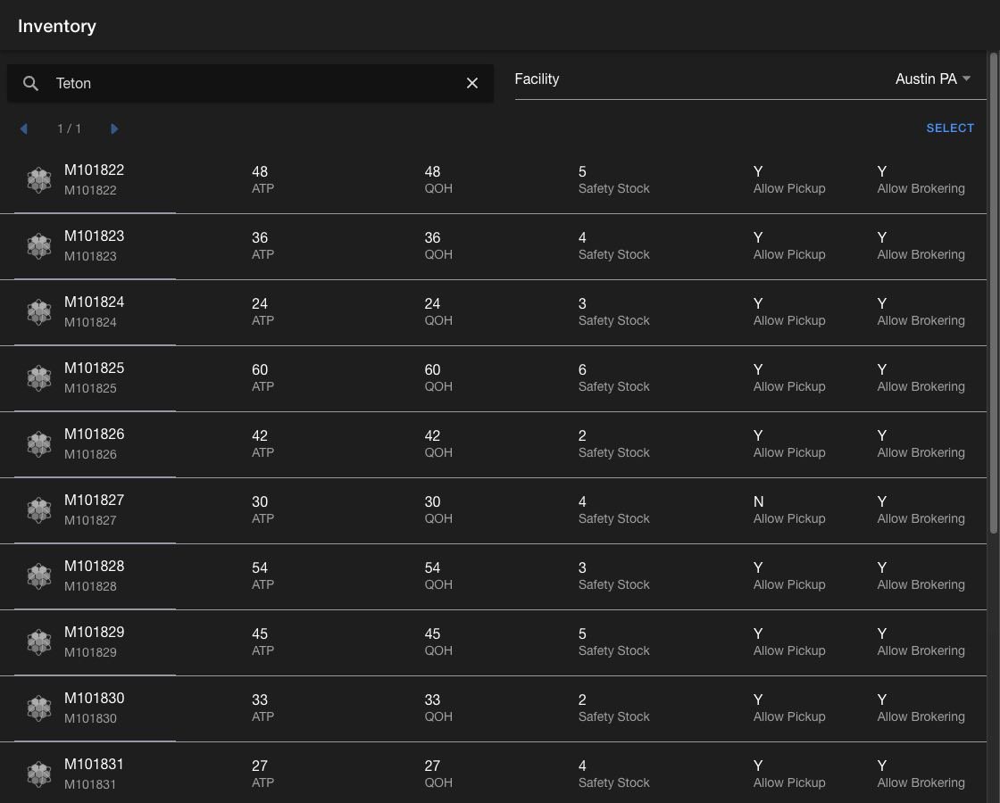

# Review product inventory

Use the `Inventory` page in the **Order Routing App** to review a product's inventory and sourcing configuration at a facility.

## Find a product

1. Open the **Order Routing App**, then go to `Inventory`.
2. Enter a product search term.
3. Select the facility whose inventory you want to review.
4. Use the previous and next controls to move through results.

The product row shows:

| Value | Meaning |
| --- | --- |
| `ATP` | Quantity currently available to promise at the selected facility |
| `QOH` | Physical quantity on hand recorded at the facility |
| `Safety Stock` | Quantity reserved by applicable safety stock configuration |
| `Allow Pickup` | Whether the product can be picked up from the facility |
| `Allow Brokering` | Whether the product can be considered for order routing at the facility |

<figure><figcaption>
Search a product family and compare its inventory and sourcing settings at one facility.
</figcaption></figure>

## Add missing product configuration

When a product does not have facility-level configuration, select `Add Config` on its row. After configuration is created, the row can show ATP, QOH, safety stock, pickup, and brokering values.

Select a configured product row to open its inventory detail page and review inventory movement history.

## Update multiple products

1. Select `Select` above the product list.
2. Choose individual products or use `Select all` for the current page.
3. Select `Adjust inventory` to update inventory quantities or `Adjust config` to update facility-level product settings.
4. Select `Done` to leave selection mode.
