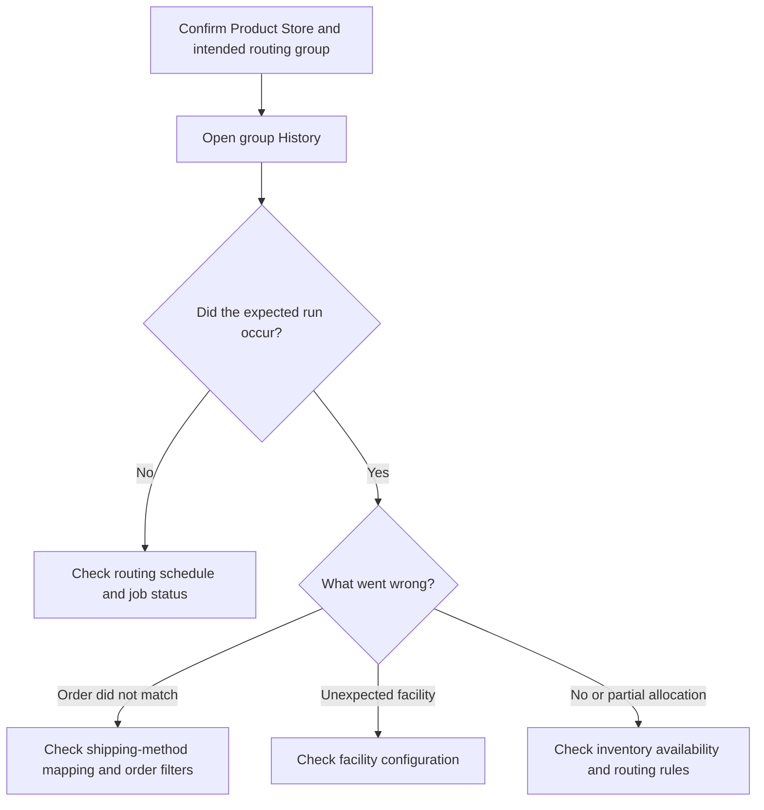

# Troubleshoot order routing

Start with the routing group that should have processed the order. Confirm that you selected the correct Product Store in the app footer, then use the symptom table to continue.

| Symptom | Check |
| --- | --- |
| A routing group did not run | [Troubleshoot a routing schedule](scheduling-error.md) |
| A facility was skipped or selected unexpectedly | [Troubleshoot facility configuration](incorrect-facility-configurations.md) |
| An order did not match the intended shipping-method filter | [Troubleshoot shipping-method mapping](incorrect-shipping-method-mapping.md) |
| A routing rule found no inventory or allocated only part of an order | [Troubleshoot inventory availability](inventory-unavailability.md) |

Use `History` on the routing group detail page to separate schedule problems from routing outcomes. A completed run with no allocation usually points to the routing, routing-rule, inventory, or reference-data configuration rather than the schedule.

See [Order routing](../README.md) for the routing group, routing, and routing-rule hierarchy.
