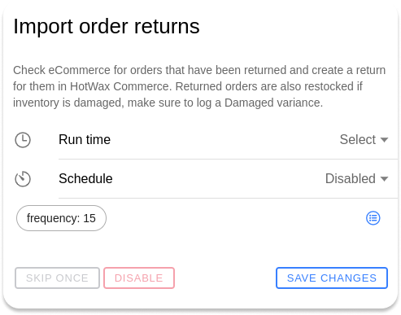

# Import Returns

The import returns feature in HotWax Commerce streamlines the return management process for retailers using Shopify. Returns, whether initiated by customers or customer service representatives (CSRs), are a common aspect of eCommerce. Retailers often leverage third-party return management apps to handle returns efficiently. However, HotWax Commerce doesn't function as a Return Management System; instead, it integrates with Shopify to import the returns.

HotWax Commerce downloads return data once the return process is completed in Shopify, and this information is then transmitted to ERP systems for financial and accounting purposes. The integration avoids the need for direct links between ERP and Return Management Systems.

Schedule the return import job:

1. Open Job Manager from the HotWax Commerce Launchpad.
2. Open `Catalog`.
3. Search for the return import job used by the instance.
4. Select the job.
5. Review its parameters.
6. Update its schedule for the required frequency.

See [Manage a job](../../workflow/job-management/jobs/job-details.md) for current scheduling instructions. Refer to the [Shopify integration guide](../../../learn-shopify/shopify-integration/order-return/import-returns-from-shopify.md) to learn how the return import works.

<figure><figcaption></figcaption></figure>
