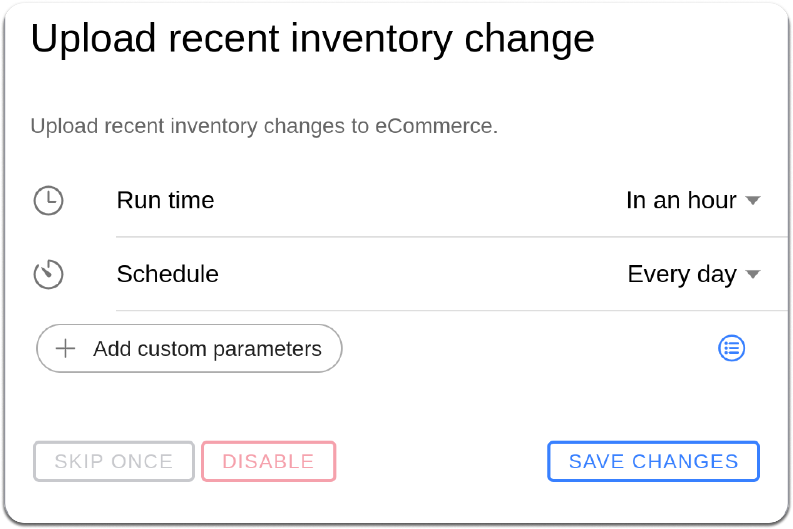

# Restock Returns

## Restock Returns for Online Orders

HotWax Commerce operates with a specific inventory management approach for restocking online returns. When inventory is returned on Shopify, it provides an option to enable the restock returned inventory flag. However, HotWax Commerce does not automatically increase the inventory count in its system even if the restocked return flag is enabled on Shopify. This is because HotWax Commerce lacks visibility into the specific location where the inventory is received. Instead, inventory is updated only when the updated inventory count is received from Warehouse Management Systems (WMS) or Enterprise Resource Planning (ERP) systems.

## Restock Returns for In-Store Orders

Store associates can configure whether to accept the return of the product with or without restocking it, depending on the specific requirements set by the retailer. If the decision is to restock in-store order items immediately upon receipt, the inventory changes are updated in HotWax Commerce instantly. These inventory updates are then synced with Shopify through the `Upload recent inventory change` job.

1. Open Job Manager from the HotWax Commerce Launchpad.
2. Open `Catalog`.
3. Search for `Upload recent inventory change`.
4. Select the job.
5. Review its parameters.
6. Update its schedule for the required frequency.

See [Manage a job](../../workflow/job-management/jobs/job-details.md) for current scheduling instructions.

<figure><figcaption></figcaption></figure>
