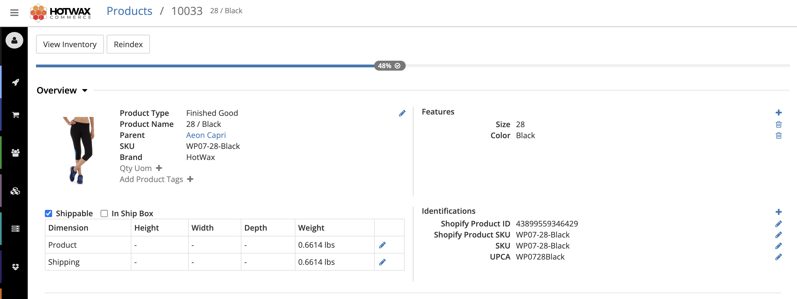

# Product management

Use the Products app to find products, review product setup, fix data quality gaps, and check recent product imports. The app is designed for operations teams that need product data to be accurate for order routing, fulfillment, inventory availability, channel sync, and financial posting.

Open the Products app from Launchpad. The side menu includes these pages:

<table data-view="cards"><thead><tr><th></th><th></th><th data-hidden data-card-target data-type="content-ref"></th></tr></thead><tbody><tr><td><strong>Product workbench</strong></td><td>Search products and filter the catalog by product type, product store, product kind, tag, and sort order.</td><td><a href="#product-workbench">Product workbench</a></td></tr><tr><td><strong>Duplicate identifiers</strong></td><td>Find duplicate SKU, UPC, or identifier values and resolve each duplicate group.</td><td><a href="#duplicate-identifiers">Duplicate identifiers</a></td></tr><tr><td><strong>Missing values</strong></td><td>Review catalog coverage and open products that are missing required fields.</td><td><a href="#missing-values">Missing values</a></td></tr><tr><td><strong>Imports</strong></td><td>Review the last 100 recently synced product updates and search by product, SKU, barcode, or shop.</td><td><a href="#imports">Imports</a></td></tr><tr><td><strong>Settings</strong></td><td>Select the product store, confirm the OMS instance, rebuild the product search index, and manage app preferences.</td><td><a href="#settings">Settings</a></td></tr></tbody></table>

## Product workbench

The Product workbench is the main product search page. Use it when you need to find a product record, compare variants, or select products for bulk review.

You can search by product name, product ID, SKU, barcode, Shopify ID, or other indexed product identifiers. Use the filters to narrow the list by:

* Product type
* Product store
* Product kind
* Tags

The workbench also supports sorting by alphabetical order, recently updated, and recently created. Select one or more visible products when you need to work through a group of records.

To open a product:

1. Open **Products** > **Product workbench**.
2. Search for a product or apply filters.
3. Select the product row to open the product details page.

## Product details

The product details page shows one operational product record. For product families, use the variant selector to switch between variants, or use the segment control to edit the parent product or the selected variant.

The details page includes these sections:

| Section | Use it to |
| --- | --- |
| Product header | Confirm the product identity, image, product type, parent or variant relationship, and family context. |
| Identifications | Add, update, or expire identifiers such as SKU, UPC, barcode, and channel identifiers. |
| Features | Review selectable product features such as color, size, scent, shade, or pack size. |
| Display | Edit product display fields that identify the product to operations users. |
| Dates | Update product lifecycle dates. |
| Components | Manage component products for kit products. This section appears for kit product types. |
| Inventory policy | Manage inventory-related product settings and substitute product relationships. |
| Shipping and handling | Maintain shipping dimensions, weight, unit of measure, and handling fields. |
| History | Review recent product update activity. |


Inventory balances, safety stock, thresholds, and available-to-promise rules are managed in the inventory and Available to Promise apps. The Products app shows product setup needed by those workflows, but it does not replace inventory policy management.


<figure><figcaption>
Product details
</figcaption></figure>

## Duplicate identifiers

Use **Duplicate identifiers** when a SKU, UPC, or other identifier is active on more than one product. Duplicate identifiers can cause product sync, scan, and fulfillment issues because downstream systems may not know which product owns the value.

To resolve duplicate identifiers:

1. Open **Products** > **Duplicate identifiers**.
2. Select the identifier rule you want to review.
3. Open a duplicate group.
4. Give each product a unique value.
5. Save the resolution.

## Missing values

Use **Missing values** to find product data gaps. The page groups coverage issues by rule, with the worst gaps first. Select a rule to list the affected products, then open each product to add the missing data.

You can also look up another field by entering a field name, such as `brandName`, `upc`, or `mainImageUrl`.

## Imports

Use **Imports** to review recently synced product updates. The page lists the last 100 product update records and supports search by product, SKU, barcode, shop, or update message.

Review import history when:

* Product details look stale after a Shopify sync.
* A product is missing an expected SKU, barcode, image, or shop mapping.
* A product update was imported but the product search result does not show the new data.

## Settings

Use **Settings** to confirm the connected OMS instance, select the current product store, and check product search index status.

If product search results look stale or empty, use **Rebuild search index** from the Product data diagnostics card. Rebuilding the index refreshes the product search data used by the Product workbench.

<figure><figcaption>
Product search index rebuild
</figcaption></figure>

## Screenshot gaps

This page still needs updated screenshots from a clean test OMS catalog. Use product records with realistic names, SKUs, variants, identifiers, and product images. Avoid customer-specific data, placeholder products, empty states, browser chrome, and screenshots that show only one field without surrounding context.
