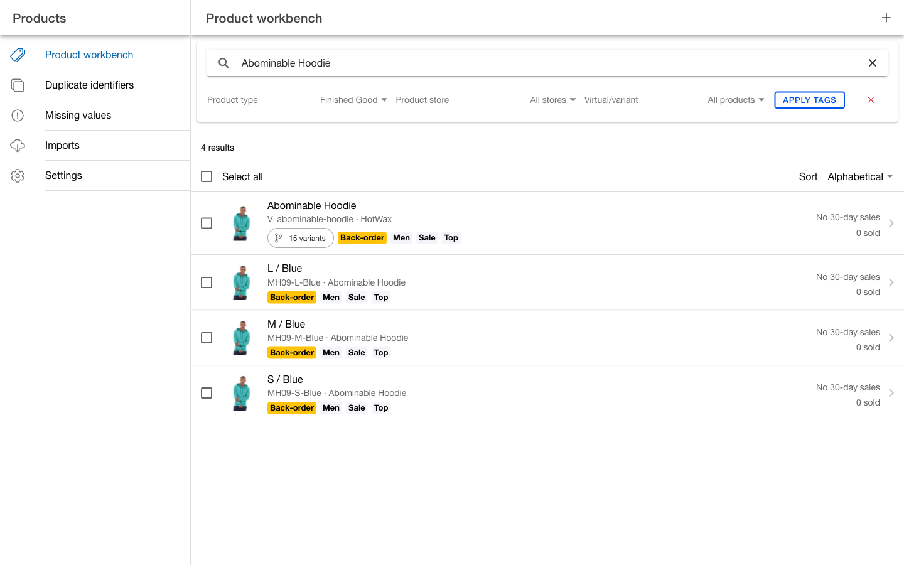
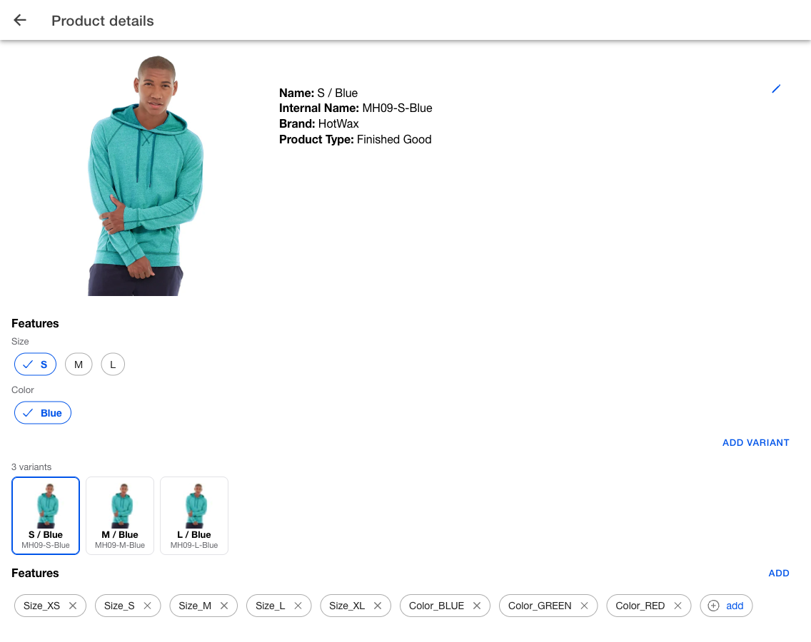
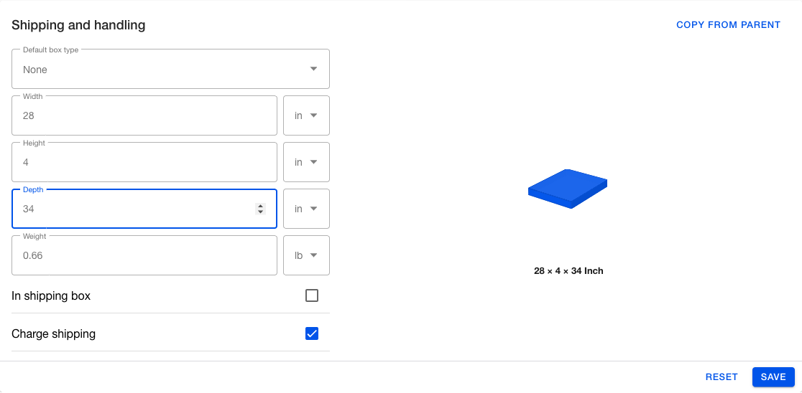
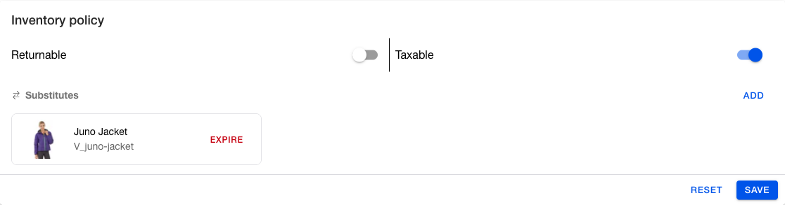
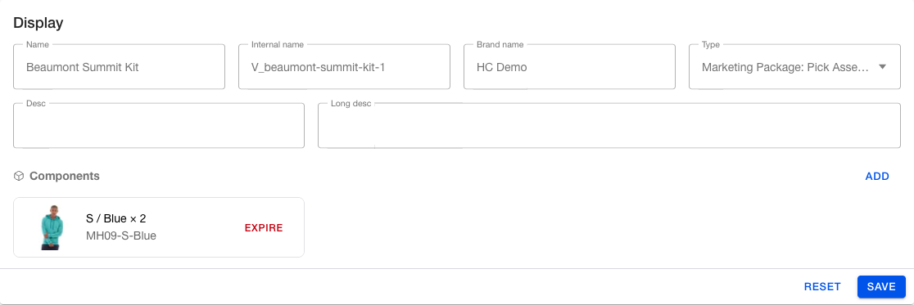
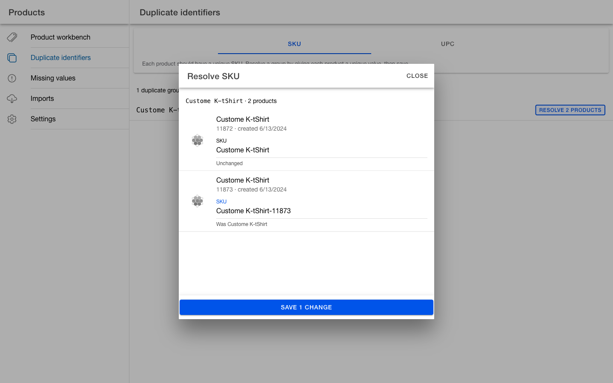
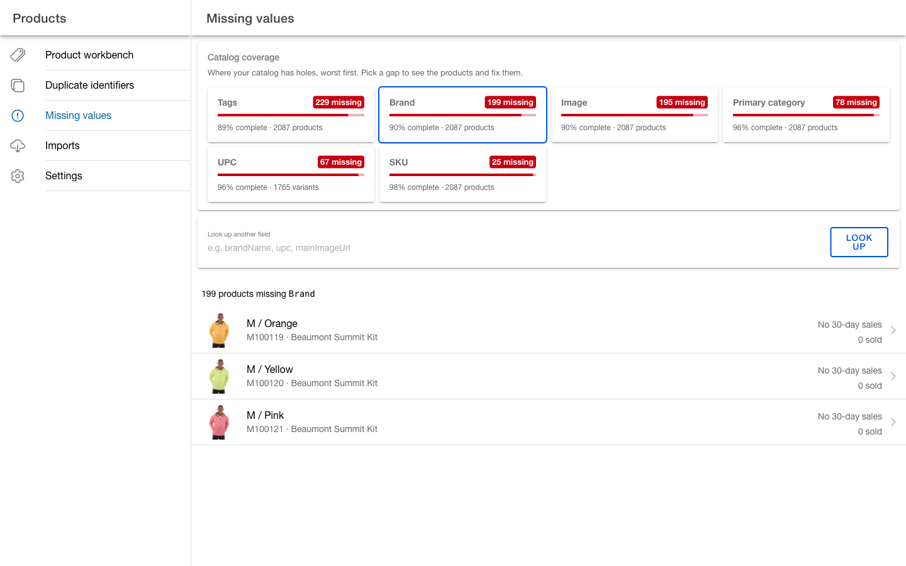
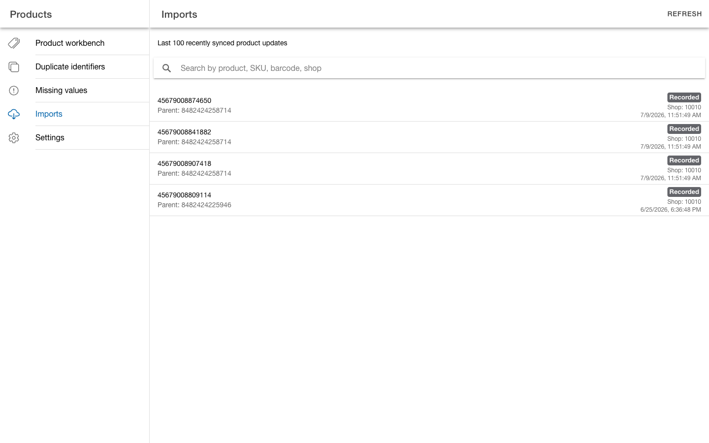
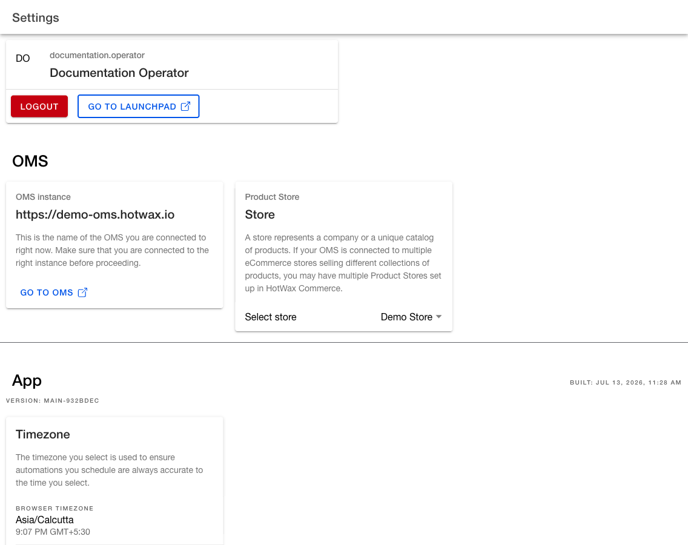

# Manage products in the Products app

Use the Products app to find catalog records, edit product setup, repair common data gaps, and review recent product updates in your order management system (OMS). Open the app from Launchpad, then use the side menu to move between each workflow.

## Before you begin

The pages and edit actions available to you depend on your permissions. If a page or action described here is not visible, ask your administrator for access.

Before editing categories or prices, open `Settings` and confirm the current `Product Store`. This selection provides the store context for those changes. It is separate from the `Product store` filter on the Product workbench.

## 1. Find and triage products

**Goal:** Narrow the catalog to the products that need review and open the correct product or variant.

**Use this flow when:** You know a product ID, SKU, UPC, or name. You can also use this flow to review products that share a type, store, virtual or variant status, or tag.

**Key labels:** `Product workbench`, `Product ID, SKU, UPC, name`, `Product type`, `Product store`, `Virtual/variant`, `Apply tags`, `Alphabetical`, `Recently updated`, `Recently created`, `Add tag`.

1. Open `Products` > `Product workbench`.
2. Search by product ID, SKU, UPC, or product name.
3. Narrow the results with `Product type`, `Product store`, `Virtual/variant`, or `Apply tags`.
4. If an expected product is missing, clear the search and tags, then select `All types`, `All stores`, and `All products`.
5. Sort the list by `Alphabetical`, `Recently updated`, or `Recently created`.
6. Review the product ID or SKU, the parent name for a variant or the brand or product type for another record, the variant count for a virtual product, tags, `Pre-order` or `Back-order` badges, and 30-day sales.
7. Select a row to open the product. Use the checkboxes only when you want to apply `Add tag` to multiple visible products.

**Outcome:** You have isolated the relevant records and opened the correct product for detailed review.

<figure><figcaption>
Find and triage products in the Product workbench
</figcaption></figure>

## 2. Inspect and edit product details

**Goal:** Confirm the product family and update the correct parent or variant without overwriting unrelated product data.

**Use this flow when:** A product has the wrong display data, identifiers, dates, tags, categories, prices, shop mapping, inventory policy, shipping data, or kit components.

**Key labels:** `Product details`, `Features`, `Edit parent`, `Edit variant`, `Display`, `Product identifications`, `Dates`, `Tags`, `Categories`, `Prices`, `Shopify Shop Products`, `Inventory policy`, `Shipping and handling`, `Components`, `Change history`, `Save`, `Reset`.

1. Open the product from the Product workbench.
2. For a product family, use the feature options or variant strip to select the variant you want to inspect.
3. Select `Edit parent` for shared parent data or `Edit variant` for data that belongs to the selected variant.
4. Use the section that matches the task. For example, use `Display` for the name, description, brand, or product type; `Product identifications` for SKU or UPC; and `Categories` or `Prices` for store-specific setup.
5. Complete the action for that section. `Display`, `Dates`, `Prices`, `Inventory policy`, and `Shipping and handling` use card-level `Save` and `Reset` actions. `Product identifications` uses an edit dialog, while `Tags` and `Categories` apply add or remove actions directly.
6. For sections with a `Save` footer, save each changed card. Select `Reset` to restore that card's editable fields. Staged substitute and component links have the additional behavior described below. If the app reports `Underlying data changed`, review the latest data before saving again.
7. Use `Change history` to review recorded identifier changes. Use `Imports` for recent shop product update records.

**Outcome:** The app updates the intended parent or variant data, while card-level drafts remain separate.

<figure><figcaption>
Inspect product details and select the intended variant
</figcaption></figure>

### Update shipping dimensions with the visualizer

**Goal:** Record the physical measurements and shipping controls for the correct product or variant, and use the dimension visualizer to catch obvious entry errors before saving.

**Use this flow when:** Package dimensions, weight, box type, or the `In shipping box` and `Charge shipping` settings are missing or incorrect.

1. Open the product and select `Edit parent` or `Edit variant`, depending on where the shipping data belongs.
2. In `Shipping and handling`, select a `Default box type` when your shipping process requires one.
3. Enter `Width`, `Height`, and `Depth`, and confirm the unit beside each value. Enter `Weight` and confirm its unit.
4. Review the box visualizer. It changes proportionally as you enter all three dimensions, which can help you spot a transposed or unusually large value. It does not calculate volume, validate box fit, or quote a shipping rate.
5. Set `In shipping box` and `Charge shipping` as required by your shipping policy.
6. Select `Save`. Select `Reset` to restore the saved shipping draft instead.
7. For a variant, select `Copy from parent` when the parent already has the correct values. Review the copied draft, then select `Save`; copying alone does not save the variant.

**Outcome:** The intended product record has saved shipping measurements and controls, and the visualizer reflects the relative proportions of the three dimensions.

<figure><figcaption>
Check the relative dimensions before saving shipping data
</figcaption></figure>

### Link substitute products

**Goal:** Record another catalog item that operators may use as a replacement for the product you are editing.

**Use this flow when:** Merchandising or operations has approved another product as an acceptable substitute for an unavailable item.

1. Open the product ID that appears on the order item. If orders contain a variant, select `Edit variant` and configure that variant; downstream workflows do not fall back to a substitute link on its parent.
2. In `Inventory policy`, find `Substitutes` and select `Add`.
3. In `Add substitute`, search by `Product ID, SKU, name`, then select the approved replacement product.
4. Select the checkmark button to return to `Inventory policy`. Review the staged substitute and select `Save` on the card.
5. Before saving, select `Expire` beside a staged substitute to remove it, or select `Reset` to clear all staged substitutes and restore the policy fields.
6. For a saved link, select `Expire` when the replacement is no longer approved. Select `Reactivate` to make an expired link active again.
7. Repeat the setup from the other product if either item may replace the other. A substitute link runs from the current product to the product you select; it is not automatically reciprocal.

Order Manager can offer active linked products during `Swap` review and show whether inventory is available at the same facility. Saving the link does not rebroker an order or replace an order item by itself. The order workflow still applies the actual swap.

**Outcome:** The current product has an active, directional link to an approved replacement, ready for the downstream workflows that use substitutes.

<figure><figcaption>
Review the staged substitute before saving Inventory policy
</figcaption></figure>

### Set up pick-assembly kit components

**Goal:** Define the products and quantities required to assemble one pick-assembly kit.

**Use this flow when:** Fulfillment teams assemble a sellable kit from tracked component products.

1. Create the kit product first if it does not already exist, then reopen it in `Product details`.
2. Select the `Edit parent` or `Edit variant` context for the product ID sold on the order. If orders contain a variant, configure the components on that variant; reservation processing does not fall back to component links on its parent.
3. In `Display`, set `Type` to `Marketing Package: Pick Assembly`. The `Components` area appears in the same card.
4. Under `Components`, select `Add`, then search for and select each component product.
5. Set `Qty` to the number of component units required for one kit. For example, a component with `Qty` 2 requires six units for an order of three kits.
6. Select the checkmark button. Review the staged components and quantities, then select `Save` on the `Display` card. This saves the type change and creates the staged component links.
7. Before saving, select `Expire` beside a staged component to remove it. For a saved component, use `Expire` or `Reactivate` to change whether the link is active.

For pick-assembly kits, OMS uses the active component links and quantities when it creates and releases inventory reservations. Changing a live kit is operationally sensitive because reservation processing reads the current active links.


Products can show a separate `Components` card for other marketing-package types. Confirming that picker creates the component link immediately, but downstream fulfillment behavior can differ. Use `Marketing Package: Pick Assembly` for the reservation flow described here.


**Outcome:** The pick-assembly kit has active component links with the quantity required for one kit.

<figure><figcaption>
Set the kit type, component, and per-kit quantity before saving Display
</figcaption></figure>

## 3. Resolve duplicate identifiers

**Goal:** Give each product a unique SKU or UPC so operators and integrations can identify the correct record.

**Use this flow when:** `Duplicate identifiers` shows a duplicate group, or a known SKU or UPC points to more than one product.

**Key labels:** `Duplicate identifiers`, `SKU`, `UPC`, `Resolve N products`, `Resolve SKU`, `Resolve UPC`, `Save N changes`.

1. Open `Products` > `Duplicate identifiers`.
2. Select `SKU` to review duplicate SKUs across products, or `UPC` to review duplicate UPCs on variants.
3. Open a duplicate group with `Resolve N products`.
4. Confirm each listed product, then replace the duplicate value with the correct unique SKU or UPC.
5. Select `Save N changes`.
6. Refresh the page and confirm that the corrected group no longer appears.


This workflow changes product identifiers. It does not merge or delete product records. Confirm the correct value for every listed product before saving.


**Outcome:** Each product in the group has a distinct identifier, and the corrected group leaves the page after the updated data becomes available.

<figure><figcaption>
Assign a unique value to each product in a duplicate group
</figcaption></figure>

## 4. Find and fix missing values

**Goal:** Prioritize common catalog gaps and update the affected products from the appropriate product details card.

**Use this flow when:** A product is missing an image, tags, brand, UPC, SKU, or primary category, or when you are performing a catalog quality review.

**Key labels:** `Missing values`, `Catalog coverage`, `Image`, `Tags`, `Brand`, `UPC`, `SKU`, `Primary category`, `Image URL`, `Display`, `Product identifications`, `Categories`.

1. Open `Products` > `Missing values`.
2. Review `Catalog coverage`. The page orders the cards with the largest gaps first.
3. Select `Image`, `Tags`, `Brand`, `UPC`, `SKU`, or `Primary category` to list the affected products.
4. Open a product from the list.
5. Update the matching area in `Product details`:
   * Select the product image and update `Image URL` for a missing image.
   * Use `Display` for a missing brand.
   * Use `Product identifications` for a missing SKU or UPC.
   * Use `Tags` for a missing tag.
   * Use `Categories` to add the intended category when `Primary category` is missing. The app does not provide a control to designate a category as primary, so escalate the product ID if the gap remains.
6. Complete the section's save or add action. Return to `Missing values` and confirm the product leaves the affected list after the updated search data becomes available.

**Outcome:** You have completed the available repair or identified a primary-category gap that needs administrator support. Catalog coverage reflects completed repairs after the search data refreshes.

<figure><figcaption>
Prioritize and open products with missing values
</figcaption></figure>

## 5. Review product import history and diagnose stale updates

**Goal:** Determine whether `Imports` contains a recent shop product update snapshot and collect useful evidence when the product still looks stale.

**Use this flow when:** A shop-originated product change is not visible in Product details or the Product workbench. Use it also to compare recent snapshots for a product or shop.

**Key labels:** `Imports`, `Refresh`, `Last 100 recently synced product updates`, `Synced`, `Recorded`, `Shop`, `System message`.

1. Open `Products` > `Imports` and select `Refresh` to load the latest records. The page shows the latest 100 records, not a complete event history.
2. Search by product ID, parent product ID, displayed SKU, shop, or system message.
3. Compare the displayed timestamp and `Shop` with the change you expected.
4. Read the badge as an update-record detail:
   * `Synced` means the record includes a `System message` value.
   * `Recorded` means the record does not include a system message value.
5. Do not treat either badge as proof that every field updated successfully. Open the product from the Product workbench and compare Product details with the expected change.
6. If the expected shop update is missing or the product remains stale, record the product ID, shop, displayed timestamp, and system message, when present, for your OMS administrator or HotWax Support.

**Outcome:** You can distinguish a missing recent shop snapshot from a product that remains stale after a snapshot appears, and you have the evidence needed for escalation.

<figure><figcaption>
Compare recent product update records
</figcaption></figure>

## 6. Verify product store and recover product search

**Goal:** Confirm that you are working in the intended OMS and product store, then rule out search filters before escalating stale or unavailable search data.

**Use this flow when:** Category or price edits may have used the wrong store context, Product workbench results are empty, or recently saved data does not appear in search.

**Key labels:** `Settings`, `OMS instance`, `Go to OMS`, `Product Store`, `Select store`, `Product workbench`, `All types`, `All stores`, `All products`, `Could not load products`, `Retry`.

1. Open `Products` > `Settings`.
2. Confirm `OMS instance`. Use `Go to OMS` if you need to verify the connected OMS directly.
3. Under `Product Store`, use `Select store` to choose the store context required for category and price edits.
4. Return to `Product workbench`. Clear the search and tags, then select `All types`, `All stores`, and `All products` to rule out hidden filters.
5. If the page shows `Could not load products`, select `Retry`.
6. For a shop-originated update, compare the latest matching record in `Imports` with Product details and the Product workbench. For a change made in Product details, reload Product details and the Product workbench.
7. If the inconsistency remains, send the collected product and update details to your OMS administrator or HotWax Support for search-index recovery.


The Products app does not provide search-index status or a manual index rebuild action. The `Product Store` in Settings also does not change the `Product store` filter on the Product workbench.


**Outcome:** You have confirmed the OMS and store context, ruled out search filters and a retryable load error, or prepared a focused escalation for index recovery.

<figure><figcaption>
Confirm the OMS instance and current product store
</figcaption></figure>

## Related guides

* [Create shipping boxes](../../system-admin/fulfillment/shipping-methods/shipping-box.md)
* [Download kit products from Shopify](../../learn-shopify/shopify-integration/products/download-kit-products.md)
* [Import kit components from an ERP](../workflow/job-workflows/products.md#import-kit-component)
* [Find product inventory](../inventory/inventory-management/find-product-inventory.md)
* [Configure product inventory](../inventory/inventory-management/configure-product-inventory.md)
