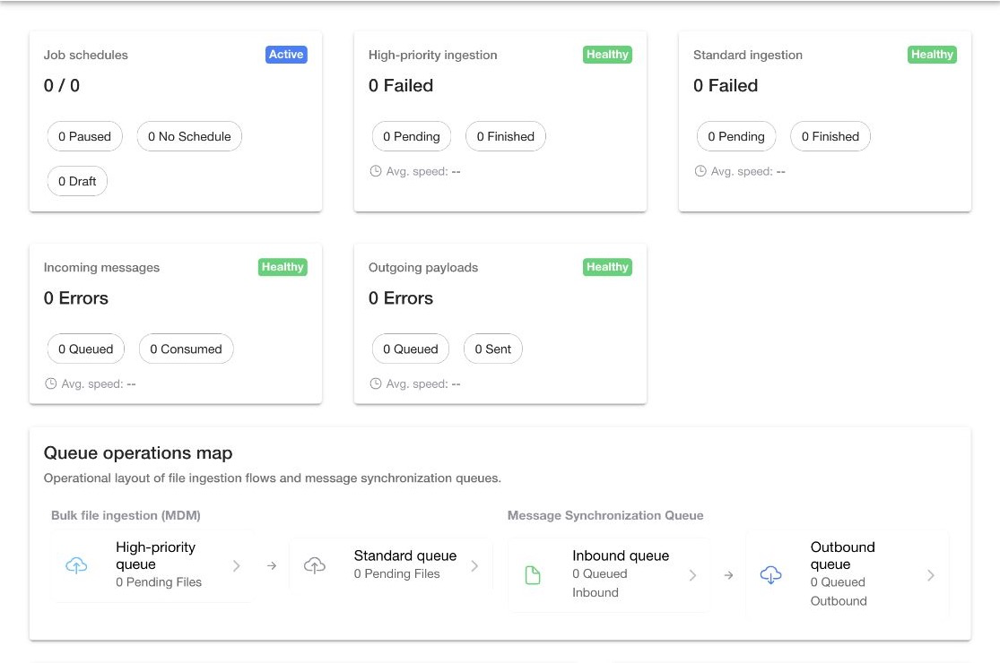

# Review the Job Manager Dashboard

Open `Dashboard` to review current operational health before you investigate an individual record.

Dashboard counts reflect the active instance and the data available when the page was last refreshed. Open the linked page to confirm the current records behind a count.

<figure><figcaption>
Review schedule, ingestion, and message health from the Dashboard.
</figcaption></figure>

## Review schedule health

Use the schedule summary to compare:

- Active jobs
- Paused jobs
- Jobs without a schedule
- Draft jobs

Select a status to open `Catalog` with the matching filter. Review the job before you run it or change its schedule.

## Review ingestion and message health

Use the ingestion and system message cards to identify:

- High-priority and normal-priority file activity
- Inbound and outbound system message activity
- Failed file imports
- System messages in an error state

Select a count to open the relevant history. Use [File history](mdm/file-history.md) for import processing and [Message history](system-messages/message-history.md) for integration messages.

## Read the Queue Operations Map

Use the Queue Operations Map to see how work is moving through the available processing stages. Treat the map as a summary, then open the related history to inspect a specific record.

## Review service job diagnostics

Use `Service Job Diagnostics` to find jobs with configuration problems. A diagnostic can identify missing or invalid job setup, but it does not replace the job detail or run error.

1. Select the diagnostic action.
2. Open the affected job.
3. Review `Overview`, `Parameters`, and `History`.
4. Compare the configuration with the latest failed run.

See [Manage a job](jobs/job-details.md) and [Investigate job runs](jobs/run-history.md).

## Review recent activity

Use `Recent Activity` to move from a dashboard event to its related job, file, or message. Confirm the target identifier and status on the detail page.

## Refresh dashboard data

Open `Settings` when a dashboard section appears stale. Review `Data Status`, then refresh the affected data source or use the full refresh action.

See [Manage Job Manager settings](settings.md).
