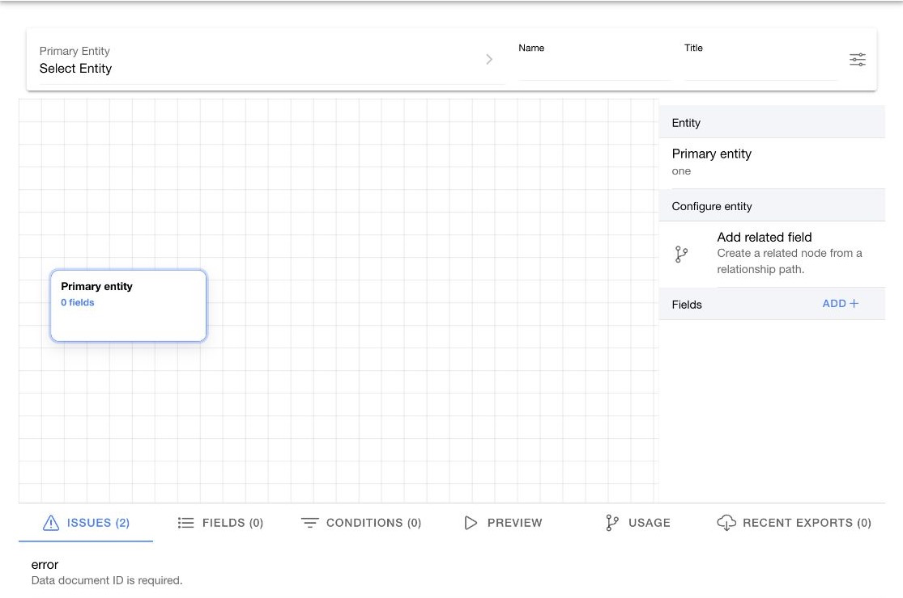

# Build a data document

Open `Data documents` > `Documents`, then select the create action.

<figure><figcaption>
Build the data document from a primary entity, fields, and conditions.
</figcaption></figure>

## Create the document

1. Select `Primary Entity`.
2. Enter the document name.
3. Enter the title.
4. Select `Add`.

Choose a primary entity that represents one row in the intended result. The entity determines which direct and related fields are available.

## Add fields

1. Open `Fields`.
2. Select the add-field action.
3. Choose a direct field or related field.
4. Configure the field options shown by the form.
5. Add the field.
6. Repeat for each required output value.

Use clear aliases or labels when the builder provides them. Do not select sensitive fields unless the export consumer is authorized to receive them.

## Add conditions

1. Open `Conditions`.
2. Select the add-condition action.
3. Choose the field and operator.
4. Enter or select the comparison value.
5. Add the condition.

Review conditions together. Multiple conditions can change the result more than one condition viewed by itself.

## Review issues

Open `Issues` after you add or remove entities, fields, or conditions. Resolve each reported issue before you save or export.

## Change the primary entity

Changing the primary entity can invalidate fields, relationships, and conditions.

1. Open the primary-entity control.
2. Select the replacement entity.
3. Review the confirmation.
4. Confirm the change.
5. Rebuild invalid fields and conditions.
6. Review `Issues`.

## Save the document

Select `Save` after the definition is complete. If you try to leave with unsaved changes, Job Manager asks whether to cancel navigation, discard the draft, or save it.

After saving, [preview the document](preview-export-schedule.md) before you use its export.
