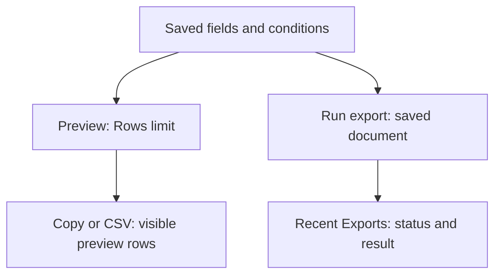

# Preview and export a data document

Open a saved document from `Data documents` > `Documents`.

## Preview the result

1. Save any changes to the document fields and conditions.
2. Open `Preview` and set the `Rows` limit.
3. Run the preview.
4. Confirm the columns and review representative rows.
5. Compare the result with the saved document fields and conditions.

An empty preview can be valid when no records match the conditions. Review `Issues` and `Conditions` before you change the document.

## Choose the output scope

Preview runs against the saved document. Its `Rows` value limits the rows loaded for review. Search and column sorting then change which loaded rows you see.

| Action | What it produces |
| --- | --- |
| `Copy` | The displayed preview rows after search and sorting |
| `CSV` in the preview table | A download of those displayed preview rows |
| `Run export` or the header `Export` action | A queued export of the saved document with its saved conditions, using the current default limit of 10,000 rows |

Preview search does not narrow a queued export. Save a condition in the document when that condition must apply to the exported data. If the expected result exceeds 10,000 rows, confirm an approved export plan before treating the file as complete.

## Review usage

Open `Usage` to understand where the document is referenced when usage information is available. Review dependencies before you remove or rename fields.

## Export the document

1. Save the latest changes.
2. Open `Preview`.
3. Select `Run export` in the preview table or `Export` in the header.
4. Confirm the `Data document export queued.` message.
5. Open `Recent Exports` or `Export history` and inspect the result.

Export processing can continue after you leave the builder. Use export history to confirm the final status.

## Schedule an email export

Use the schedule action when the document supports email delivery.

1. Open the schedule form.
2. Enter the recipient and delivery values requested by the form.
3. Select a frequency or enter a custom cron expression.
4. Review the human-readable schedule.
5. Save the schedule.

Share exported data only with approved recipients. Confirm the document fields before you add an email address.

## Pause or resume an export schedule

Open the schedule list in the builder, then select the pause or resume control for the required schedule. Confirm the resulting state before you leave the page.

## Review recent exports

Open `Recent Exports` to inspect exports for the current document. Select an export to open its detail.

Use [Export history](export-history.md) to investigate exports across documents.
