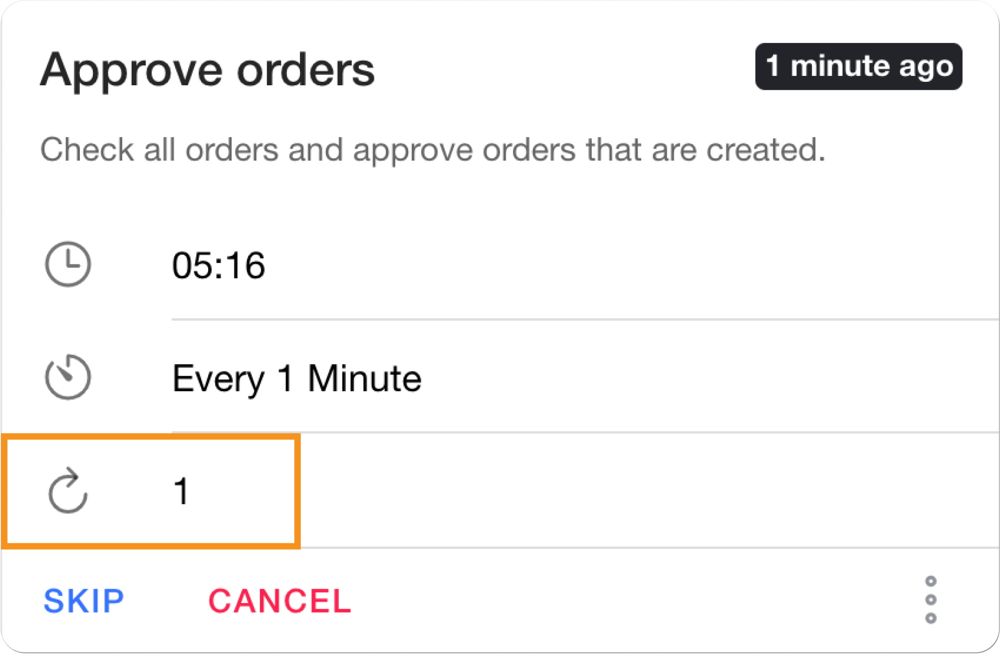

# Job queueing

Pipeline page

Provides a holistic view of all jobs, including their status, scheduled time, and execution details.

**Characteristics**

**Chronological sequence for prioritized execution**

Jobs are displayed in chronological sequence, ensuring that jobs with the closest expiration time are prioritized for execution.

**Timeline Visualization for Clear Execution Scheduling**

A highlighted time frame clearly depicts the job's runtime and scheduled frequency, providing a visual representation of the job's execution timeline.

**On-the-fly Editing for Dynamic Job Management**

Users can seamlessly skip, cancel, edit, or reschedule any pending jobs before they start running. This flexibility allows users to adapt to changing requirements and optimize job execution based on real-time needs.

**Customized Job Configurations for Tailored Execution**

Scheduled job parameters can be modified directly from the Job Pipeline page, enabling users to tailor job execution to specific needs. This flexibility allows for optimization of job performance and resource utilization.

**Detailed Job History for Analysis and Troubleshooting**

Comprehensive historical job data is readily accessible for analysis and troubleshooting purposes. Users can identify patterns, optimize job performance, and resolve recurring issues by examining historical job execution details.

<figure><figcaption></figcaption></figure>

### Segmentation

The Job Manager App shows all jobs (scheduled, running, or completed) on the Pipeline page, organized into three tabs: Pending, Running, and History.

#### Actions retailers can perform on a job card:

- **Change run time and frequency**: Use the dropdowns to update when and how often the job runs.
- **Edit custom parameters**: View, copy, and modify job-specific parameters with the `more` option on the job card.
- **Skip the job**: Temporarily skip the current run. The job will resume based on its schedule.
- **Disable the job**: Cancel the current and future runs. The job can only be manually re-enabled to run again.
- **View history**: Check the execution history and status (e.g., finished or failed).
- **Run Now**: Run the job immediately by creating a duplicate instance. This action is irreversible.
- **Copy job details**: Copy key job info like job ID, name, description, and runtime data.
- **Pin job**: Pin frequently used jobs for quick access at the bottom of the page.

#### 1. Pending Tab

This tab lists jobs in the **pending status**, meaning they are queued and waiting to begin execution. Retailers can take multiple actions from the job card, as listed above.

**Details visible in the Pending tab:**

- **Time**: Indicates when the job is scheduled to run, based on the timezone selected in the app.  
- **Frequency**: Indicates how often the job runs (e.g., every 15 minutes).  
- **Recurrence**: Displays the number of counts the job is retried once failed.
- **Job Enum ID**: An internal identifier used by HotWax to define the type or purpose of the job.  

#### 2. Running Tab

This tab lists jobs in the **running status** i.e jobs those are currently in execution. It allows retailers to monitor the active job.

**Details visible in the Running tab:**  
- **Start Time**: Indicates when the job started running.
- **Service Name**: Indicates which OMS service is executing the job.
- **Running Duration**: Indicates how long the job has been running.

#### 3. History Tab

This tab lists all jobs that have been **completed**, whether finished or failed. Retailers can add custom parameters, view job history, copy details, or pin the job card.

**Details visible in the History tab:**

- **Created By**: Shows the user who initially created the job.
- **Updated By**: Shows the user who last updated job parameters like schedule or frequency.
- **Time Zone**: Displays the time zone in which the job was executed.
- **Copy Job Info**: Retailers can copy fields like Job ID, Job Name, and runtime data for further use.



Displays all the jobs queued for execution.

<figure><figcaption></figcaption></figure>

<figure><figcaption></figcaption></figure>



Displays all the jobs running in the system.

<figure><figcaption></figcaption></figure>



Displays all the historical jobs. Historical jobs can be filtered by their status.

<figure><figcaption></figcaption></figure>



### **Search**

Easily locate specific jobs by name or category.



### Filters

Quickly find jobs by applying filters based on category and status.

<figure><figcaption></figcaption></figure>

### History
#### View Import Logs

The Data Manager log provides history of files imported into the OMS, including the file import status, processing timestamps, and any error records. These logs support tracking, analysis, and troubleshooting of file imports.

When accessing the Data Manager Log from the **Job Manager App**, users can directly view the following details:

- Number of successfully processed files.
- Number of failed files.
- Files with error records.

#### Detailed Log View
Clicking `View Details` redirects retailers to a detailed logs page where they can:

- Access individual logs with specifics like start and finished date and time, user information, and unique log IDs.
- Download the original file and failed records for further analysis.
- Filter logs to display only those that failed execution or contain error records.
- View file execution mode such as `Async` or `Queued` 

### Pin job

Keep frequently accessed jobs readily available for quick access. Pinned jobs will be visible in the footer.



### **Recurrence**

Displays the number of counts the job is retried once failed.

<figure><figcaption></figcaption></figure>
