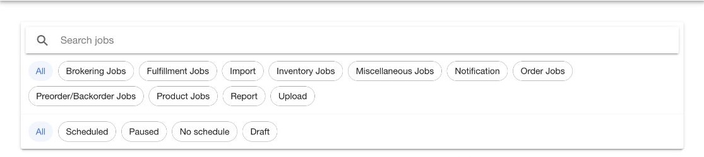

# Find a job

Open `Jobs` > `Catalog` to find service jobs available in the active HotWax Commerce instance.

<figure><figcaption>
Use catalog filters to narrow the available jobs.
</figcaption></figure>

## Search the catalog

Enter a job name, product identifier, or service name in `Search jobs`. Matching text is highlighted on each result.

Use the category chips to narrow the list:

1. Select a primary category.
2. Select a subcategory when the second row appears.
3. Select a status.

The catalog provides these status filters:

| Status | Meaning |
| --- | --- |
| `Scheduled` | The job has an active schedule |
| `Paused` | The job schedule is paused |
| `No schedule` | The job does not have a cron expression |
| `Draft` | The job definition is not available for normal execution |

Select `All` or clear the search to reset a filter.

## Read a job card

Each card can show:

- Job name
- Product identifier
- Service name
- Category
- Enabled, paused, unscheduled, or draft state
- Human-readable schedule

Select the card to open the job.

## Check the active product store

The selected product store can affect the jobs returned by the catalog. Check the product store in the app menu before you conclude that a job is missing.

## Continue to job details

Open [Manage a job](job-details.md) to review technical details, schedule, parameters, and history.
