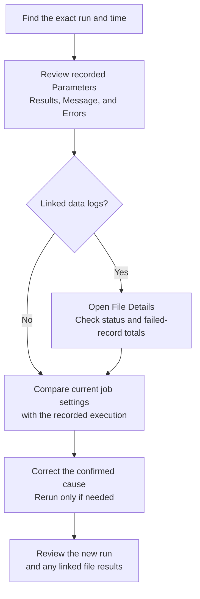

# Investigate job runs

Open `Jobs` > `Run history` to investigate service-job executions across the active instance.

## Review run totals

Use the summary cards to compare:

- Total runs
- Successful runs
- Failed runs
- Running jobs

The cards summarize the loaded runs after filtering. The current view loads up to 25 recent runs per job, so these totals do not represent all historical executions.

## Find a run

Use `Search by run, job, service, user, message, or result`, or combine these filters:

- `Status`: Running, Successful, Failed, or Terminated
- `Job`
- `User`
- `Data logs`: Has data logs or No data logs

Use `Previous` and `Next` to move through pages of results.

These controls paginate the loaded results; they do not fetch older runs for each job. To investigate an older execution, open the job's [History tab](job-details.md#review-job-history) and scroll to load more runs.

The active product store can exclude runs associated with another store. Confirm the selected store before treating a missing result as evidence that a job did not run.

## Read a run card

A run card shows the run identifier, job, service, status, start time, completion time, duration, user, and linked data-log count when available.

Select the card to open its job. Expand a section without opening the job to review:

- `Message`
- `Linked data logs`
- `Errors`
- `Results`
- `Parameters`

Select a linked data-log identifier to open the related [file detail](../mdm/file-details.md).

## Trace the execution evidence

Start with the exact run. Its recorded parameters describe that execution; the job's current settings may have changed since it ran. Sections appear only when the corresponding data is available.

Each linked file has its own processing status and record totals. Use [file-import recovery](../troubleshooting/file-imports.md#choose-the-next-check) when a file has failed records or needs correction.

## Investigate a failed run

1. Filter `Status` to `Failed`.
2. Find the affected job, time, or run identifier.
3. Expand `Errors` when available.
4. Review the available `Parameters` and `Results`.
5. Open each linked data log and check its status and record totals.
6. Open the job and compare its current schedule and parameters with the failed run.

Record the original error before you rerun or edit the job.

If you rerun the job after correcting the cause, inspect the new run and any linked file results before considering the recovery complete.
