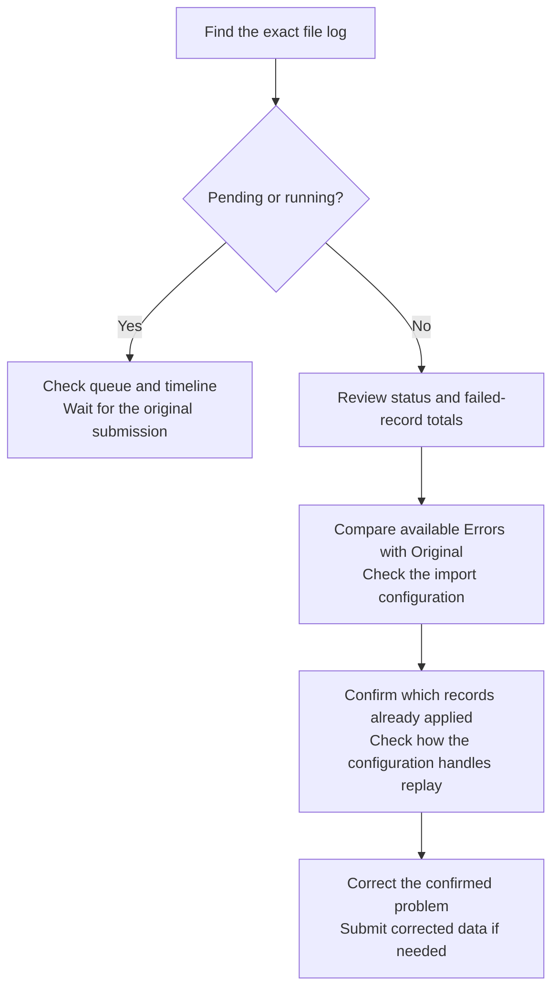

# Troubleshoot file imports

Open `MDM` > `File history` and find the exact file or log identifier.

## Choose the next check

Use the current status and record totals together. `Finished with errors` means processing finished with failed records; it still requires investigation.

## Investigate a pending file

1. Confirm the file status and submission time.
2. Review its priority and configuration.
3. Check whether earlier queued files are still processing.
4. Open the relevant file detail.
5. Review the processing timeline.

Do not upload the file again while the original submission remains pending.

Use the cancel action only when it appears for the pending record and you have confirmed that the file should not process.

## Investigate failed records

1. Open the file detail.
2. Select `Errors`.
3. Search for the affected record identifier.
4. Compare the error with the same row in `Original`.
5. Open the import configuration.
6. Correct the source data or confirmed configuration problem.
7. Confirm which records already applied and how the configuration handles repeated records.
8. Submit corrected data through `Manual uploads` when needed.

Cancellation or resubmission does not reverse records that were already processed.

The `Errors` tab appears only when failed records have an available error file. If the tab is missing, use the status, record totals, and linked job or backend logs to continue the investigation.

## Investigate a missing file

1. Confirm the active product store.
2. Clear File History filters.
3. Search by file name, configuration, and log identifier.
4. Confirm whether the submission succeeded.
5. Refresh file data from `Settings` > `Data Fetch Status`.

If the source system did not submit the file, investigate that integration before changing the import configuration.

## Check the queue poller

Queued imports depend on the configured bulk-file processing job.

1. Open `Catalog`.
2. Search for the bulk imported file processing job used by the instance.
3. Confirm its schedule and pause state.
4. Review recent runs and linked file logs.

See [Configure Data Manager](../../../../system-admin/administration/data-manager/README.md) for backend queue and configuration concepts.
