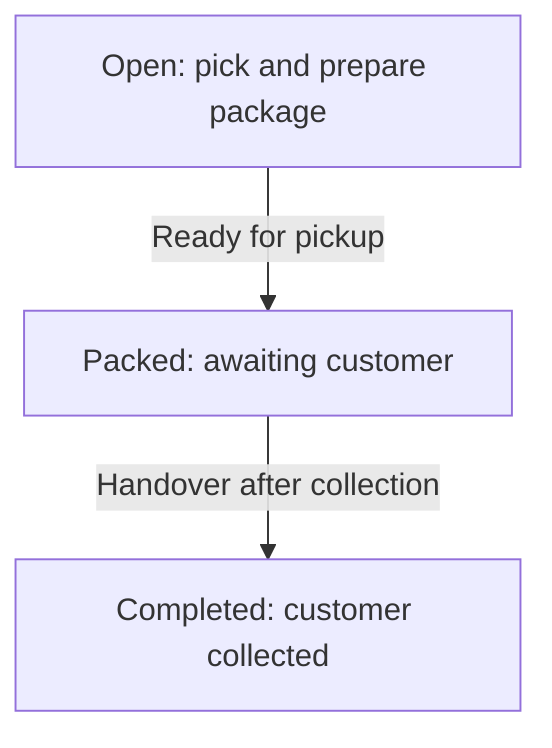

# BOPIS Fulfillment App

The BOPIS Fulfillment App is designed for store managers and associates, providing a focused interface to pick, pack, and hand over store pickup orders. The app also includes features to manage Ship-to-Store items, activate gift cards, and view notifications for new and open orders.

## Pickup lifecycle

Use the order tabs to distinguish preparation from customer collection. Mark an order ready only after its items are picked and the package is prepared. Record handover when the customer actually receives it.

`Ready for pickup` does not mean the customer has collected the order. Keep it in Packed while awaiting collection. See [Open Orders](open-orders-page.md), [Packed Orders](packed-order-tab.md), and [Completed Orders](completed-orders-tab.md) for actions at each stage.

This flow describes the store's pickup shipment. An order can have other shipments at different locations; review `Other Shipments` in Order Details when checking the full order's progress.

## Key Features

Along with pick and pack, the BOPIS App includes key features for order fulfillment:

### Catalog Page
The Catalog page lets store staff search for products and see if they’re available for pickup at the store. It shows useful details like product name, SKU, and how many units are in stock. 

### Orders Page
The Order Details page in the BOPIS App provides comprehensive information about orders and is for store associates to perform key functions such as order picking, packing, and marking orders as ready for pickup or picked up.

### Ship-to-Store Page
This page is used when a customer places a pickup order for a product that is not available at their selected store. In such cases, the item is shipped from another location to the store, where the customer can pick it up once it arrives.

### Gift Card Activation
When a customer buys a gift card online, store staff can activate it before handing it over during pickup.

### Notifications
Whenever a new BOPIS order is placed for store pickup, store associates receive a notification to take action. To access the notifications, tap the bell icon in the top right corner of the page.

## Pre-requisites
To access the BOPIS Fulfillment App, users must have the `BOPIS_APP_VIEW` permission.


This permission only allows viewing. To perform actions like Pick, Pack, view the `Order Details` page, and manage other store operations, store staff must also have the `COMMON_ADMIN` and `STOREFULFILLMENT_ADMIN` permission.

