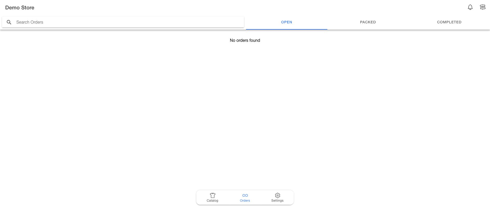

# Orders Page

The Orders page is the default page that opens up when a user logs in to the BOPIS app. It can also be accessed by clicking on the `Orders` button on the bottom tab of the BOPIS app. It displays a list of all the orders currently assigned to the facility for store pickup from the e-commerce platform, and it can be used to search, view and fulfill orders. This page reflects the journey of an order from receiving the pickup order via ecommerce platform till the order is complete.

<figure><figcaption>
Orders page in BOPIS App v5.2.3
</figcaption></figure>
