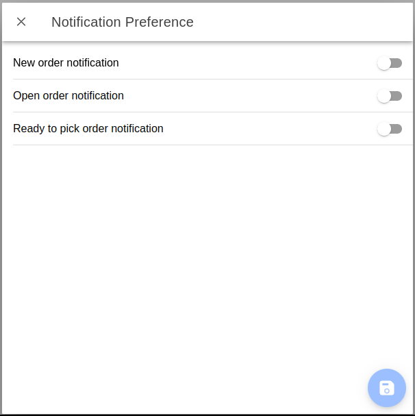

# Notifications

Timely notifications are crucial for store associates upon the arrival of a new order. BOPIS notifications provide updates on both new and open orders within a facility, significantly improving the efficiency of order preparation and handover procedures. Notifications can be viewed within the BOPIS app by clicking on the `bell` icon on the top right corner of the `Orders` page.

Store managers can customise the following notification preferences.

* **New Orders:** Receive notifications as new orders become available for fulfillment at the facility.
* **Open Orders Reminder:** Receive periodic reminders for open orders at the facility, helping users stay organised.
* **Ready for Pickup Orders Reminder:** Receive reminders for orders ready for pickup at the facility, ensuring timely customer communication.

Configure reminder frequency through the `Open BOPIS order notifications` service job in Job Manager.

1. Open Job Manager from the HotWax Commerce Launchpad.
2. Open `Catalog`.
3. Search for `Open BOPIS order notifications`.
4. Open the job.
5. Review its parameters and schedule.
6. Save the required frequency.

See [Manage a job](../../../retail-operations/workflow/job-management/jobs/job-details.md) for current scheduling instructions.

Users can configure the notification settings in two ways.

1. Users can click on the `bell` icon on the top right corner of the `Orders` page, this will open the `Notifications` page. Once they have accessed the Notifications page, they can click on the `settings` icon at the top right corner of the page and configure notification preferences.
2. Users can also use the `Notification Preference` card on the `Settings` page of the BOPIS app.

<figure><figcaption></figcaption></figure>
