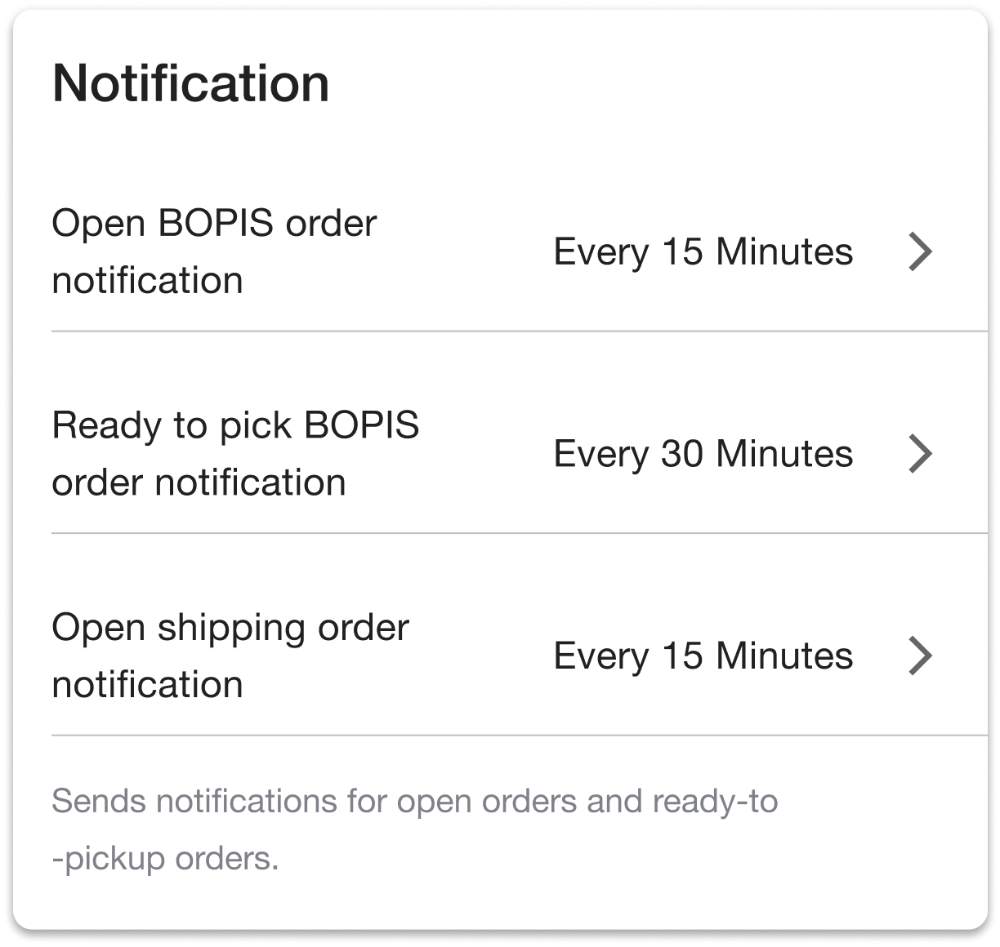

# Notification Error

## Not Receiving Notifications

If you are not receiving BOPIS notifications, consider the following troubleshooting scenarios:

### Check Internet Connection

Ensure that your device has a stable internet connection. Notifications rely on an active connection for delivery.

### Verify BOPIS App settings

Confirm that the BOPIS app has the necessary settings to send notifications. Go to the BOPIS app's settings page, and ensure that notifications are enabled for required topics.

### Confirm System Compatibility

Verify that OMS instance meets compatibility requirements:

* For BOPIS notifications to work, the instance should be on v5.2.0 or above.

### Review Browser Notification Settings

If you are using browser notifications, check the settings for your specific browser:

* **Safari:** [Manage Website Notifications on Safari](https://support.apple.com/guide/safari/manage-website-notifications-sfri40734/mac)
* **Chrome:** [Manage Notifications on Chrome](https://support.google.com/chrome/answer/3220216?co=GENIE.Platform%3DDesktop\&hl=en)
* **Firefox:** [Push Notifications on Firefox](https://support.mozilla.org/en-US/kb/push-notifications-firefox)

If you have blocked notifications in your browser, follow these steps to unblock and enable them:

* **Safari:** [Unblock Notifications on Safari](https://support.apple.com/guide/safari/manage-website-notifications-sfri40734/mac)
* **Chrome:** [Unblock Notifications on Chrome](https://support.google.com/chrome/answer/3220216?co=GENIE.Platform%3DDesktop\&hl=en)
* **Firefox:** [Unblock Notifications on Firefox](https://support.mozilla.org/en-US/kb/push-notifications-firefox)

### Review Operating System Notification Settings

Ensure that operating system notifications are enabled:

* **MacOS:** [Change Notification Settings on MacOS](https://support.apple.com/guide/mac-help/change-notification-settings-mchlpx1065/mac)
* **Windows:** [Change Notification Settings on Windows](https://support.microsoft.com/en-us/windows/notifications-and-do-not-disturb-in-windows-feeca47f-0baf-5680-16f0-8801db1a8466)

## Not Receiving Reminder Notifications

Check the `Open BOPIS Order Notifications` job when reminder notifications do not arrive:

1. Open Job Manager.
2. Open `Catalog`.
3. Search for `Open BOPIS Order Notifications`.
4. Open the job.
5. Confirm its pause state, parameters, and schedule.
6. Open `History` and review the latest run.

See [Troubleshoot job runs and schedules](../../../retail-operations/workflow/job-management/troubleshooting/job-runs-and-schedules.md).

<figure><figcaption></figcaption></figure>

**Contact Support**

If issues persist, reach out to our support team for further assistance. Provide details about your device, operating system, and any error messages encountered for resolution.
