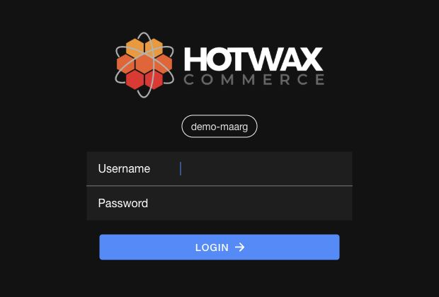
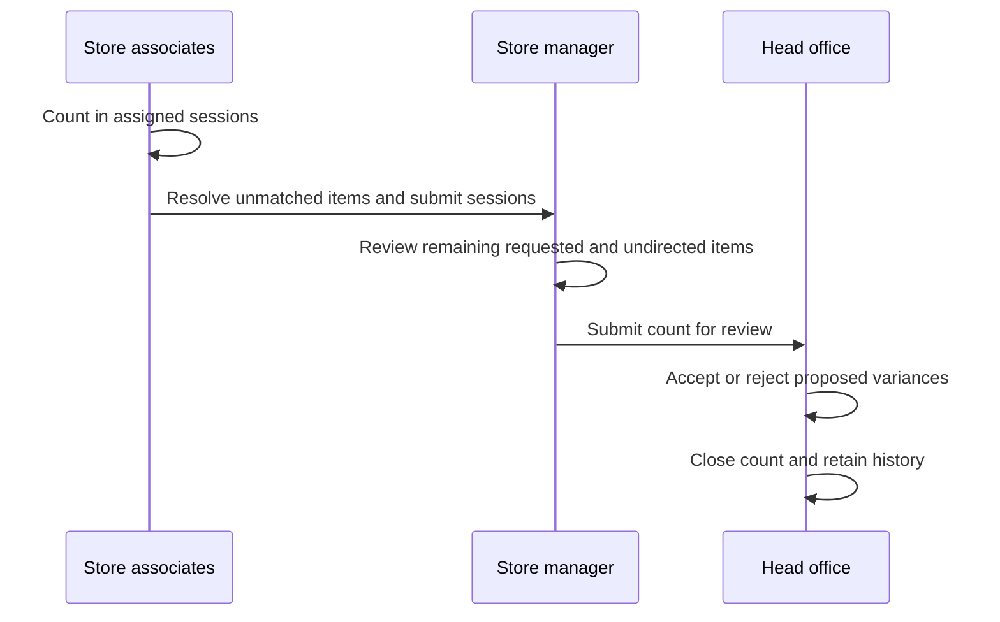

# Cycle Count Application: Store Operations User Manual

## Sign in to the correct instance

Open the Cycle Count app URL provided by your organization. If the app asks for an `OMS`, enter the instance name provided by your administrator and select `Next`. Check the instance name above the sign-in fields before entering your account credentials.

<figure><figcaption>
Confirm the selected instance before signing in. The demo instance shown here is an example; use your organization's instance.
</figcaption></figure>

## Dashboard

When the store associate or manager logs into the application, all assigned cycle counts appear on the dashboard. Each count card shows the type (Hard/Directed), name of the count, start date & time, and due date.

## Open app navigation

On a phone or tablet, use the top-left menu button on the list and settings pages to open navigation. On Assigned and Pending review, the separate top-right filter button opens filters for that page.

When opening the app inside Shopify POS, confirm that its selected facility matches the POS location. If login reports that your user is not associated with that location, ask an administrator to check your facility access and location mapping.

## From counting to final review

Submitting a session finishes one associate's work. Submitting the count sends the store's combined work to head office. These are separate steps; head office reviews the proposed variances before closing the count.

## Cycle count workflow

* [Plan your count with a preview](plan-cycle-count.md)
* [Create sessions and complete your count](start-complete-session.md)
* [Review counts at the store before submitting for review](count-progress-review.md)
* Review and approve variances at head office
* [Go back and review old counts and export](../../retail-operations/inventory/cycle-count/closed.md)


Inventory Cycle Count
