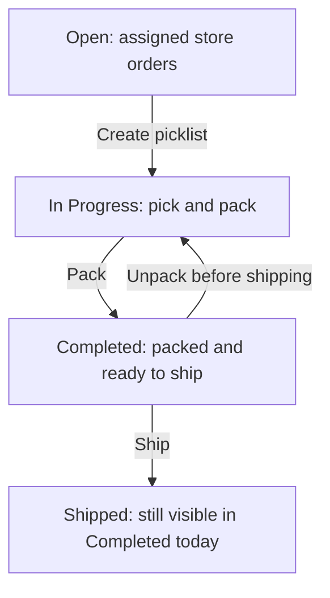

# Fulfillment App

The Fulfillment App is designed for store managers and associates, providing a focused interface to pick, pack, and ship orders. The app also includes features to create and update rejection reasons, manage carriers and shipping methods, and more.

## Fulfillment stages

The tabs describe the store shipment's work. `Completed` includes packed shipments awaiting shipping, as well as shipments shipped during the current day in the facility's time zone. Opening that tab does not establish that the entire order has shipped.

Creating the picklist starts the fulfillment work; it does not prove that staff have physically picked every item. Verify the products and quantities before packing. A packed shipment still needs the shipping step, and other shipments on the same order can remain open.

See [Open Orders](open-orders.md), [In Progress Orders](in-progress.md), and [Completed Orders](completed-orders.md) for the controls at each stage. The Shopify fulfillment update is a separate handoff; see [Order fulfillment sync](../../learn-shopify/shopify-integration/order-fulfillment/README.md).

## Key Features

Along with core functions like Pick, Pack, and Ship, the app includes helpful tools for both associates and managers:
 
- **Download Shipping Manifest for Carriers**: Managers can generate and download a shipping manifest. It is a detailed list of all ready-to-ship packages that will be shipped by a carrier.  
- **Gift Card Activation**: Associates can activate gift cards directly from the app to speed up in-store gift card fulfillment.  

## Pre-requisites to Use the App

To access the Fulfillment App, users must have the `FULFILLMENT_APP_VIEW` permission.
