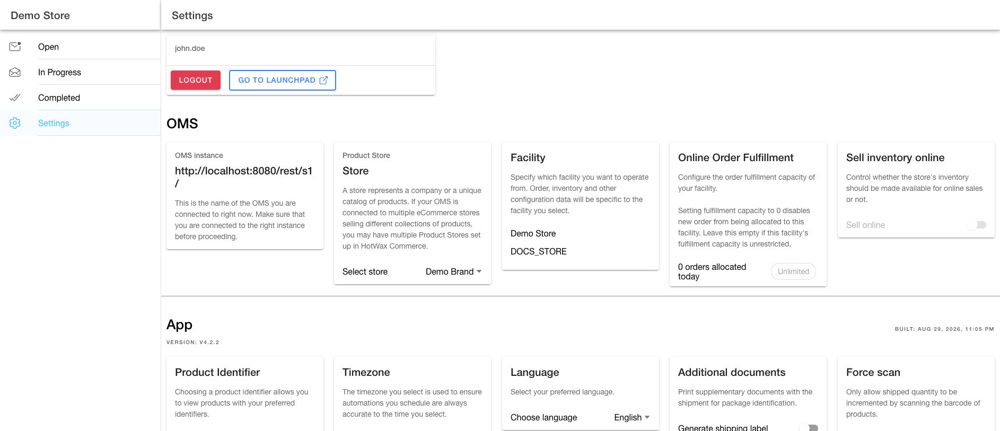
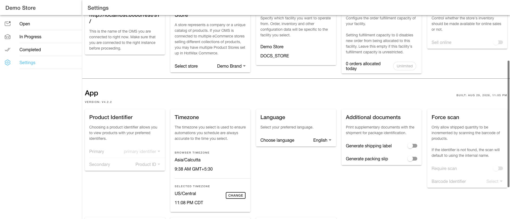

# Settings page

<figure><figcaption>
Settings page in Fulfillment App v4.2.2
</figcaption></figure>

Use the Fulfillment App Settings page to confirm which OMS, product store, and facility you are working in before fulfilling orders. The page also controls user preferences, notification preferences, fulfillment capacity, scan requirements, and rejection behavior.

Settings are grouped by scope:

| Scope | Applies to |
| --- | --- |
| User-specific | Only the current user. |
| Facility-specific | The selected facility. |
| Product store-wide | The selected product store and all users who work in that product store. |

## OMS

### OMS instance

`User-specific`

The OMS instance card shows the OMS environment connected to the app. Use it to confirm that you are working in the right environment before changing settings or fulfilling orders.

### Product store

`User-specific`

A product store represents a company, brand, or catalog. If the OMS is connected to multiple eCommerce stores with different product collections, select the product store you want to work in.

### Facility

`User-specific`

The facility setting controls the store or warehouse context for the app. Orders, inventory, notification topics, and facility settings depend on the selected facility.

### Online order fulfillment

`Facility-specific`

Set the number of orders the selected facility can receive for fulfillment.

* `0` means no new orders are allocated to the facility.
* Empty means the facility has unlimited capacity.
* A custom number limits how many orders can be allocated.

The card also shows how many orders are allocated to the facility today.

### Sell inventory online

`Facility-specific`

Use `Sell online` to control whether inventory from the selected facility is available for online sales. If the toggle is off, inventory from that facility is not included for online selling.

## App

### App version

`User-specific`

The app version card shows the installed Fulfillment App version and build information. Use it when checking whether a reported issue is happening on the current app version.

### Product identifier

`User-specific`

Select the primary and secondary product identifiers shown in the app. For example, you can show SKU as the main identifier and product ID as the secondary identifier. The card includes a product preview so you can confirm how items will appear during fulfillment.

### Timezone

`User-specific`

Select the timezone used for app dates and scheduled automation times.

### Language

`User-specific`

Choose the display language for the app.

### Additional documents

`User-specific`

<figure><figcaption>
App preferences in Fulfillment App v4.2.2
</figcaption></figure>

These settings control whether shipping labels and packing slips are printed along with each shipment by default.

#### Generate shipping label

A shipping label is used by the delivery carrier to send the package to the customer's address. This setting controls whether shipping labels should be printed for the selected location.

#### Generate packing slip

A packing slip shows the list of items in an order and helps match delivered products with what was ordered.

### Notification preference

`User-specific`

Select which fulfillment notifications you want to receive for the selected facility.

### Force scan

`Product store-wide`

This card contains two related settings for controlling barcode scanning behavior during order fulfillment:

* **Require scan:** Store associates must scan each product barcode to increase the shipped quantity.
* **Barcode identifier:** Select the product identifier used for barcode scans. If the selected identifier is not found, the scan falls back to the product internal name.

### Allow partial rejections

`Product store-wide`

When [partial rejection is enabled](rejection.md), store associates can reject individual items without rejecting the rest of the order.

### Collateral rejections

`Product store-wide`

[Collateral rejection](rejection.md) automatically rejects the same product from other pending orders at the facility when one order item is rejected.

### Affect QOH on rejection

`Product store-wide`

Use [Affect QOH on rejection](rejection.md) to control whether rejected quantities adjust quantity on hand (QOH) along with available to promise (ATP).
