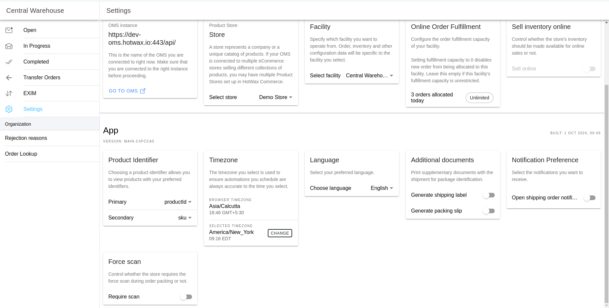
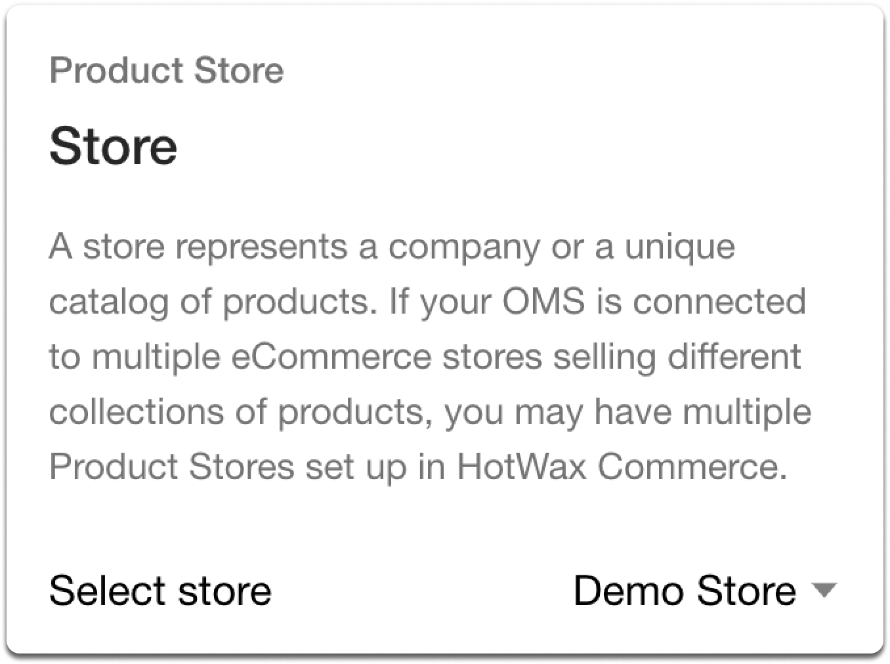
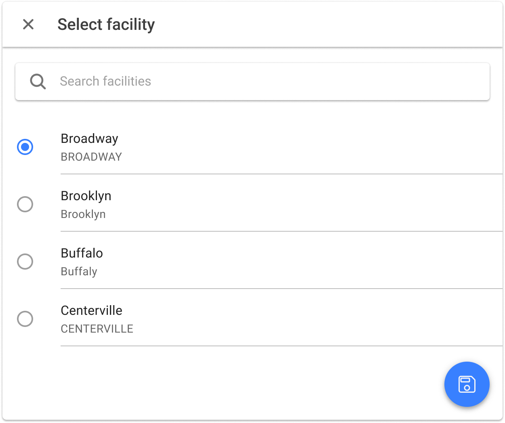
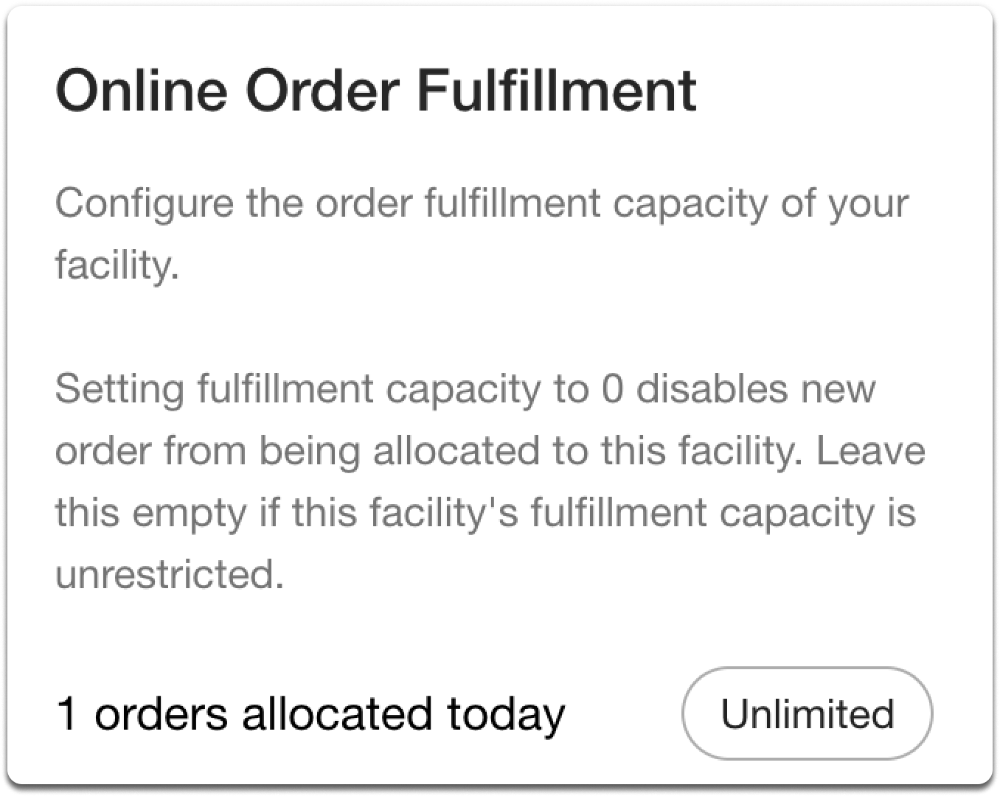
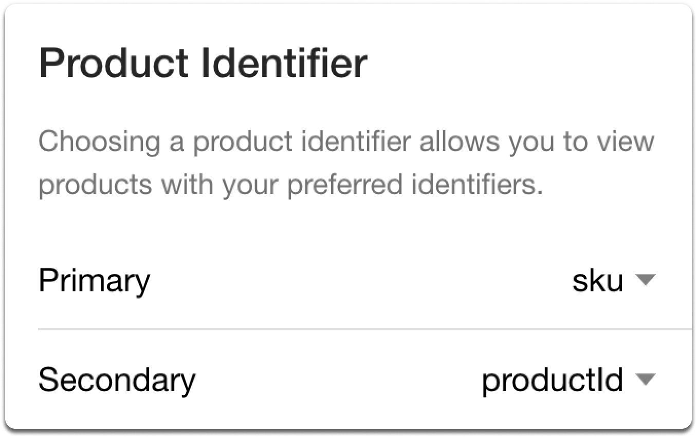
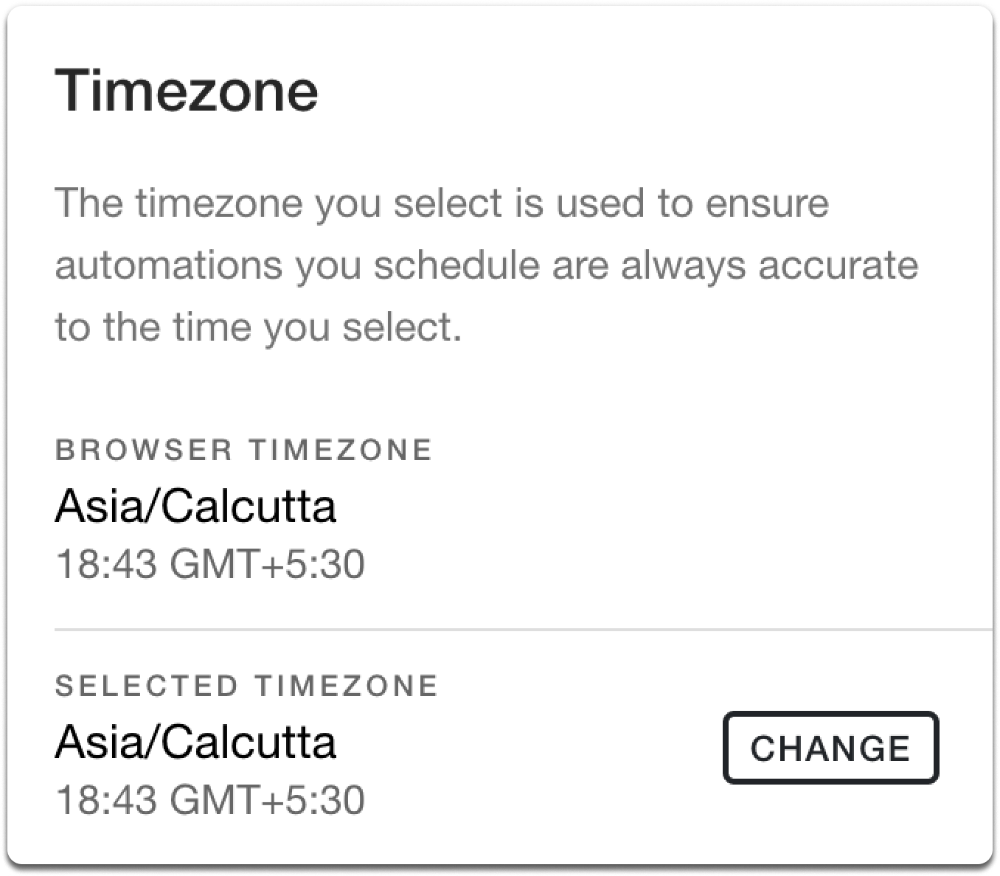
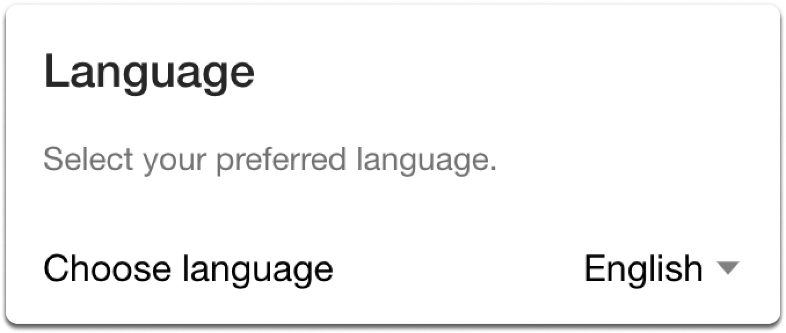
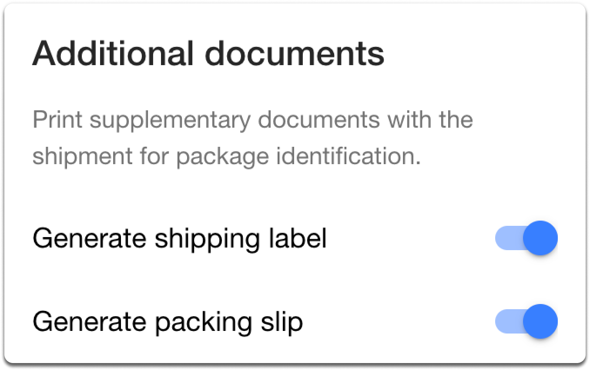

# Settings Page

<figure><figcaption></figcaption></figure>

Settings are categorized as either **product store wide** (apply across the entire company for all users), **facility-specific** (apply to the selected facility), or **user-specific** (apply only to the individual user).

## OMS

### Product Store

`User-specific`

A Product Store represents a brand or a set of products. If your OMS is connected to multiple eCommerce brands selling different product collections, you can have separate Product Stores in HotWax Commerce.

<figure><figcaption>
Select Product store
</figcaption></figure>

### Facility

`User-specific`

The Fulfillment App allows authorized users to select a facility to operate from, determining the visibility of orders, inventory, and other configuration data.

<figure><figcaption>
Select Facility
</figcaption></figure>

### Online Order Fulfillment

`Facility-specific`

Adjust the order fulfillment capacity for your facility. Setting fulfillment capacity to No Capacity disables new orders from being allocated to this facility. Select Unlimited Capacity if this facility's fulfillment capacity is unrestricted. You can also select a custom option to set a specific capacity limit.

<figure><figcaption>
Online Order Fulfillment
</figcaption></figure>

### Sell Inventory Online

`Facility-specific`

Determine whether the inventory of the store should be accessible for online sales or not. This setting allows you to specify whether the products available in your physical store should also be available for purchase through online channels or not. If enabled, customers browsing your online store will be able to see and purchase items from your inventory. If disabled, the products will not be listed for online sale, restricting purchases to in-store transactions only.

## App

### Product Identifier

`User-specific`

This setting allows selection of a primary and secondary product identifier, such as product ID or SKU, to control how products are displayed in the app.

<figure><figcaption>
Choose Product identifier
</figcaption></figure>

### Timezone

`User-specific`

This setting allows selecting an appropriate timezone to maintain consistency and optimize operations according to local time.

<figure><figcaption>
Select timezone
</figcaption></figure>

### Language

`User-specific`

Choose the preferred display language. This setting controls the language used throughout the interface.

<figure><figcaption>
Select Language
</figcaption></figure>

### Additional Documents

`User-specific`

These settings control whether shipping labels and packing slips are printed along with each shipment by default.

##### Generate Shipping Label
A shipping label is used by the delivery carrier to send the package to the customer's address. This setting controls whether shipping labels should be printed for the selected location.

##### Generate Packing Slip
A packing slip shows the list of items in an order and helps match delivered products with what was ordered. This setting allows deciding whether to print packing slips for shipments or not.

<figure><figcaption>
Additional Documents
</figcaption></figure>

### Notification Preference

`User-specific`

This setting controls whether store associates receive notifications for orders awaiting fulfillment.

### Force Scan

`Product store wide`

This card contains two related settings for controlling barcode scanning behavior during order fulfillment:

* **Require Scan:** When enabled, store associates must scan the barcode of each product to increment the shipped quantity. This prevents manual entry and helps reduce packing errors.
* **Barcode Identifier:** Select the product identifier (such as SKU, UPC, or internal name) that will be used when scanning barcodes. If the selected identifier is not found on a product, the scan will fall back to using the product's internal name.

### Allow Partial Rejections

`Product store wide`

When [Partial Rejection is enabled](/documents/store-operations/fulfillment/rejection.md), individual items get rejected from a facility without impacting the rest of the order.

### Collateral Rejections

`Product store wide`

[Collateral Rejection](rejection.md) helps manage situations where the product in a rejected order item is part of multiple pending orders at a facility. When enabled, rejecting an item in one order automatically rejects the same product in all other pending orders.

### Affect QOH on Rejection

`Product store wide`

[The Affect QOH on Rejection](/documents/store-operations/fulfillment/rejection.md) toggle provides control over inventory adjustments during order rejections.
