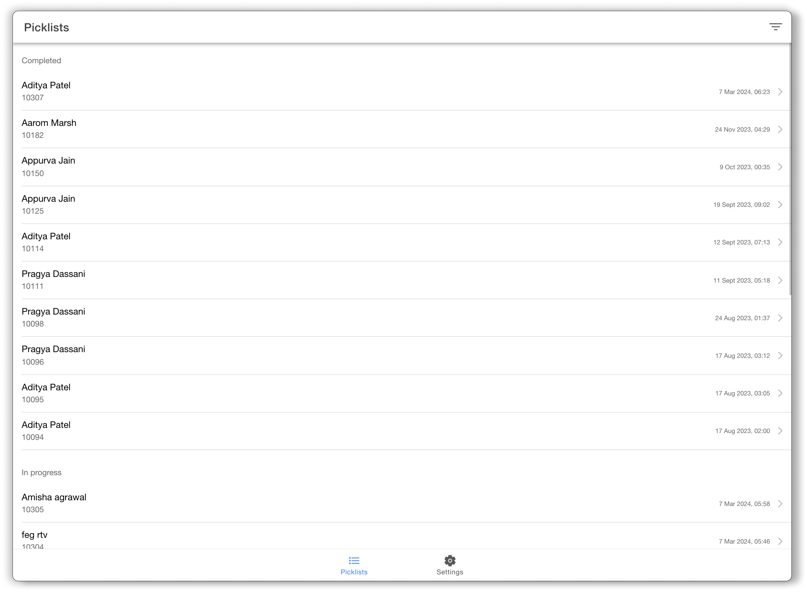
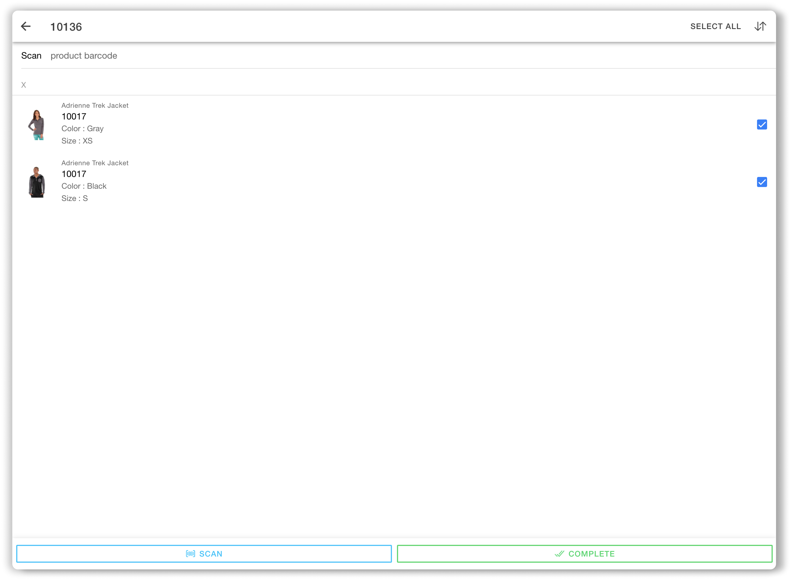

# Picking App

## Picklists

**Filters:** Using filters provides a focused view, highlighting the tasks that still need attention.

* Only show my picklists: Only show picklists associated with the logged-in user. Users can also see a picklist of other users by turning the toggle off to view other team members' picklists within a facility to make collaboration during fulfillment simpler.
* Hide completed picklists: Don't show recently completed picklists.

<figure><figcaption>
Image: Picklist Page
</figcaption></figure>

## Picklist Details

Shows the details of all the picklist items in a picklist for quick scanning and tracking to complete the picklist.

<figure><figcaption>
Image: Picklist Detail page
</figcaption></figure>

### Search

Search for a picklist item by typing in the product SKU.

### Scan

Use the built-in scanner to scan products to search the picklist items, eliminating the manual effort of searching an item.

### Select Item

Select the picklist items by clicking on the checkbox for the picked item.

### Select all

Select all the picklist items with a single click to quickly acknowledge the completion of all picklist items.

### Complete a Picklist

Complete a picklist to initiate the packing process.

