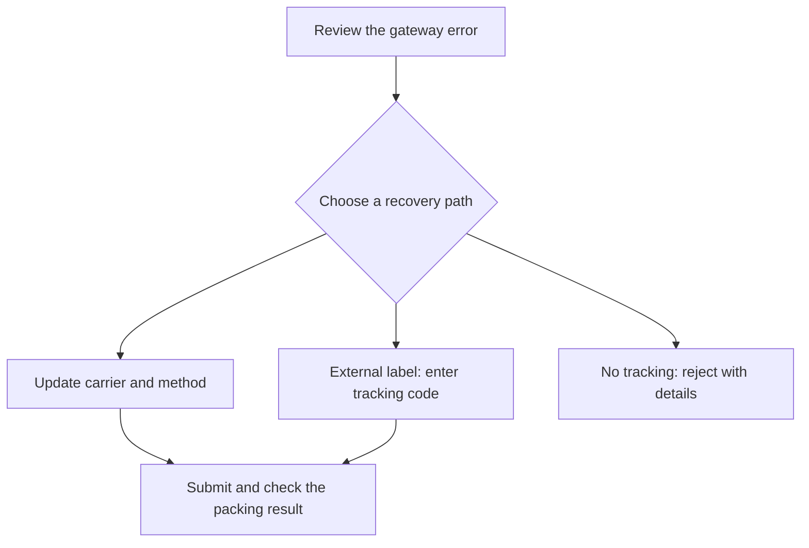
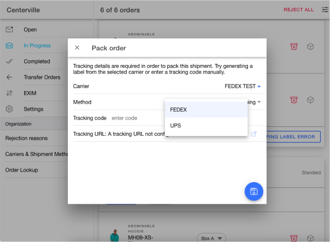

# Shipping Label Generation

## Shipping Label Generation

If you encounter difficulties generating a shipping label within the `HotWax Commerce Fulfillment App`, it may be attributed to incorrect configurations of the shipping carrier, incomplete facility associations, or missing customer details. Here are some cases that may result in shipping label generation errors:

### Verify Shipping Carrier is set up in HotWax Commerce

**Case: Shipping Carrier Not Set Up in HotWax Commerce**

HotWax Commerce relies on the accurate setup of shipping carriers to facilitate the generation of shipping labels. Without a properly configured carrier, the system lacks the necessary information to process and generate shipping labels for orders.

Resolution:

1. Verify if the shipping carrier corresponding to the desired shipping method is set up in HotWax Commerce.
2. For more details, refer to the [documentation on creating a carrier in HotWax Commerce](../../system-admin/fulfillment/shipping-methods/carrier-and-shipment-methods.md).
3. Ensure the carrier setup includes accurate details relevant to the shipping method.

**Case: Shipping Gateway Configurations Missing**

Shipping gateway configurations are essential for HotWax Commerce to communicate with external shipping services and facilitate the exchange of shipping data. Without proper configurations, the system cannot communicate with shipping gateways to process shipping labels.

Resolution:

1. Check if the carrier data has been successfully loaded into HotWax Commerce.
2. Follow the steps outlined in the documentation to [add shipping gateway configurations](../../system-admin/fulfillment/shipping-methods/shipping-gateway.md).
3. Ensure that the shipping gateway configurations are accurately entered and correspond to the carrier data.

**Case: Shipping Method Not Configured**

Shipping methods need to be configured within HotWax Commerce to map the shipping method the customer selected during the checkout process on Shopify with the shipping method provided by the carrier.

Resolution:

1. Verify if the shipment method corresponding to the carrier is set up in HotWax Commerce.
2. Follow the documentation to [set up shipping methods](../../system-admin/fulfillment/shipping-methods/shipping-gateway.md#add-shipment-methods).

**Case: Shipment Boxes Not Configured for Carrier**

Proper configuration of shipment boxes within HotWax Commerce ensures accurate label generation by providing the necessary dimensions and specifications for packaging orders.

Resolution:

1. Follow the steps outlined in the documentation to [configure shipment boxes for the carrier](../../system-admin/fulfillment/shipping-methods/shipping-box.md#adding-shipment-boxes-for-specific-carriers).
2. Ensure that the dimensions and specifications of the shipping boxes are accurately entered to facilitate accurate label generation.

### Check Facility Association

**Case: Facility Not Associated with Shipping Carrier**

In HotWax Commerce, shipping labels are generated based on the association between facilities and shipping carriers. If the facility for which a shipping label is being generated is not associated with the relevant shipping carrier, the label generation process will fail.

Resolution:

Verify Facility Association: Confirm that the facility for which the shipping label is being generated is properly associated with the corresponding shipping carrier. Refer to the [shipping gateway documentation](../../system-admin/fulfillment/shipping-methods/shipping-gateway.md) for guidance on associating facilities with carriers.

**Case: Shipping Label Generation Disabled for Facility**

HotWax Commerce provides the option to enable or disable shipping label generation for individual facilities. If this feature is disabled for the facility from which orders are being fulfilled, shipping labels cannot be generated.

Resolution

1. Access Facility Details: Navigate to the Facility Detail page within the Facilities App to access the settings for the relevant facility.
2. Enable Label Generation: Locate the toggle for "Generate Shipping Label" and ensure it is switched on to allow for shipping label generation.
3. Retry Label Generation: After enabling shipping label generation for the facility, attempt to generate the shipping label again for the affected order.

**Case: Missing Facility Phone Number**

A valid phone number associated with the facility is often required by shipping carriers for shipment notifications and communication purposes. Failure to provide this information may result in errors during label generation.

Resolution

1. Edit Address Section in Facility detail page: Open the facility from the `Facilities App` and update the phone number from the [`Address and Contact Details`](../../system-admin/administration/facilities/manage-facility-details.md#manage-address-and-contact-details) section.
2. Retry Label Generation: After adding the phone number, attempt to generate the shipping label again for the affected order.

### Check Customer Information

**Case: Customer Address Not Compatible with Shipping Method**

Shipping methods may have specific requirements or restrictions based on the destination address. If the customer's address does not meet the criteria set by the shipping method (e.g., international shipments not supported), the shipping label generation process may fail.

Resolution:

1. Facility Rejection: Reject the order from the facility if the customer's address does not comply with the shipping method requirements.
2. Manual Release: Manually release the order and assign it to a facility located in the customer's country.
3. Fulfillment from Appropriate Facility: Fulfill the order from the facility aligned with the customer's country to ensure compatibility with the shipping method.

**Case: Incorrect Customer Zip Code**

Accurate zip code information is crucial for generating shipping labels, as it ensures the delivery of packages to the proper location. If the customer's zip code is incorrect, label generation may fail.

Resolution:

1. Facility Rejection: Reject the order from the facility to prevent incorrect label generation.
2. Edit Customer Address: Navigate to the Sales Order > View Order page for the affected order ID.
3. Update Zip Code: Access the Item Groups section and click on the pencil icon next to the address to edit the information.
4. Save and Broker Order: Enter the correct zip code, save the address changes, and broker the order again for fulfillment.

**Case: Missing Customer Contact Number**

Customer contact numbers are often required by shipping carriers for notification purposes and to facilitate communication regarding delivery. If the customer's contact number is missing, label generation may encounter errors.

Resolution:

1. Facility Rejection: Reject the order from the facility to prevent label generation until the issue is resolved.
2. Edit Customer Information: Access the order details and edit the customer's address to include the contact number.
3. Save and Broker Order: After adding the contact number, save the changes, and broker the order again for fulfillment.

If the issues persist despite following the troubleshooting steps, consider reviewing the specific requirements of the shipping method or contacting HotWax Commerce support for further assistance.


If you are using test APIs, then there may be a slight delay in shipping label generation, wait for a few minutes and try generating label again, if it's not generated on the first try.


## Choose a recovery path

When packing fails and the app cannot fetch a shipping label, the `Add tracking details` dialog offers three recovery paths. Review its `Gateway error` before choosing an action. The separate `Shipping label error` button on an order card opens the carrier's error details; it does not open the tracking form.

| Dialog tab | When to use it | What to review |
| --- | --- | --- |
| `Update carrier` | Another configured carrier and method can serve the shipment | Select from carriers associated with the facility and their configured shipment methods |
| `Manual tracking details` | A label was generated outside HotWax Commerce | Select the carrier and method, then enter the real carrier tracking code |
| `Reject order` | You cannot provide tracking for this shipment | Confirm the rejection checkbox and add troubleshooting details for the operations team |

### Try a different carrier

1. Select `Update carrier` in the `Add tracking details` dialog.
2. Choose an available `Carrier` and `Method`.
3. Select the submit icon at the bottom right.
4. Check the packing result. If the dialog remains open with an error, investigate that error before trying another action.

Available choices come from the facility's carriers and the product store's shipment methods. If the required carrier or method is missing, ask the administrator to review the [carrier and shipment method configuration](../../system-admin/fulfillment/shipping-methods/carrier-and-shipment-methods.md).

### Enter tracking from an external label

1. Generate the label through the approved carrier process outside HotWax Commerce.
2. Select `Manual tracking details` in the `Add tracking details` dialog.
3. Review the `Carrier` and `Method`, then enter the carrier's `Tracking code`.
4. Review the displayed tracking URL. It uses the selected carrier's configured URL; this dialog does not provide a tracking-URL input. Use `Test` when available to open the URL with the entered code.
5. Select the submit icon and check the packing result.

Entering a tracking code does not generate a new carrier label. If the app reports that the carrier has no tracking URL configured, ask the administrator to review the carrier configuration.

### Reject when tracking is unavailable

Select `Reject order`, confirm that you cannot provide tracking, and add the gateway error or other useful troubleshooting details. Submit the rejection and check the resulting order state. The dialog states that this rejection does not affect inventory for the ordered items at the store.

<figure><figcaption>
Earlier dialog layout. Current versions separate Update carrier and Manual tracking details into tabs.
</figcaption></figure>
