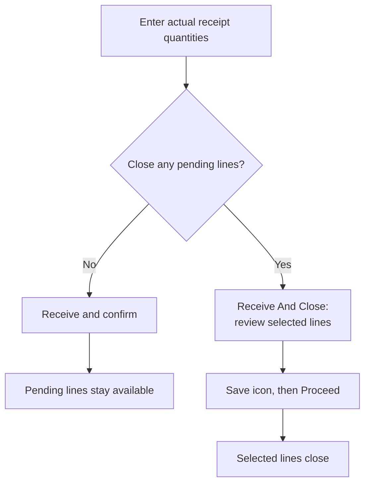

# Returns and purchase orders

The Receiving app also supports purchase-order receipts and return receipts. These flows share core actions such as barcode scanning, quantity entry, progress indicators, and inventory updates, but their screens are not identical to the transfer-order workflow.

## Purchase orders

Purchase orders are supplier-facing inventory orders that can be received directly in the app.

### Purchase orders list

The `Purchase Orders` page includes:

* A search bar.  
* `Open` and `Completed` filters.  
* Refresh and load-more controls.

Open purchase orders include records in `Created` or `Approved` status.

### Purchase order detail

The Purchase Order detail page shows:

* A scan field and camera-based scanning action while the order is still open.  
* Pending and completed item sections.  
* Item cards with product image, identifiers, facility location, `Qty`, `Receive All`, a progress bar, and received history.  
* `Receive` and `Receive And Close` actions.

Use `Receive` to post the quantities that arrived while keeping pending items available for later receipts. Use `Receive And Close` to post entered quantities and close the items you select in the closing dialog.

Purchase orders support partial receiving across multiple receipts, so users can receive inventory in stages as shipments arrive.

### Choose what to close

Enter only quantities physically received. Then choose the action according to whether you need to close any pending lines:

In `Close purchase order items`, review every checked line before saving. Lines with earlier receipts can already be checked. Uncheck a pending line if more units are expected; use `Select all` only when all remaining lines should close. Completed or rejected lines cannot be selected for another closure.

Tap the Save icon, then review the warning and select `Proceed`. The selected lines will no longer be available for receiving. Closing a line does not mean its full ordered quantity arrived: only the entered receipt quantities are added to inventory.

### Review receiving history

Select the history icon in the purchase order header to review all receipts, or select an item's received-history chip to review that product. Each history row shows the product image, your configured primary and secondary identifiers, product features such as size and color, accepted and rejected quantities, receipt time, and receiver name. If the primary identifier is unavailable, the product name appears instead.

Use the identifiers and features together to distinguish similar variants before investigating a quantity discrepancy. This dialog reviews recorded receipts; it does not change received quantities.

## Returns

The `Returns` section is used to receive return shipments and add returned stock back into inventory when applicable.

### Returns list

The `Returns` page includes:

* A search bar.  
* `Open` and `Completed` filters.  
* Refresh and load-more controls.

Users can search returns by values such as return shipment ID, tracking code, external ID, HotWax order ID, or Shopify order name.

### Return detail

The Return detail page shows:

* Return header information and status.  
* A scan field and camera-based scanning while the return is still receivable.  
* Item cards with product image, identifiers, QOH, `Qty`, `Receive All`, and a progress bar against the returned quantity.  
* A floating action button to complete receiving when at least one quantity has been entered.

If the return is already completed or no longer receivable, the same field is used to search and highlight items instead of updating quantities.

### Confirm a return receipt

Enter or scan the quantities that physically arrived, then tap the floating checkmark button. At least one positive quantity and receiving permission are required. Review the `Receive Shipment` confirmation before selecting `Proceed`: it warns that these quantities cannot be edited afterward in this flow.

The app returns to the Returns list after a successful receipt. Lines with earlier receipts have no manual `Qty` or `Receive All` controls, and this flow excludes them from the next receipt. If a response is unclear, check the recorded receipt in OMS before submitting the quantities again.

## Related guides

* For transfer-order receiving, see [Transfer Orders](transfer-orders.md).
