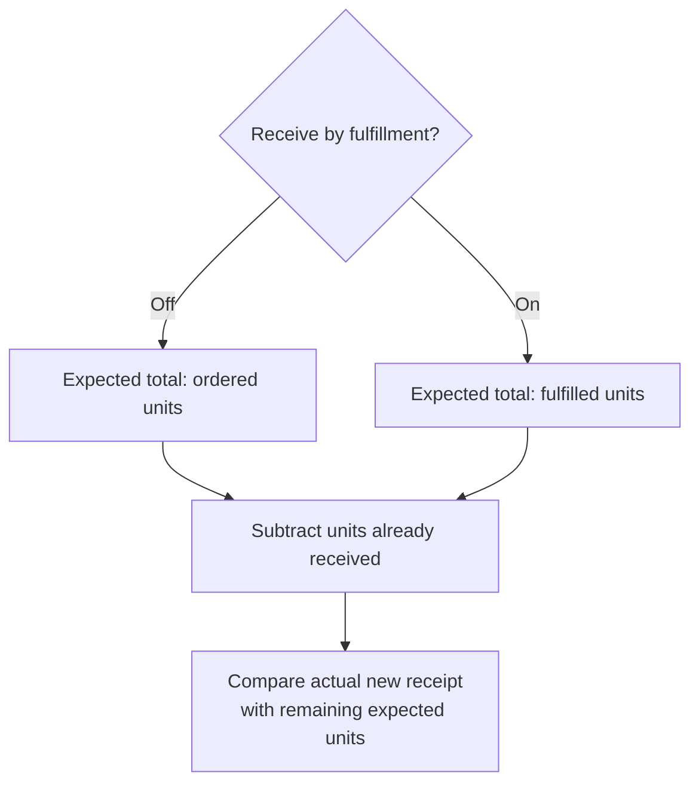

## Settings

In the Settings section you can:

* View your profile details such as user ID, name, and avatar (if available).  
* Log out of the app (when not embedded) or return to Launchpad.  
* View the order management system (OMS) instance and the facility you are connected to, and switch facilities when needed.  
* View the app version information.  
* Configure product identifiers. For example, select a primary identifier such as UPCA or SKU and a secondary identifier if needed.  
* Change your time zone. The selected time zone determines how timestamps appear throughout the app.  
* Enable Force scan. When enabled, associates can increment received quantities only by scanning barcodes.  
* Choose the barcode identifier used for Force scan. If the identifier is not found, the scan defaults to the internal name.  
* Set the receiving flow type for transfer orders by enabling or disabling Receive by fulfillment.  
* Some options may be hidden or disabled based on your permissions.

### Receive by fulfillment (transfer orders)

Use this setting when receiving should be based on what the warehouse fulfilled instead of the original ordered quantity. It only impacts transfer orders.

When Receive by fulfillment is enabled:

* Item cards show fulfilled quantity instead of ordered quantity.  
* The Unfulfilled items count appears in the header to highlight items with no fulfilled quantity.  
* Scan all, progress bars, and completion checks use fulfilled quantity as the target.
* Save progress and Receive and complete totals compare received units against fulfilled units.  
* Over- and under-receipt checks are calculated against fulfilled quantities.

When Receive by fulfillment is disabled, the app uses the ordered quantity for all of the above behaviors.

### Which quantity is expected?

Check `Receive by fulfillment` before interpreting a shortage. The setting changes the expected quantity; enter only the units that physically arrived.

For example, a line has 100 units ordered, 60 fulfilled, and 20 already received:

| Setting | Expected total | Remaining expected |
| --- | --- | --- |
| Off | 100 ordered | 80 units |
| On | 60 fulfilled | 40 units |

`Scan all` fills the remaining expected quantity when available. Verify that quantity against the delivery before saving. This setting does not mean the remaining ordered units have been shipped or received.

See [save progress or complete](transfer-orders.md#choose-whether-to-save-or-complete) to choose an action after entering actual quantities.
