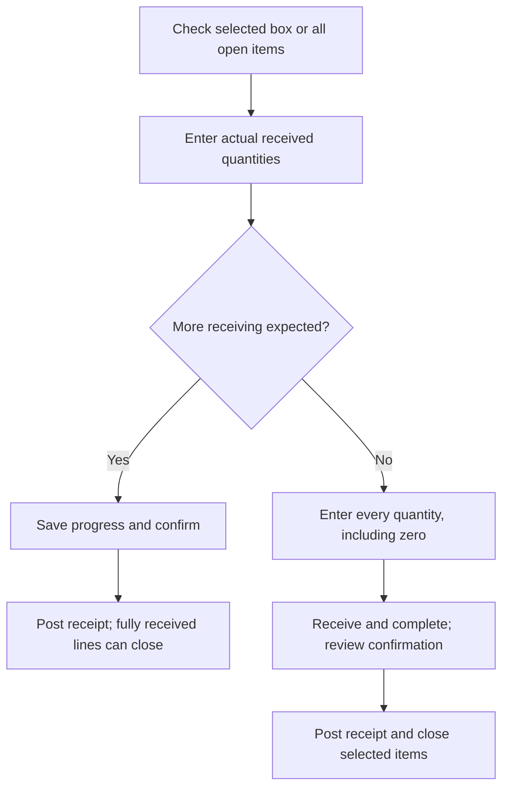

# Transfer orders list

Within the Transfer Orders section you will see an Open tab and a Completed tab. The Open tab displays transfer orders waiting to be received; the Completed tab contains orders that have already been closed. A search bar at the top lets you filter by transfer order number. When there are no open orders, an illustration appears with a message “There are no transfer orders to receive”.  
Each transfer‑order item shows the transfer order name (e.g., to-test-11), the corresponding internal ID. Clicking an item opens the detail page for that order. If the list is long, use the Load more transfer order button at the bottom to fetch additional entries.

## Receiving a transfer order

### Understanding the detail page

When you open a transfer order, you land on the Transfer Order Detail page. A banner at the top tells you how many items still need to be received. For example, it may state “There are 1 open item(s) to be received; enter a quantity for all items before completing” with a small info icon labelled Tap to learn more. Clicking this icon opens a modal explaining the steps needed to complete the order and reminds you to enter zero for items you did not receive. If Receive by fulfillment is enabled in Settings, the header also shows an Unfulfilled items count for items that have no fulfilled quantity.  
Below the banner are:

* A Scan items field and Scan button. The input field labelled Scan items accepts barcodes from a handheld 2D scanner in HID (keyboard) mode—simply scan a product and press Enter to increment its quantity. The matching item card automatically scrolls into view and a toast message (“Scanned MH09MRedHC successfully”) confirms the scan. The Scan button with a camera icon opens a camera‑based barcode scanner when permissions are enabled; if permissions are not granted, a message appears prompting you to allow camera access.  
* A set of tabs labelled All, Open and Received and Completed. These tabs filter the item list.  
  * All shows every item on the transfer order.  
  * Open lists only items that still need quantities (blank or partially received).  
  * Received and Completed lists items that have been closed.

Switching to the Open tab is useful when working through large orders.

### Item cards

Each item appears as a card containing:

* Product image and SKU – helps identify the product.  
* On‑hand quantity – a chip (for example, “19 on hand”) shows how many units are currently in your store.  
* Qty field – a numeric input where you type the quantity received. The field is blank by default. Clicking inside the field displays a cursor; you can type a value or use the up/down arrows to adjust.  
* Scan all button – fills the quantity field with the remaining expected quantity for that item. Use this when you physically receive the full shipment.
* Progress bar and badges – a horizontal bar reflects how much of the expected quantity you have entered. To the right are two numbers: the first shows how many units were received in previous sessions, and the second shows the expected quantity (for example, “0 received 10 ordered”). When your entry equals the expected quantity, the bar turns green; if the number exceeds it, the bar turns red to highlight a potential error. If Receive by fulfillment is enabled, the expected quantity is the fulfilled quantity instead of the ordered quantity.

When manual entry is available, enter the quantity you physically received for each line item. Force scan settings disable manual quantity entry and bulk scanning. If you did not receive any units, type 0 instead of leaving the field blank; blank fields will prevent you from completing the order. You can also scan barcodes into the Scan items field to increment the quantity automatically; scanning the same code multiple times increases the quantity each time.

### Review receiving history

Select the history icon in the order header to review all receipts, or select an item's received-history chip to review that transfer-order line. Rows show the product image, your configured primary and secondary identifiers, product features, accepted and rejected quantities, receipt time, and receiver name. A missing primary identifier falls back to the product name.

Check size, color, and identifiers together when several lines look similar. History is read-only and does not correct a receipt or close the transfer order.

### Saving progress vs completing the order

At the bottom of the detail page you will see a bar showing your progress and two actions: Save progress and Receive and complete.

* Save progress – Use this when more units are expected. Review the inventory-update confirmation, or acknowledge any over-receiving discrepancies before saving. The app posts the entered quantities and returns to the transfer-order list. Fully received items automatically move to Received and Completed; items still awaiting inventory remain open.
* Receive and complete – Use this when you are ready to close the selected scope. If some quantities are blank, the action shows the items that need an actual quantity or 0, with a Back to open items link. Enter every missing quantity before continuing. When quantities match expectations, confirm with Proceed. When discrepancies exist, acknowledge every listed discrepancy and select Complete transfer order. Those checkboxes verify discrepancies; they do not choose the items to close.
* Empty quantities – The app requests a quantity for at least one item when the action has no eligible receipt quantities. While a receipt is being processed, quantities need readback, or the page has a draft conflict, receiving actions are disabled. Resolve the displayed issue before continuing.

If an error occurs while completing the order, you may see “Error in receiving transfer order”. Check receiving history or OMS to establish whether the receipt was posted, then refresh the quantities before another submission. If the app shows `Review receipt`, verify the outcome before selecting `Resolve reviewed receipt`; this clears the draft quantities without submitting inventory. Contact support if you cannot establish the outcome.

### Choose whether to save or complete

Use `Save progress` when more inventory is expected later. It posts the quantities you receive now, and fully received lines can close automatically. Use `Receive and complete` when you have finished receiving the items in the selected scope, including any shortages you have verified.

If the page has a box selected, review that scope before confirming: only visible items in that box are received and completed; hidden items remain open. With no box selected, the action covers the order's open items.

If the receipt response is lost or the page says a receipt was saved but quantities need refreshing, check receiving history and refresh the totals before submitting again. A missing response does not prove that inventory was unchanged.

### Using the scan feature

Scanning barcodes can speed up receiving, especially for large orders with many units. There are two scanning modes:

* HID scanner mode – At the top of every transfer‑order detail page is a Scan items input field. When you use a handheld 2D scanner configured in HID (keyboard) mode, each barcode you scan is typed into this field. Pressing Enter (or the scanner’s trigger) adds one unit to the matching item, scrolls that item card into view and displays a toast notification confirming the scan. Re‑scanning the same item increments the quantity again.  
* Camera mode – Clicking the Scan button opens a camera‑based scanner. The app requests camera permission the first time; if granted, a scanning window appears. Align the barcode within the frame. When a barcode is detected, the app automatically increments the quantity for the matching item by one. If the barcode is not recognized or the product is not part of the transfer order, you will see a message.

Scanning can be repeated until the expected quantity is reached. If you later determine that the scanned count was incorrect, click inside the Qty field and edit the number before saving progress or completing the order.

## Tips for efficient receiving

* Use the search bar on the dashboard to quickly locate a specific transfer order.  
* Work through the Open filter on the detail page to focus on outstanding items.  
* Use Receive All when the full ordered quantity has arrived; otherwise, manually enter the quantity.  
* Enter 0 for items you did not receive rather than leaving the field blank – blank fields prevent order completion.  
* Save progress periodically on large orders to avoid losing work if you need to step away.  
* If you encounter a scanning error (for example, camera permission denied), check your browser settings and grant camera access.  
* Review the confirmation modal carefully before completing an order; once completed, the order moves to the Completed tab and cannot be reopened.

## Receiving unexpected items

At times, stores receive items that differ from the recorded shipment. This discrepancy could arise from mispicking at the warehouse or inadvertently shipping more items than intended. When stores unexpectedly receive these extra items, they require a process to receive and record these additional items effectively.

### How to receive unexpected items

1.  **Add Product**: Click the `(+)` icon located at the top right corner of the Transfer Order Detail page. This will open a box to search for and add a product to the order.
2.  **Search and Select**: Search for the product by its SKU or name. Once the product appears in the search menu, click the `Add to Transfer Order` button to include it.
3.  **Enter Quantity**: The product will then appear on the Detail page. Enter the quantity of the unexpected item and proceed with the usual receiving process.

## Handling discrepancies and reconciliation

Before closing an order, the app checks whether any items have been received in quantities different from what was fulfilled. If you attempt to Save progress or Receive and complete with an over‑receipt or under‑receipt, a Save receiving progress modal appears summarising the affected items and highlighting how much was over or under. You must select the items or mark them as a discrepancy to proceed. This in‑app review step reduces accidental over‑receipts and ensures you acknowledge exceptions.  
The receiving app then integrates with NetSuite to automatically reconcile under‑receipts, over‑receipts and mis‑ships. When you close an item using Receive and complete, the app sets a custom field that triggers NetSuite automation:

* Under receipts – If you receive fewer units than were shipped, NetSuite creates an Item Receipt for the received quantity and an Item Adjustment for the shortfall, then closes the order item.  
* Over receipts – If more units arrive than were fulfilled, NetSuite records the fulfilled quantity as an Item Receipt and logs the excess units as an Item Adjustment referencing the transfer order.  
* Mis‑shipped items – NetSuite will create an Item Adjustment referencing the transfer order to account for the mis‑shipped goods.

---
