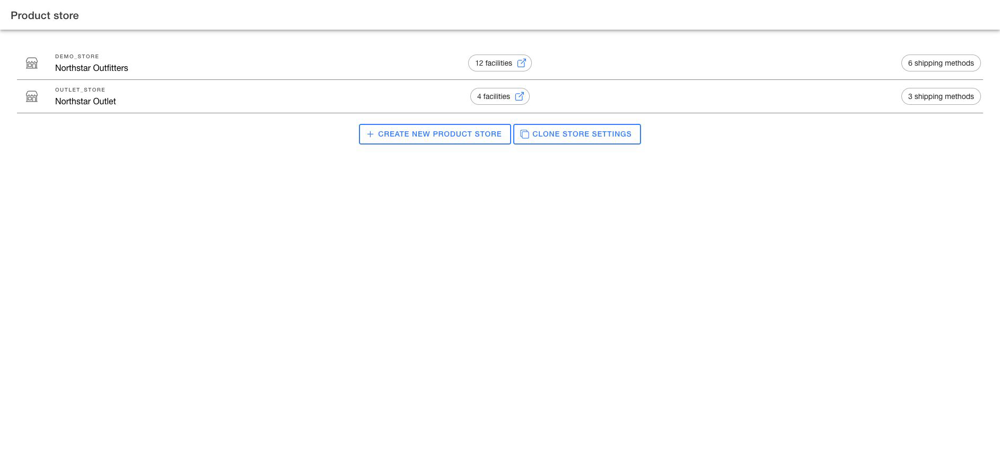
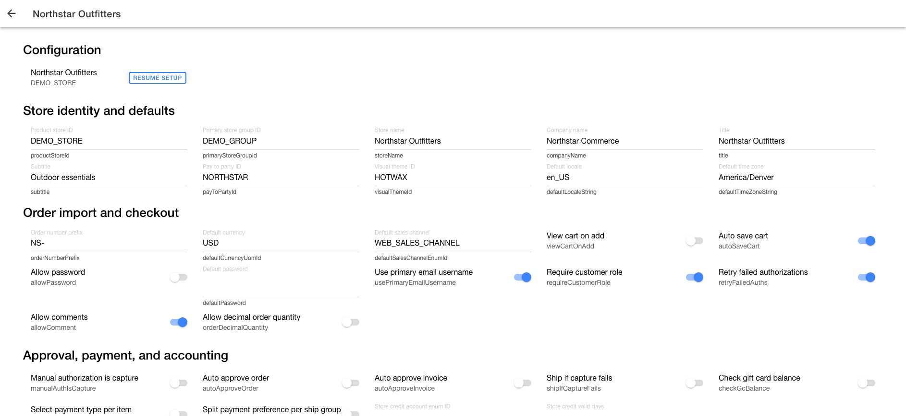

# Manage Product Store settings

The Product Store details page is the canonical reference for brand-level settings. It separates direct Product Store fields from application settings used by order, inventory, routing, fulfillment, and customer workflows.

Change only settings included in the implementation plan. A Product Store setting can affect imported orders and active store operations.

## Open Product Store details

1. Open the **Company App**.
2. Go to `Product Store`.

<figure><figcaption>
Choose the Product Store whose configuration you need to review.
</figcaption></figure>

3. Select the Product Store you need to change.
4. Confirm the Product Store name and ID.
5. Locate the setting in its configuration group.
6. Change the field or toggle.
7. Wait for the success message and confirm the displayed value.

Click `Resume setup` when the Product Store still has guided setup work.

<figure><figcaption>
Match the setting to its configuration group before changing it.
</figcaption></figure>

## Review Product Store fields

The first part of the page contains these groups:

| Group | Examples |
| --- | --- |
| Store identity and defaults | Store name, company, pay-to party, locale, and timezone |
| Order import and checkout | Order prefix, currency, sales channel, comments, and decimal quantity |
| Approval, payment, and accounting | Order approval, capture behavior, gift cards, and store credit |
| Inventory and product behavior | Reservation, inventory checks, search behavior, and product identifier |
| Digital, tax, and returns | Digital items, tax display, return receipt, and unpaid-order cancellation |
| Customer and suggestion behavior | Suggestion lists and digital product upload |
| Order statuses and customer messages | Approved, declined, and canceled statuses and authorization messages |
| Auto order retries | Card retry behavior and retry limits |
| Deprecated storefront fields | Legacy stylesheet and header assets |

Treat `Deprecated storefront fields` as read-only unless a current implementation explicitly depends on them.

## Review application settings

The second part of the page contains settings used by HotWax applications:

| Group | Settings covered |
| --- | --- |
| Order import and approval settings | Billing information, approval without payment check, and payment capture tag |
| Returns and cancellation settings | Return deadline, returns facility, and idle-order rejection |
| Inventory and preorder settings | Physical pre-order inventory, pre-order group, release routing group, and product-type exclusions |
| Brokering and routing settings | Preselected facility tag and order-item pickup, shipping facility, and shipment method |
| Fulfillment operations settings | Fulfillment notifications, scan requirements, partial rejection, and receiving scan |
| Store pickup and BOPIS settings | Partial rejection, package, shipping-order visibility, printing, and tracking |
| Customer self-service settings | Cancellation, delivery address/method changes, pickup changes, and reroute method |
| Shipping and carrier settings | Rate shopping |
| Product identity and scanning settings | Product and barcode identification preferences |
| Rejection and exception settings | Quantity-on-hand effect, cycle count creation, and collateral rejection |

## Change a setting safely

1. Confirm the Product Store at the top of the page.
2. Record the current value.
3. Locate the relevant configuration group.
4. Change only the intended field.
5. For a text or number field, press Enter or leave the field. A toggle applies the change immediately.
6. Wait for the success message and confirm the displayed value.
7. Validate the affected workflow before applying the same change to another Product Store.

Use [Clone Product Store settings](clone-product-store.md) when the same approved configuration must be copied to another Product Store.
