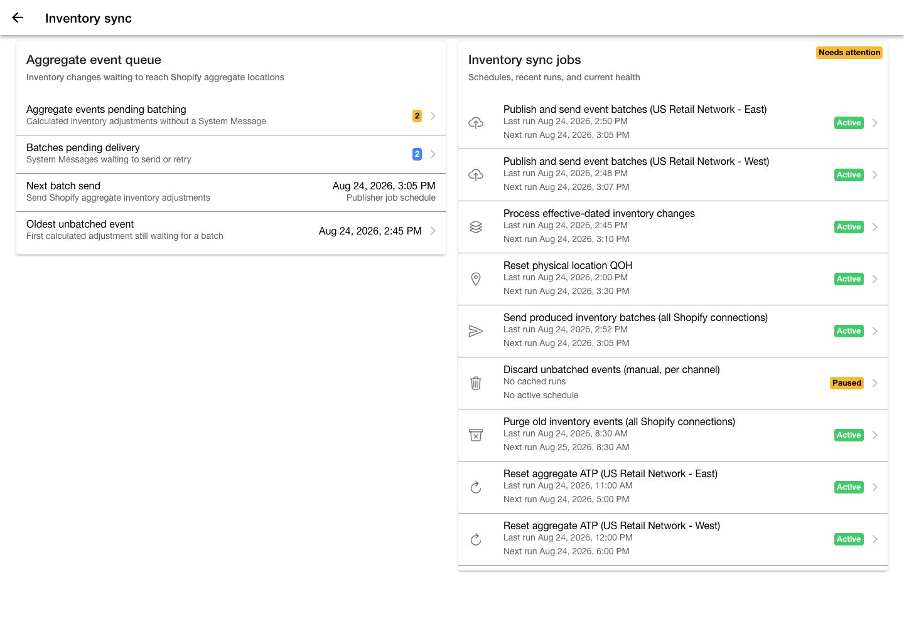
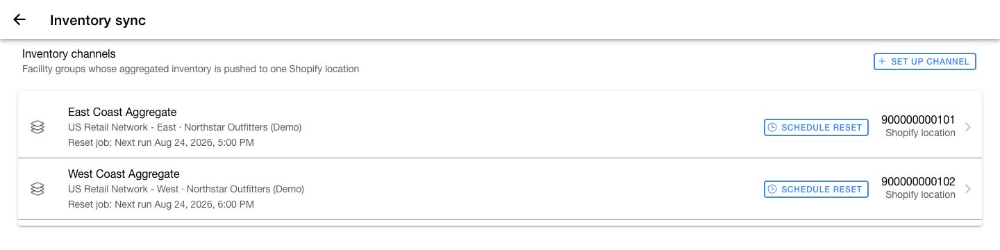
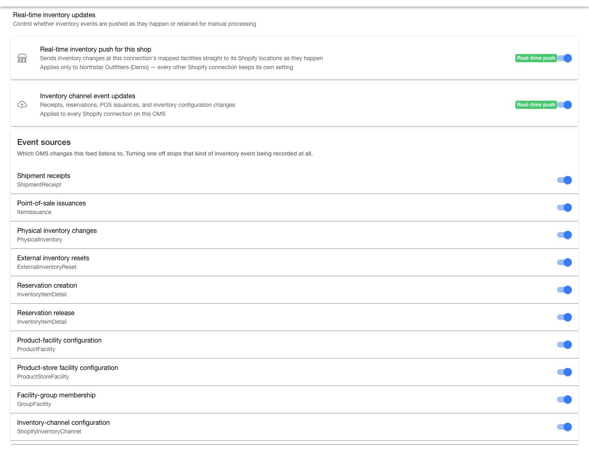
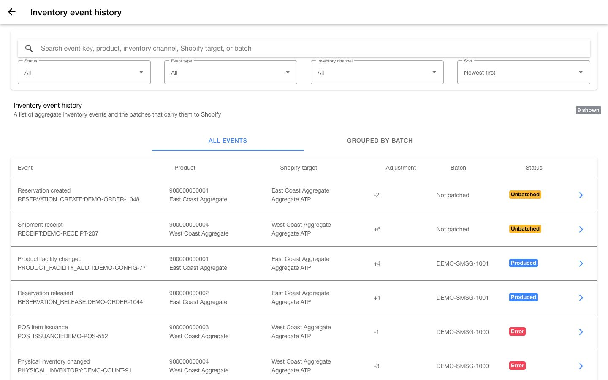
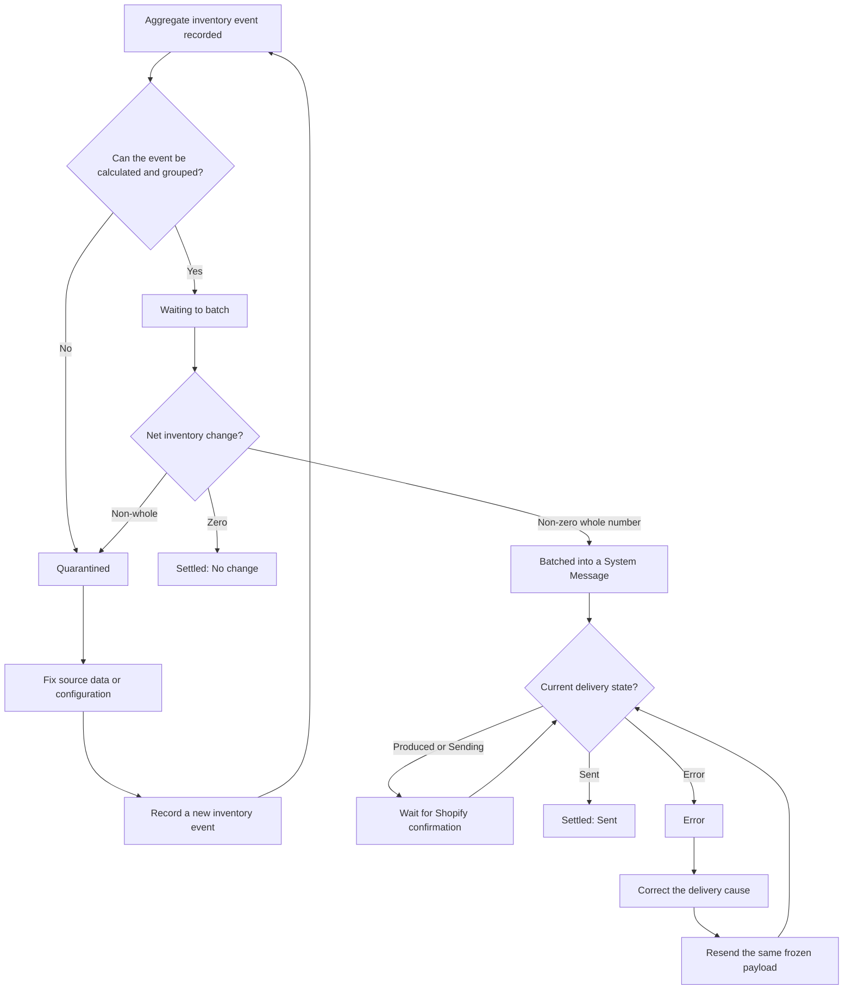
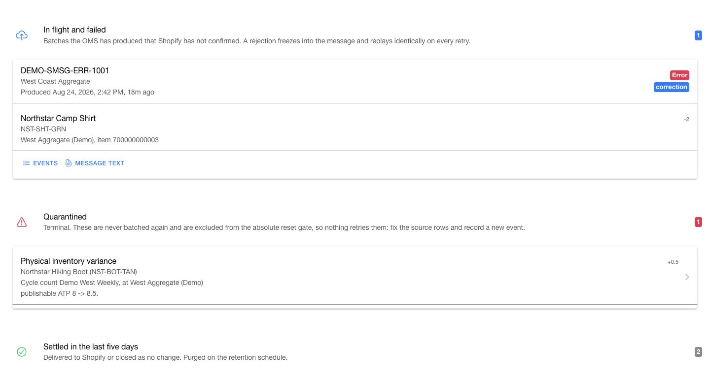

# Monitor Shopify inventory sync

Use the `Inventory sync` dashboard in the Company App to monitor inventory published from HotWax Commerce to Shopify. The dashboard separates physical-location quantity on hand from aggregate-channel available-to-promise inventory, so you can investigate the correct path before changing a schedule or running a reset.

This guide covers outbound inventory updates after a Shopify connection is set up. It does not import starting inventory from Shopify. For the one-time inbound quantity-on-hand seed, follow [Chapter 8 of Set up HotWax Commerce with Shopify](product-store-onboarding.md#8-seed-starting-inventory-from-shopify).

## Understand the two inventory paths

HotWax Commerce can publish inventory to Shopify in two ways:

| Inventory path | Shopify target | Control | Reconciliation job |
| --- | --- | --- | --- |
| Physical-location inventory | A Shopify location mapped to one HotWax facility | `Real-time inventory push for this shop` | `Reset physical location QOH` |
| Aggregate-channel inventory | One Shopify location that represents a group of facilities | `Inventory channel event updates` and its event sources | `Reset aggregate ATP` for the affected channel |

Quantity on hand (QOH) is the physical count at a location. Available-to-promise (ATP) is the quantity available for new orders after HotWax Commerce applies reservations and sourcing rules. Do not use a physical QOH reset to repair an aggregate ATP target, or an aggregate ATP reset to repair a physical-location target.

See [Understand sourcing concepts](../../../retail-operations/inventory/available-to-promise/concepts.md) for the rules that determine which facilities contribute to a channel.

## Open the inventory sync dashboard

1. Open the **Company App** from the HotWax Commerce Launchpad.
2. Select `Shopify` from the menu.
3. Select the Shopify connection that you want to monitor.
4. Select `Inventory sync` under `Products & Inventory`.

Before you rely on the dashboard, open `Access scopes` on the connection and confirm both write gates:

* Under `Connection access`, confirm `SHOP_RW_ACCESS`. Do not select `SHOP_READ_WRITE_ACCESS`; it has the same description but does not satisfy the current service gate.
* Under `Granted OAuth scopes`, refresh the Shopify scopes and confirm `write_inventory` for the approved connection profile.

Resolve either missing gate through the approved Shopify connection flow before you publish or reset inventory.

## Read the dashboard

Start with the queue and job-health cards. They answer two different questions: what is waiting, and what should move it.

As of August 24, 2026, the screenshots and event-pipeline terminology in this guide preview the unreleased `feat/inventory-event-pipeline-view` UI at commit `672694b`. This commit is not on Company `main` or in a tagged release, and the preview still reports package version 2.2.1. Do not use the version label alone to identify this UI. Until a deployed release contains it, follow the older Company and Job Manager surfaces described in the release boundary below.

The screenshots use fictional demo data; their shop, channel, location, event, batch, and job identifiers do not describe a live retailer. In the overview, `Needs attention` reflects the intentionally paused manual discard job; assess automatic pipeline health from the individual job rows.

<figure><figcaption>
The queue shows what is waiting. The Shared sync jobs card covers cross-channel movement; open the affected channel card for its publisher and aggregate ATP reset.
</figcaption></figure>

### Review the aggregate event queue

The `Aggregate event queue` card shows:

* `Aggregate events pending batching`: Calculated adjustments that are not assigned to a System Message
* `Batches pending delivery`: System Messages that are waiting to send, retrying, or in an error state
* `Next batch send`: The next active publisher schedule
* `Oldest unbatched event`: The earliest calculated adjustment still waiting for a batch

The pending-event count represents inventory event-detail rows. One receipt, reservation, or configuration change can create rows for multiple channels or Shopify inventory items, so do not interpret this number as a count of business events or products.

`Next batch send` is the earliest active channel-publisher run that the dashboard can find. It does not confirm that every channel has a publisher, that the produced-message sender is active, or that Shopify has received a batch.

Select an event or batch row to open inventory event history.


When the page displays `Inventory data could not be loaded from the OMS`, the counts are unavailable, not confirmed zero. Retry the load before you conclude that nothing is pending.


### Review shared and channel jobs

`Shared sync jobs` contains schedules that serve the connection or every Shopify inventory channel on the OMS. Each channel card contains the two schedules that belong only to that channel. Both surfaces show a configured job as `Active` or `Paused`, and show `Not configured` when the required job is missing.

| Job | Where shown | Scope | Purpose |
| --- | --- | --- | --- |
| `Publish and send event batches` | A channel card | One inventory channel | Batches calculated aggregate adjustments for delivery |
| `Reset aggregate ATP` | A channel card | One inventory channel | Replaces the target location quantity with the channel's current ATP |
| `Process effective-dated inventory changes` | `Shared sync jobs` | OMS-wide | Processes inventory changes that become effective at a later time |
| `Reset physical location QOH` | `Shared sync jobs` | One Shopify connection | Reconciles every mapped physical Shopify location with HotWax QOH |
| `Send produced inventory batches (all Shopify connections)` | `Shared sync jobs` | OMS-wide, when available | Sends produced Shopify inventory-adjustment System Messages |
| `Discard unbatched events (manual, per channel)` | `Shared sync jobs` | One selected channel, manual only, when available | Cancels pending events that must not be sent |
| `Purge old inventory events (all Shopify connections)` | `Shared sync jobs` | OMS-wide, when available | Removes old ledger details according to the connector retention policy |

The jobs displayed depend on the installed Company and Shopify connector releases. `Process effective-dated inventory changes` and `Purge old inventory events` are connector-seeded jobs. If either is missing, treat it as a deployment gap. Do not copy a job definition from another instance.

Inspect every shared and channel-owned row before you use the `Shared sync jobs` rollup as a health verdict. The rollup includes the jobs inside channel cards, even though it is displayed on the shared card. A manual recovery job can be intentionally paused and have no schedule while the automatic publication pipeline remains healthy.

Select a configured job from its shared or channel row to review its internal name, service, active state, schedule, parameters, recent runs, and edit history. A row can summarize multiple matching jobs and open only one of them. Use Job Manager to check for duplicate or overlapping schedules before you activate or reschedule a job. Select `Run now` only after you confirm the job scope and verify that an earlier run is not active.

A job's next-run line can show a countdown and timestamp. If the cached next-run timestamp is older than a more recent run, Company shows the cron cadence instead of reporting a false overdue state. `Next run not yet recalculated` means that the schedule exists but the cache has no dependable next timestamp. `No active schedule` means that Company found no unpaused matching job with a cached next-execution timestamp; inspect the job's paused state and cron expression before you conclude that it is unscheduled.

A completed run means that the job has an end time and did not report an error. It does not prove that Shopify now matches HotWax Commerce. After a reset or recovery run, compare representative item quantities at the affected Shopify target.

If the dashboard offers `Set up`, the app creates the missing job in a paused state. Open the new job and verify its parameters and schedule. Activate only jobs approved for scheduled execution. Keep `Discard unbatched events` paused and unscheduled.

Some Company versions allow supported job parameters to be edited in the job modal. Keep `inventoryChannelId` unchanged for a channel publisher or reset job because that value defines which channel the job belongs to.

The channel-card job placement and the four-stage event pipeline are an unreleased preview at `672694b`. Older released deployments can show the channel jobs in a single `Inventory sync jobs` card and provide separate `All events` and `Grouped by batch` history views. Use Job Manager and the controls visible in that deployed Company build when the newer surfaces are absent. Replace this commit boundary with the released Company version after the feature ships.

### Configure a channel publisher safely

Keep the `publish_PendingShopifyInventoryAdjustments` template paused. Each inventory channel needs its own cloned publisher job. Before you activate a clone, confirm:

* `inventoryChannelId` identifies the intended channel.
* `maxChangeCount` is `100`, unless the implementation plan specifies another tested batch size.
* `staleSendingMinutes` is `60`, unless the implementation plan specifies another recovery window.
* The schedule belongs to this channel and does not overlap an unintended publisher.

A newly created clone is paused. Activate it only after its channel, parameters, and schedule are correct; do not activate the template itself.

### Configure the produced-message sender safely

When the sender's `systemMessageTypeIds` value is blank, that job sends all supported System Message types. It is a shared sender, not an inventory-only sender. Do not change or replace a shared sender as an inventory recovery action.

Some Company versions can show the sender as both `Active` and `Set up`: an active shared sender exists, but a dedicated inventory sender does not. A dedicated inventory sender is created paused and should use:

* A five-minute schedule
* `systemMessageTypeIds` set to `ShopifyInventoryAdjustment`
* `mode` set to `sync`

Review the shared delivery design with the deployment owner before activating a dedicated sender, so the same messages are not targeted by unintended schedules.

### Verify reset job scope

App-created reset jobs start paused. Use these defaults to audit a newly created job; preserve an approved deployment-specific schedule when it intentionally differs.

* The physical QOH reset runs hourly by default. Its parameters must include `systemMessageTypeId=ResetInventoryQoh`, the selected shop's `systemMessageRemoteId`, and `runAsBatch=true`. Together, these values define its Shopify connection scope.
* Each aggregate ATP reset runs every four hours by default. Its protected `inventoryChannelId` must identify exactly one inventory channel.

Do not copy a physical reset between connections or an aggregate reset between channels by changing only the job name. Verify the scope parameters first.

### Discard unbatched events safely

`Discard unbatched events` is one OMS-wide manual recovery job that acts on one selected channel per run. Keep it paused and without a schedule. Never activate or schedule it.

When obsolete unbatched events must be removed:

1. Open the discard job and select the intended `inventoryChannelId`.
2. Enter and review the reason.
3. Select `Save`.
4. After the modal closes, reopen the job and verify the stored channel and reason.
5. Select `Run now` once.
6. Run a full aggregate ATP reset for that channel.


`Run now` does not save draft parameters. If you select it before `Save`, the job runs with its previously stored channel and reason. Reopen and verify the saved values before every discard run.


### Review recent resets and batches

The lower dashboard sections show:

* Recent full physical-location QOH reset runs
* Recent full aggregate ATP reset runs
* Aggregate event batches, their delivery states, publish reasons, and summed change entries

Each run card shows its run identifier, start time, parameters, scope, result, and whether the job reported an error. Select `View all runs` to search one job's history by run, service, user, parameters, result, and status.

The job modal previews only the five most recent runs and ten edit-history records. Use `View all runs` when the required execution is not in that preview.

The job-run page loads at most the 500 most recent runs. When it reaches that limit, it displays a warning rather than presenting the results as complete history.

## Set up an aggregate inventory channel

An aggregate inventory channel maps one channel facility group to one Shopify location. Eligible inventory from the facilities in the group contributes to that target after the channel's brokering, safety-stock, threshold, and demand rules are applied.

<figure><figcaption>
Audit each channel as one unit: facility group, Shopify target, cached delivery activity, publisher, and full-reset schedule.
</figcaption></figure>

`Feeding this channel` counts effective facility-group members by facility type. `Delivered in 24h` counts cached ledger-detail rows that were created in the last 24 hours and currently have a sent System Message. It is not a count of deliveries, units, products, or batches; an older row delivered today is excluded. Treat this value as a recent operational signal rather than a complete throughput total.

Before you begin:

* Create and review the channel facility group in `Sourcing` > `Channels`.
* Confirm the facilities that belong to the group.
* Create or select a Shopify location intended only for aggregate inventory.
* Do not use a Shopify location that already represents a physical HotWax facility.

Follow these steps:

1. Open the `Inventory sync` dashboard.
2. Select `Set up channel`.
3. Select a facility group. The app lists only groups of type `CHANNEL_FAC_GROUP` and shows their store, warehouse, configuration, and other facility counts.
4. Review every facility count. A facility with an uncommon type can still contribute inventory and appears in `other`.
5. Select `Next`.
6. Select the Shopify aggregate location.
7. Select `Create channel`.

The location list excludes locations that already back a physical HotWax facility or another active inventory channel. A location mapped to the `_NA_` placeholder can appear as `Suggested` because it is not assigned to a physical facility. Use `_NA_` only for an intentionally unassigned aggregate target, not as the mapping for a real store or warehouse.

After the channel is created, the app attempts to create its aggregate reset and event-publisher jobs and the connection's physical reset job. These jobs are created paused.


If the channel is created but one or more jobs fail, do not create the channel again. Return to the dashboard and use `Set up` for each missing job. Run a full aggregate ATP reset before you rely on incremental events for the new channel.


## Edit or expire a channel

Select a channel from the `Inventory channels` section to manage it.

The Shopify shop and facility group are fixed because they define the channel's identity. You can update the description and choose another eligible aggregate location. Open `Reset aggregate ATP` on the channel card to review or change that channel's full-reset schedule.

### Move an aggregate target

1. Select the channel.
2. Select the new Shopify aggregate location.
3. Confirm that no other active inventory channel uses the new target. The edit dialog does not exclude every target claimed by another channel.
4. Review the warning.
5. Save the change.
6. Run a full aggregate ATP reset for the channel.
7. Search event history by the old Shopify location. A waiting entry displays `Drains the location the channel left`; a settled row displays `Channel has left this location`; event detail displays `Retarget drain`. An in-flight entry shows the old location without a retarget badge.
8. Confirm that the old target is cleared and the new target contains the current channel ATP.

The Company warning states that inventory placed by the channel should be cleared from the old target. Saving the edit records the new target, while the connector performs the inventory clearing. Verify both Shopify locations after the save and reset. If the old target remains stocked, do not reuse it; record the channel and location identifiers and escalate the failed clear. Incremental events alone do not seed the complete quantity at the new location.

### Expire a channel

1. Open the channel's publisher and aggregate reset jobs in Company or Job Manager and record their internal job names.
2. Pause the aggregate reset job and save the change. Keep the channel publisher and produced-message sender active so they can deliver the clearing adjustment created by expiration.
3. Verify that the aggregate reset has no active run and that the publisher is not currently running.
4. Review event history for the channel. Resolve pre-existing `Waiting` events and batches awaiting delivery according to the approved channel-decommission plan before you expire it.
5. Select the channel.
6. Select `Expire` under `Stop using this channel`.
7. Review the target and channel.
8. Select `Expire channel`.
9. Track the clearing adjustment, whether it is still in `Waiting to batch` or already assigned to a batch, until its System Message reaches a successful delivery state. After expiration, the channel is no longer available in the `Inventory channel` filter; search its label, old Shopify location, event type, source record, or inventory item instead. Then verify that the Shopify target is zero.
10. Find the recorded publisher in Job Manager, pause it, and confirm that both the publisher and aggregate reset jobs remain paused.

Expiration is intended to stop aggregation into the target and clear the inventory that the channel placed there. Verify the Shopify target after expiration. HotWax Commerce retains the mapping so historical events remain attributable to the expired channel.

Expiration removes the channel from the active channel rows, but the Company page does not show it pausing or deleting the channel's publisher and reset jobs. If the clearing adjustment does not appear or the Shopify target is not zero, keep the location out of use, record the channel and location identifiers, and escalate before pausing the publisher or assigning the location elsewhere. If the installed connector uses a different approved decommission path, follow that release-specific runbook instead.

## Manage real-time inventory controls

The dashboard contains three controls with different scopes. Review the scope and recovery action before changing one.

| Control | Scope | What happens when it is off | Recovery after it is turned on |
| --- | --- | --- | --- |
| `Real-time inventory push for this shop` | The selected Shopify connection | Physical inventory changes for that shop are skipped. No backlog is created. | Run `Reset physical location QOH`. |
| `Inventory channel event updates` | Every Shopify connection on the OMS | The aggregate event feed changes from real-time push to manual processing. | Reconcile aggregate ATP, enable the feed, then restart every OMS node. |
| An individual `Event source` | One class of aggregate inventory change across the OMS | That class of event is not recorded. No backlog is created. | Turn the source on, then run full aggregate ATP resets for affected channels. |

<figure><figcaption>
Confirm the scope of each real-time control before changing it.
</figcaption></figure>


Changes made while the shop-specific push or an individual event source is off do not create a backlog and will not replay later. Reconcile affected targets with the correct full reset before you rely on real-time updates again.


When you enable `Inventory channel event updates`, restart every OMS node so that Moqui registers the real-time feed. When you switch it to manual, new real-time events can continue for up to 15 minutes while the cached feed configuration expires.

### Review event sources

Event sources determine which OMS changes create aggregate inventory events. The supported sources cover:

* Shipment receipts
* Point-of-sale item issuances
* Physical inventory changes and external inventory resets
* Reservation creation and release
* Product-facility and product-store facility configuration changes
* Facility-group membership changes
* Inventory-channel configuration changes

If a source displays `Not loaded on this OMS`, the connector's seed data is missing. The toggle cannot create the missing source. Record the source name and ask the deployment owner to load the matching connector seed data.

## Audit aggregate inventory events

Open inventory event history from an aggregate queue row or select `Event history` in the batch section.

The page presents one `Inventory event pipeline` in the order that the publisher acts. Use search and the available filters to decide which groups, batches, and rows remain visible by:

* Event type and source record
* Resolved product name or SKU, when available
* Shopify inventory item identifier
* Shopify location
* Shopify publish reason
* Batch identifier
* Ledger status
* Inventory channel

The `Status` filter applies to the inventory-event ledger lifecycle. It does not filter System Message delivery states such as `Produced`, `Sending`, `Error`, or `Sent`.

The `shown` badge counts matching ledger rows. When one event matches inside a waiting group or batch, that card continues to show the complete publisher boundary, including its full event count and summed change entries. Do not interpret those totals as a subtotal of only the matching rows.


In preview commit `672694b`, the `Sort` control does not reorder the pipeline sections. `Waiting to batch` remains oldest first, while batches and other event rows retain their operational order. Use the displayed timestamps when sequence matters.


The ledger's remote identity is the Shopify inventory item. The page also tries to resolve the OMS product and originating business record, such as an order, receipt, cycle count, reset, reservation, or point-of-sale movement. Treat an unresolved enrichment as missing context, not as proof that the source record does not exist.

<figure><figcaption>
Waiting groups mirror publisher grouping and expose the Shopify reason, summed changes, and retarget drains before batching.
</figcaption></figure>

### Follow the pipeline stages

The following flow separates the inventory-event ledger lifecycle from System Message delivery and recovery.

| Stage | What it contains | Operator focus |
| --- | --- | --- |
| `Waiting to batch` | Pending events grouped from the publisher configuration loaded by the page | Review the oldest group, publish reason, summed changes, and target location. |
| `In flight and failed` | Produced System Messages that Shopify has not confirmed, including `Produced`, `Sending`, and `Error` | Diagnose delivery and resend only after correcting the cause. |
| `Quarantined` | Terminal ledger failures that are never automatically batched again | Fix the source rows and record a new event. |
| `Settled in the last five days` | Events delivered to Shopify or closed as no change | Use this UI-labelled five-day tail for recent confirmation, not long-term audit history. |

Within the ledger, lifecycle and delivery are separate state machines:

| State | Meaning | Next check |
| --- | --- | --- |
| `Waiting` | The adjustment is calculated but has no System Message | Check the channel card's publisher and its next run. |
| `Batched` | The ledger row is assigned to a System Message | Find that batch in `In flight and failed` or the settled tail and review its delivery state. |
| `No change` | The grouped change nets to zero and requires no Shopify mutation | Open the event and review its ATP calculation. |
| `Quarantined` | A terminal calculation or grouping result cannot be published | Fix the source data and record a new inventory event; do not wait for an automatic retry. |

Open an event to review its source record, resolved originating artifact, actor or note when available, product and SKU, Shopify inventory item, channel, effective Shopify location, publish reason, batch delivery, and ATP calculation. The raw ledger reference remains available when the human-readable source does not contain it.

### Review a waiting group

`Waiting to batch` puts the oldest group first. By default, a publisher group is scoped to one channel, Shopify inventory item, and event type.

In preview commit `672694b`, the page applies the first nonblank `groupByFields` value that it finds among the cached channel publishers to every waiting channel. The displayed grouping matches actual publication only when the channel publishers use the same grouping fields. Compare `groupByFields` on every affected channel publisher in Company or Job Manager before you rely on the cards for a mixed-channel audit.

For each group, verify:

* `Publishes under`: The Shopify inventory-adjustment reason. An unmapped event type or a group containing mixed event types falls back to `correction`; resolve an unexpected fallback before it freezes into a System Message.
* `Change entries Shopify will receive`: Events for the same Shopify inventory item and effective location are summed into the delta that Shopify receives.
* Outcome warnings: A zero sum settles as `No change`. A non-whole sum is quarantined. A nonzero whole-number sum can publish.
* Target warnings: `Drains the location the channel left` means that the change applies to the former Shopify location recorded on the event, not the channel's current target.
* `Contributing events`: The source records and ATP calculations that produced the summed entry.

If the page warns that batches can mix event types, the publisher's grouping configuration omits event type. Such a mixed batch must use `correction` because no more specific Shopify reason describes every event in it.

<figure><figcaption>
Use In flight and failed for delivery problems, Quarantined for terminal ledger failures, and Settled for cached delivery and no-change outcomes.
</figcaption></figure>

The history page is an operational monitor, not a permanent archive. It initially loads a recent set plus all pending and unresolved rows, then adds new updates; it is neither a fixed 500-record report nor complete history. The UI labels the settled stage as a five-day tail, but the client does not enforce an age cutoff or remove already cached rows when the backend purge runs. Older settled rows can remain visible until the app cache is cleared, normally at logout or an identity change. Use backend records when an investigation requires a complete or authoritative time window.

### Investigate and resend a failed batch

1. Find the batch under `In flight and failed`.
2. Select `Events` on the failed batch.
3. Record the System Message identifier, target, status, and delivery errors.
4. Review the contributing source records and summed change entries.
5. Correct the connection, access, or data problem that caused the failure.
6. Select `Resend` once.
7. Refresh the batch and confirm its new delivery state. Do not use an unchanged error list as proof that no new attempt occurred.

The app resends the same frozen payload and idempotency key. Review the resulting Shopify and System Message states before another retry. Repeated retries without correcting the cause still create noise and delay recovery.

The batch dialog fetches up to 50 delivery errors and can retain that cached set after the dialog or page is reopened. Use backend System Message error records to inspect the newest attempt, more than 50 errors, or older error history.

Select `Message text` when the technical team needs the stored System Message payload. If the dialog says that the payload is still loading, refresh or reopen it before treating the displayed content as exact. Keep credentials and customer data out of screenshots and tickets.

### Recover a quarantined event

1. Open the row under `Quarantined`.
2. Record its source record, product, inventory item, effective Shopify location, and ATP calculation.
3. Correct the invalid source data or configuration that produced the terminal result.
4. Use the approved business workflow to record a new inventory event; the quarantined row itself is never batched again.
5. Run a full aggregate ATP reset for the affected channel when the correction or outage could have left Shopify out of sync.
6. Verify the new event or reset and compare the Shopify target with current channel ATP.

## Audit common inventory discrepancies

### One physical Shopify location is stale

1. Confirm that the Shopify location maps to the intended HotWax facility.
2. Confirm that `Real-time inventory push for this shop` is enabled.
3. Review `Reset physical location QOH`, including its active state, schedule, parameters, and latest run.
4. Compare sample HotWax QOH values with the same Shopify physical location.
5. Run the physical QOH reset only after you confirm its connection scope.

### One aggregate Shopify location is stale

1. Confirm that the inventory channel maps the intended facility group to the intended Shopify target.
2. Review the channel's facility membership and sourcing rules.
3. Confirm that `Inventory channel event updates` and the relevant event source are active.
4. Check the oldest waiting group and the publisher row inside the channel card.
5. Check pending batches and the produced-message sender when it is displayed.
6. Open failed batches and record their System Message errors.
7. Run the channel's full aggregate ATP reset when events were skipped or the target moved.

### Events remain waiting to batch

1. Filter history to `Waiting` and the affected channel.
2. Find the oldest group in `Waiting to batch` and record its age.
3. Review `Publish and send event batches` on the channel card, including its active state, next run, and recent runs.
4. Use `Set up` when the publisher is not configured.
5. Activate and schedule a newly created publisher after you verify its `inventoryChannelId`.

### Batches remain produced or enter an error state

1. Find the batch under `In flight and failed` and record its System Message identifier.
2. Select `Events` to review its delivery errors and contributing events, and use `Message text` when the stored payload is required.
3. Check the inventory-batch sender when it is displayed, or the deployed System Message sender in Job Manager.
4. Confirm Shopify write access and the target location.
5. Correct the cause, then resend the batch once.

### An event is quarantined

1. Open the quarantined event and record its source, product, target, delta, and calculation.
2. Correct the source row or configuration; the terminal ledger row will not retry.
3. Record a new event through the approved business workflow.
4. Run a full aggregate ATP reset when the affected target may remain out of sync.
5. Verify the new event or reset against Shopify.

### One kind of inventory change never appears

1. Identify the missing business event, such as receipt, reservation, point-of-sale issuance, or configuration change.
2. Find the matching event source.
3. Distinguish `off` from `Not loaded on this OMS`.
4. Enable a loaded source or ask the deployment owner to load missing connector seed data.
5. Run full aggregate ATP resets for affected channels because missed changes are not replayed.

Contact the technical team with the Shopify connection, inventory channel, target location, event type, source record, Shopify inventory item, System Message identifier, job-run identifier, timestamps, and the first recorded error when the same discrepancy returns after reconciliation.
