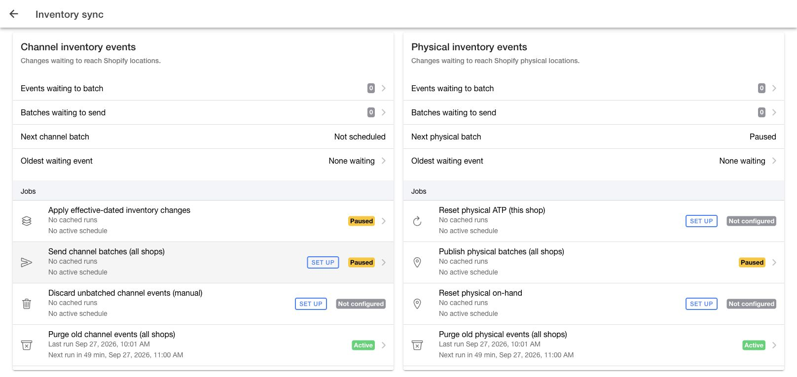
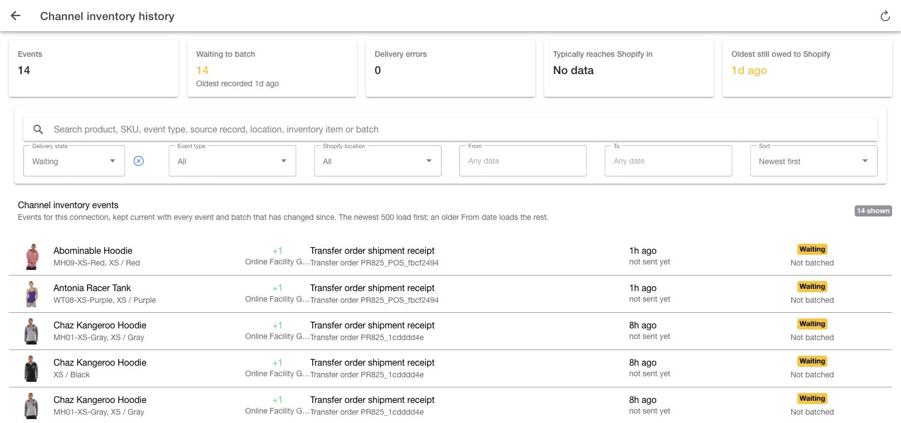
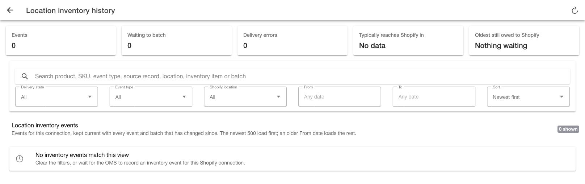
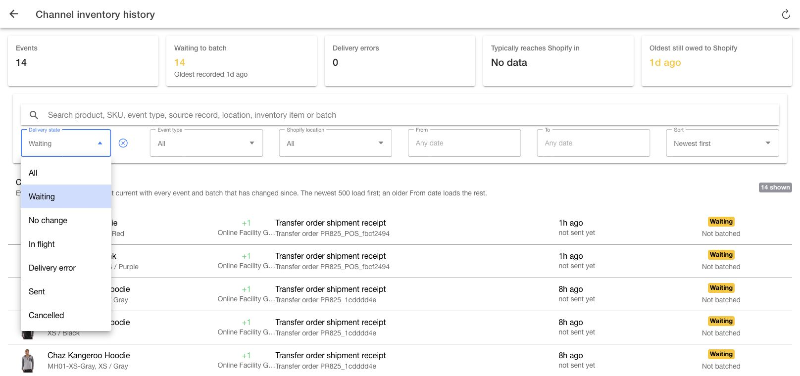

# Monitor Shopify inventory sync

Use `Inventory sync` in the **Company App** to check whether inventory changes are waiting, batched, or delivered to Shopify. Start with the affected Shopify connection and location, then follow the event and its batch.

## Open the correct connection

1. Open `Shopify` in Company.
2. Select the connection.
3. Confirm its shop and Product Store.
4. Open `Inventory sync`.

The page separates two paths:

| Path | What it publishes | Where to investigate |
| --- | --- | --- |
| Channel inventory | Aggregated available-to-promise inventory from a facility group to a Shopify aggregate location | `Channel inventory events`, the channel card, and `Channel inventory history` |
| Physical-location inventory | Inventory changes for Shopify locations mapped to physical HotWax facilities | `Physical inventory events` and `Location inventory history` |

An aggregate location should not also represent a physical facility. Review [Shopify mappings](manage-shopify-mappings.md) before changing a target.

## Read the event queues

Both queue cards show:

* `Events waiting to batch`: Event-detail rows with a nonzero change and no batch
* `Batches waiting to send`: Distinct batches awaiting delivery
* The next publisher run
* `Oldest waiting event`: The earliest waiting row
* Related jobs and their last run, next run, and active or paused state

Select a waiting-event row, a waiting-batch row, or the oldest-event row to open the corresponding history with that context already selected. The oldest-event link also selects oldest-first ordering.

A count of event rows is not a count of products, units, or business transactions. A scheduled publisher is not proof that Shopify received a batch. Review the batch's delivery state.

If the toolbar reports a sync failure, counts depending on that failed read are unavailable; do not treat them as confirmed zero.

<figure><figcaption>
Channel and physical inventory queues show their own waiting work and related jobs. This UAT example has no waiting events.
</figcaption></figure>

## Review channels and jobs

Each `Inventory channels` card identifies the facility group and Shopify target. `Facilities` opens the group's membership. `Delivered in the last 24 hours` counts cached event rows created in that period that have a successful delivery state. It is not a count of units, batches, or all deliveries completed today.

Channel cards contain `Send channel batches` and `Reset channel ATP`. Jobs shared by a connection or all shops appear in the channel and physical event queue cards.

| Job | Scope and purpose |
| --- | --- |
| `Send channel batches` | Publishes adjustments for the channel shown on the card |
| `Reset channel ATP` | Reconciles aggregate inventory for that channel |
| `Reset physical ATP (this shop)` | Resets available-to-promise inventory for this connection's mapped physical locations |
| `Publish physical batches (all shops)` | Publishes physical-location event batches across the OMS |
| `Apply effective-dated inventory changes` | Processes inventory-rule or membership date boundaries |
| `Reset physical on-hand` | Reconciles physical-location quantity on hand for the configured shop |
| `Send channel batches (all shops)` | Sends produced channel batches across the OMS |
| `Discard unbatched channel events (manual)` | Manual recovery for the selected channel; keep paused and unscheduled |
| `Purge old channel events (all shops)` | Retention for the channel ledger |
| `Purge old physical events (all shops)` | Retention for the physical-location ledger |

Available jobs depend on the installed connector and instance configuration. A job row can summarize several matching jobs but open only one. Use Job Manager to check for duplicate schedules when that matters to the investigation.

Select a configured job to open the dialog titled with its internal job name. Review the service, parameters, execution time zone, schedule, runs, and edit history. See [Manage sync jobs in Company](manage-sync-jobs.md).

When a supported missing job offers `Set up`, the app creates it paused. Review the scope and parameters before activating an automatic job. A connector-seeded job without `Set up` needs the technical team's deployment review; do not copy a definition from another instance.

Keep discard jobs manual. Confirm their selected channel before an approved recovery run.

## Review recent resets and batches

The reset sections show recent runs for physical ATP, physical on-hand inventory, and channel ATP. Use `View all runs` to open the relevant job's run history. A completed reset run is an execution result; verify the resulting Shopify inventory before considering a discrepancy resolved.

`Channel event batches` and `Physical location event batches` each preview the 20 newest batches. Older batches remain accessible through `Event history`. Select a batch card to review its target, delivery state, publish reason, and summed change entries.

## Audit inventory history

Open `Event history` from the relevant batch section or use a queue link. Channel and location histories use the same controls and row layout.

<figure><figcaption>
Channel history combines delivery indicators and filters. This connection has no matching events.
</figcaption></figure>

<figure><figcaption>
Location history uses the same investigation controls for physical-location events.
</figcaption></figure>

### Narrow the investigation

| Control | What it filters |
| --- | --- |
| Search | Loaded product name, SKU, variant, event type, source record, Shopify location, inventory item, or batch |
| `Delivery state` | Waiting, No change, In flight, Delivery error, Sent, or Cancelled |
| `Event type` | The business event that produced the row |
| `Shopify location` | The target location for the change |
| `From` and `To` | The event's recorded date |
| `Sort` | Newest first or oldest first |

Clear individual filters using the clear action beside each control. All filters work together. `shown` counts the rows matching the current filters.

The figures above the filters are recalculated for the matching rows:

* `Events`: Matching event rows
* `Waiting to batch`: Nonzero changes without a batch; select to filter waiting rows
* `Delivery errors`: Rows whose batch has a delivery error; select to filter errors
* `Typically reaches Shopify in`: Median recorded-to-sent time for matching delivered rows, with sample count and slowest delivery
* `Oldest still owed to Shopify`: Age of the oldest matching row that is waiting, in flight, or in error

The median describes deliveries already completed. `Oldest still owed to Shopify` describes unresolved work. An event count is not a product or batch count.

### Read an event row

Rows show the Shopify product and variant, SKU or inventory item, signed inventory change, effective Shopify target, event type, source record, age, delivery timing, delivery state, and batch ID when assigned.

A positive change adds inventory; a negative change removes it. Channel retarget events use the location recorded for that adjustment, which can differ from the channel's current target. Open the event when the target is unexpected.

### Interpret delivery state

The `Delivery state` filter follows batch delivery, not a separate ledger-status filter. Row badges can show the more specific System Message state, such as Produced, Sending, Error, or Sent.

| Filter | Meaning |
| --- | --- |
| `Waiting` | Nonzero event change with no batch assigned |
| `No change` | Zero event change with no batch assigned |
| `In flight` | A batch is assigned and does not yet have a successful, error, or canceled delivery state |
| `Delivery error` | The batch's current delivery state is Error |
| `Sent` | The batch has a successful delivery state |
| `Cancelled` | The batch is canceled or rejected |

A no-change event does not require a Shopify adjustment. A waiting badge alone does not establish why the connector has not assigned the event to a batch; investigate the publisher and source data if the wait persists.

<figure><figcaption>
Filter by the event's delivery state to focus the investigation.
</figcaption></figure>

### Load an older date range

The page initially reads the newest 500 events and then tracks changes while the inventory area is open. It does not load the complete retained ledger immediately.

1. Select an older `From` date to load the earlier range.
2. Wait for the older events to load before using the matching counts.
3. Set `To` to limit the range when needed.
4. Confirm the range and sort before inspecting rows.

Setting only an older `To` also requests older retained rows. The calendar uses the oldest retained server event as its lower boundary and prevents an inverted or future range. Retention information appears when the purge-job configuration is available, including whether the purge is paused.

A date range cannot recover records already purged by the connector. If the page reports that live updates are off because the OMS does not report event changes, use refresh to read the ledger again. Do not treat cached history as a permanent archive.

### Inspect a source and calculation

Select an event row to open `Inventory event`. Review:

* Event type, source reference, and the resolved business record under `Came from` when available
* Product, variant, SKU, and Shopify inventory-item identifiers
* Signed change and target location
* `Publishes under`, the Shopify adjustment reason
* Recorded time, reached-Shopify time, and delivery lag
* The channel ATP calculation when present
* `Retarget drain` when the change applies to a channel's former location
* The linked batch when assigned

Unresolved product or source data leaves identifiers available for investigation. A missing readable label does not prove the underlying business record is absent.

### Investigate a failed batch

1. Filter to `Delivery error` and the affected location or product.
2. Open an event, then select its batch; alternatively open the batch from the monitor.
3. Check `Delivery errors`, including each attempt's state, timestamp, and message.
4. Review `Change entries` to see the sum per inventory item and target location.
5. Review `Events in this batch` for the contributing source rows.
6. Expand `Message payload` when the technical investigation needs the stored payload.
7. Correct the cause before selecting `Resend` through the approved recovery process.
8. Refresh and verify the new delivery state and Shopify inventory.

`Resend` sends the frozen payload and its existing idempotency key. It does not recalculate the batch from current inventory. Do not use resend to correct an obsolete quantity; choose the appropriate full reset or other approved reconciliation instead.

The dialog reads up to 50 recorded delivery errors. An investigation requiring more attempts or long-term error history needs backend records.

## Set up an aggregate channel

Before setup, review the channel facility group in `Sourcing` > `Channels`, its members, and the intended aggregate Shopify location.

1. Select `Set up channel`.
2. Choose the channel facility group and review its facility counts.
3. Select `Next`.
4. Choose an eligible Shopify aggregate location.
5. Select `Create channel`.
6. Review the created channel and its publisher and reset jobs.
7. Verify job scope and schedule, then reconcile the new target with a full channel ATP reset before relying on incremental events.

Setup excludes targets already mapped to a physical facility or another active channel. An unassigned placeholder can be offered as a suggestion; it is suitable only for the intended aggregate target.

If channel creation succeeds but job setup fails, retain the created channel and use `Set up` for its missing jobs. Do not create a duplicate channel to retry job setup.

## Edit or expire a channel

Select the channel heading to open `Edit inventory channel`. The facility group and shop remain fixed. Review the description, aggregate target, and aggregate reset job.

When moving a target, confirm that no other active channel uses the new location, review the inventory-clear warning, and save. Run a full channel ATP reset, inspect events for the old location, and verify that the old target is cleared and the new target holds the intended inventory. Saving the mapping is not proof that either adjustment reached Shopify.

For an approved expiration, review existing waiting and in-flight work, the channel publisher, and its reset schedule first. Use `Expire` under `Stop using this channel`, review the confirmation, and verify the clearing adjustment and Shopify target. The page does not automatically pause or delete all related jobs. Follow the connector release's decommission process before pausing a publisher needed to deliver the clearing adjustment or reusing the target.

## Manage real-time controls

Review the scope shown on each control before changing it:

| Control | Scope |
| --- | --- |
| `Push realtime events to` the selected shop | This connection's enablement |
| `Channel events` | Channel event capture across all shops on this OMS |
| `Physical location events` | Physical-location event capture across all shops on this OMS |
| Event-source `Channel` and `Physical location` toggles | Whether that source feeds each applicable ledger |

An unavailable or `Missing` source requires connector configuration or seed-data review. Use `Retry` when source loading failed.

Changes made while capture is off are not recorded for later replay. Reconcile affected targets with the correct reset before relying on incremental updates again. Enabling real-time event feeds requires restarting every OMS node after saving; disabling them can take up to 15 minutes while cached feed configuration expires. Arrange these changes with the team responsible for the instance.

## Investigate a stale target

1. Confirm whether the target is a physical location or aggregate channel.
2. Verify the corresponding mapping and capture controls.
3. Filter history by Shopify location and inspect waiting and failed rows.
4. Review the publisher's active state, next run, and recent run results.
5. Review the batch sender when batches remain in flight.
6. Correct the cause and use the appropriate full reset when changes were skipped or the target changed.
7. Verify Shopify inventory after successful delivery.

When escalating, include the connection, location, channel when applicable, product or Shopify inventory item, event type and source reference, batch and job-run IDs, timestamps, and first error. Use the visible sync state to distinguish a failed read from an empty queue.
