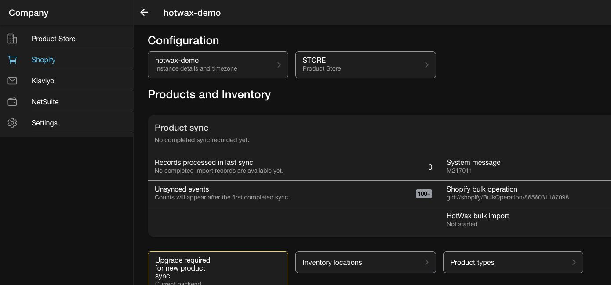
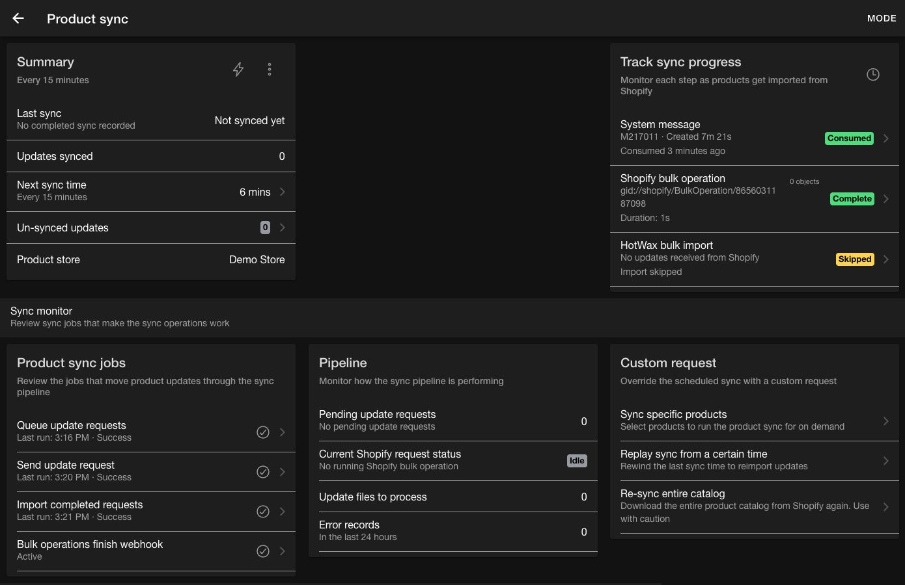
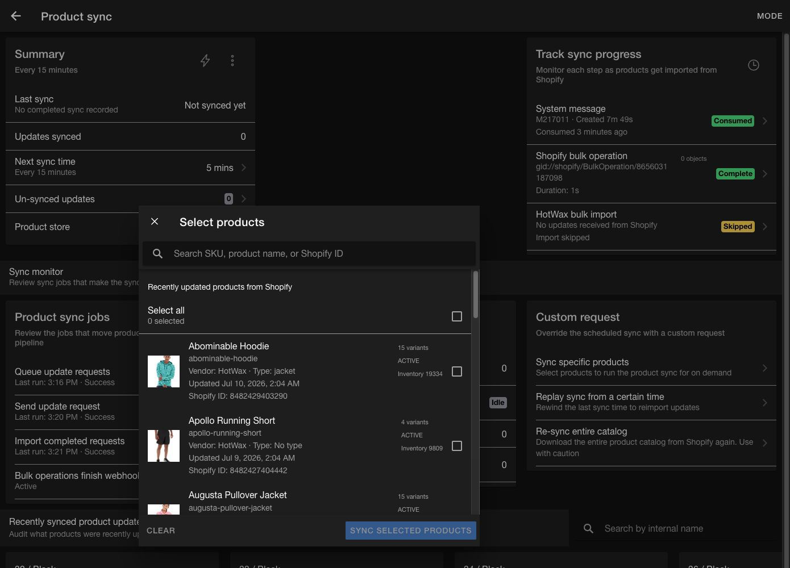
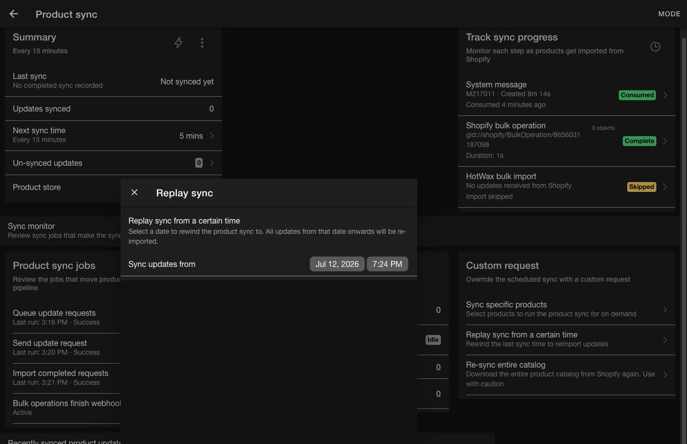
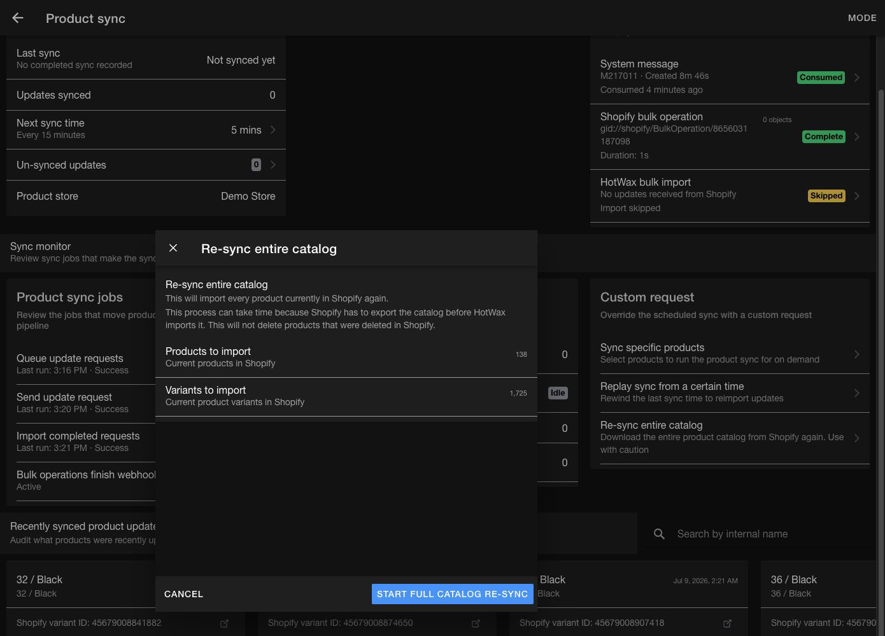
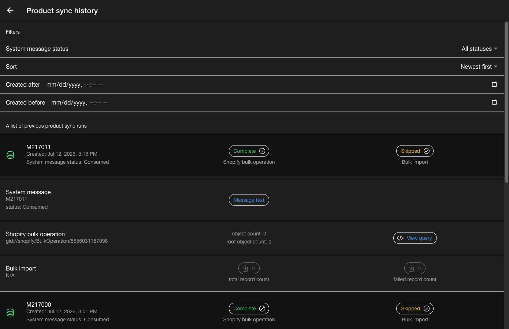

# Monitor Shopify product sync

Use the `Product sync` dashboard in the Company App to monitor scheduled imports, review the current pipeline, run targeted sync requests, and troubleshoot failed products.

This guide covers day-to-day product sync operations after setup. To connect a new shop, use [Chapter 6 of Set up HotWax Commerce with Shopify](product-store-onboarding.md#6-import-and-validate-products). To move a shop from the legacy pipeline, use [Upgrade Shopify product sync](upgrade-shopify-product-sync.md).

## Open the product sync dashboard

1. Open the Company App from the HotWax Commerce Launchpad.
2. Select `Shopify` from the menu.
3. Select the Shopify connection that you want to monitor.
4. Select the active `Product sync` card.

The card summarizes records processed in the last completed import, unsynced Shopify events, and the latest pipeline status. If the connection shows `Setup new product sync`, complete the [first product import in Chapter 6](product-store-onboarding.md#6-import-and-validate-products). If it shows `Upgrade to new product sync` or `Disable old product sync`, follow the [legacy upgrade guide](upgrade-shopify-product-sync.md).

<figure><figcaption>
Product sync status on the Shopify connection details page
</figcaption></figure>

## Monitor the product sync dashboard

The dashboard brings the current run, scheduled jobs, pipeline health, and custom requests into one view.

<figure><figcaption>
Product sync dashboard overview
</figcaption></figure>

### Review the summary

The `Summary` card shows:

* The last completed sync and its relative time
* The number of updates processed in the last sync
* The next scheduled sync or a `Paused` status
* The number of unsynced Shopify updates
* The linked product store

Select the lightning action to run the recurring sync job now. The app asks for confirmation because stopping an active job run is unavailable.

Open the overflow menu to select `Reschedule`, `Pause`, or `Resume`. Select the `Next sync time` row to review the job schedule, run the job, change its schedule, and view its audit history.

Select `Un-synced updates` to review Shopify products waiting to be imported. Select one or more products, then select `Sync selected products` to import them on demand.

### Track the current run

The `Track sync progress` card follows the latest run through the complete pipeline:

| Stage | Information available |
| --- | --- |
| `System message` | Message ID, status, age, error text, and the next available action |
| `Shopify bulk operation` | Bulk operation ID, duration, object count, and Shopify status |
| `HotWax bulk import` | Data Manager log ID, record count, failed record count, duration, and import status |

Select an available stage to open its details.

#### System message details

The `System Message` modal shows:

* The system message ID and current status
* Why the run is waiting and which job performs the next step
* The next scheduled time for that job, when available
* A `Send now`, `Poll now`, or `Cancel` action when the current message status allows it
* The Shopify bulk operation ID, or `Pending` until Shopify accepts the request
* `Message Text`, which contains the request payload, and `Error Text` when the system message has an error

Use the message ID when sharing a specific run with the technical team. If a message remains `Produced`, check the listed `Send update request` schedule or use `Send now`. If it remains `Sent`, check when `Import completed requests` runs or use `Poll now`. A missing bulk operation ID means that Shopify hasn't accepted the request yet. Open `Error Text` when the message reaches an error state.

#### Shopify bulk operation details

The `Bulk Operation` modal shows the Shopify bulk operation ID and its current status. It also shows the status reported for the current sync run, or `Pending` when the app hasn't received one yet.

Use the bulk operation ID to identify the request in Shopify or when escalating a run that remains active for an unusual amount of time. If the system message is still `Produced` and no bulk operation ID exists, investigate the send stage instead of Shopify processing. After Shopify completes the operation, investigate `Import completed requests` when the HotWax import doesn't begin.

#### HotWax bulk import details

The `Data Manager Log` modal loads the import log and shows:

* Log ID and status
* Total record count
* Successful record count
* Failed record count

Use the log ID when sharing an import with the technical team. Compare the total, successful, and failed counts to determine whether the whole file failed or only particular products need correction. When failed records are present, continue to `Parsed error details` or download the failed-record file from sync history.

Select the history icon on the card to open [Product sync history](#review-sync-history).

### Review jobs and pipeline health

The `Product sync jobs` card shows the jobs and webhook that move requests through the pipeline:

* `Queue update requests` creates product sync requests on the shop's schedule.
* `Send update request` sends produced requests to Shopify.
* `Import completed requests` checks completed operations and starts the HotWax import.
* `Bulk operations finish webhook`, when supported, notifies HotWax when Shopify finishes a bulk operation.

Select `Queue update requests`, `Send update request`, or `Import completed requests` to open the service-job modal. Each modal shows the following information and controls:

| Section | What it shows | Useful when |
| --- | --- | --- |
| Job identity | Display name, internal job name, and service name | Use the internal names when the technical team needs to find the same job in Service Jobs or logs. |
| `Run now` | Starts one immediate execution without changing the schedule | Use it after correcting a temporary problem or when the pipeline is waiting for this job. Avoid repeated runs while an earlier execution is active. |
| `Active` | Whether the service job is active or paused | Check this first when the dashboard shows a pause icon or records remain in one pipeline stage. |
| `Last run` | Time and outcome of the latest execution | Confirms whether the job has run since the affected request entered the pipeline. |
| `Instance of product` | The HotWax application product that owns the service job | Useful to the technical team when verifying that the job belongs to the expected installed component. This isn't the Shopify catalog's product store. |
| `Schedule` | Quartz cron expression, readable schedule, next run time, and common schedule options | Use the readable schedule and next run time for routine checks. Change the cron expression only when the operating schedule must change. |
| `Parameters` | Configured job parameters and service parameter definitions or defaults | Use these values to verify which shop and configuration a job processes. Parameter names and availability depend on the job. |
| `Recent runs` | The last five executions, including status, start and completion times, duration, user, available counts, and output message | Use the output and status to distinguish a job that hasn't run from one that ran but found no work or returned an error. |
| `Edit history` | The last recorded field changes, previous and new values, user, and timestamp | Use this when a job becomes paused or its schedule changes without an intentional update. The section can show `Unavailable` when the audit API isn't exposed. |

Use the refresh action to reload the job details. When you change `Active` or `Schedule`, use the save action. Closing or refreshing with unsaved changes displays a discard confirmation.

The most useful checks depend on the job:

* `Queue update requests` is the shop-specific job. In `Parameters`, verify `shopId`, `productStoreIds`, and `shopifyProductIdentifier` when available. These values confirm which Shopify shop, HotWax product store, and internal name mapping the job uses. Check its active state, schedule, and recent output when Shopify changes aren't creating product sync requests.
* `Send update request` sends produced system messages to Shopify. Check its active state, next run, and recent output when the current system message remains `Produced` or no Shopify bulk operation ID appears.
* `Import completed requests` checks Shopify operations and starts the HotWax Data Manager import. Check its active state, next run, and recent output when Shopify has completed an operation but the HotWax import hasn't started, or when update files remain waiting for processing.

A pause icon means that the corresponding job is paused. Resume paused jobs that the scheduled pipeline requires.


`Bulk operations finish webhook` doesn't open a details modal. Its row shows `Active` or `Inactive`, and selecting the row immediately subscribes or unsubscribes the Shopify webhook. Don't select it only to inspect its status.


The `Pipeline` card shows pending update requests, the current Shopify request, update files waiting for import, and error records from the last 24 hours. A growing count usually points to a paused job, a request still waiting to finish, or import errors that need review.

### Review synced updates

`Recently synced product updates` lists products processed by recent sync runs. Use the search field to find a product by internal name. Each product card can show:

* Product title, variant title, SKU, Shopify ID, and sync time
* A link to the product in Shopify
* A summary of changed fields
* A `Changes` section with field-level values

An empty change list means field-level details are unavailable. The product may still have synced successfully.

## Run a custom request

Use the `Custom request` card when you need a result before the next scheduled run.

### Sync specific products

1. Select `Sync specific products`.
2. Search by SKU, product name, or Shopify ID.
3. Select the products to import.
4. Select `Sync selected products`.

<figure><figcaption>
Select Shopify products for an on-demand sync
</figcaption></figure>

Use this option after correcting one or more products in Shopify or when a small set of updates needs immediate processing.

### Replay updates from a date and time

1. Select `Replay sync from a certain time`.
2. Set `Sync updates from` to the start of the period that must be processed again.
3. Select `Start replay sync`.

<figure><figcaption>
Choose when the replay should begin
</figcaption></figure>

Replay changes the last-sync time so that Shopify updates from the selected time are imported again. Use the narrowest practical time range to avoid processing unrelated updates.

### Re-sync the complete catalog

1. Select `Re-sync entire catalog`.
2. Review the current Shopify product and variant counts.
3. Select `Start full catalog re-sync`.

<figure><figcaption>
Review the catalog size before starting a full re-sync
</figcaption></figure>

This request imports every product that currently exists in Shopify. It can take a long time for a large catalog.


A full catalog re-sync leaves products in HotWax Commerce after Shopify deletes them. Use the product deletion process for deleted Shopify products.


## Review errors and retry products

`Parsed error details` shows failed objects from recent Data Manager logs. Each card includes the product title or handle, Shopify product ID, and the parsed error message.

1. Search by product ID, name, or handle.
2. Select `View details` to review the full error record.
3. Correct the source data or configuration that caused the error.
4. Select `Retry` to sync the product again.

Use the refresh action to reload the error list after another import finishes. When a failed record lacks a Shopify product ID, direct retry is unavailable. Use the error details to locate the source product or ask the technical team for help.

## Review sync history

Select the history icon in `Track sync progress` to open `Product sync history`.

Use these filters to find a run:

* `System message status`: `Produced`, `Sent`, `Received`, `Consumed`, `Confirmed`, or `Error`
* `Sort`: `Newest first` or `Oldest first`
* `Created after` and `Created before`: limit results to a date and time range

Expand a run to review the system message, Shopify bulk operation, and HotWax bulk import.

<figure><figcaption>
Review the stages and files for a previous product sync run
</figcaption></figure>

* Select `Message text` or `Error details` to inspect the system message.
* Select `View query` to inspect the Shopify query when available.
* Select the total record count to download the raw Shopify import file when available.
* Select the failed record count to download the failed-record file when available.

A `Produced` message is waiting for the send job. A missing Shopify bulk operation ID can be normal until Shopify accepts the request. A skipped HotWax import can be normal when Shopify returns no updates.

## Troubleshoot common states

| State | What to check |
| --- | --- |
| `Product sync could not load` | Select `Retry`. If the page still fails, confirm that the Shopify connection has a system message remote. |
| `Shopify write access required` | Reconnect the shop with read-and-write access before starting the sync. |
| `Update Shopify access scope` | Replace the deprecated access scope with `SHOP_RW_ACCESS`. |
| `Produced` remains unchanged | Review `Send update request`. Resume the job or use its `Run now` action. |
| Shopify bulk operation remains active | Check `Current Shopify request status`, the finish webhook, and the import/poll job before starting another request. |
| Pending update requests keep growing | Check the schedules and pause states for all product sync jobs. |
| Update files to process keep growing | Review `Import completed requests` and recent Data Manager logs. |
| A run finishes with failed records | Download the failed-record file, correct the source issue, and retry the affected products. |
| No recent changes appear | Check the selected product store, search by internal name, and review the same period in `Product sync history`. |

Contact the technical team when required artifacts are missing, a pipeline job continues to fail, or the same product fails again after you correct its source data.
