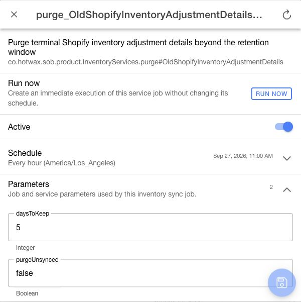

# Manage sync jobs in Company

Company's product, inventory, order, fulfillment, transfer, and onboarding pages can open a shared job dialog. Use it to review a specific service job before changing a schedule or starting a run.

## Confirm job identity and scope

1. Open the configured job from the relevant sync page.
2. Confirm the internal job name in the dialog title.
3. Review the description, service, and parameters.
4. Check whether the job serves one shop, product store, inventory channel, or the whole OMS.

If `Sync job details unavailable` appears, select `Retry` or use the refresh action. A failed load does not mean the job is absent. Run and save actions require a successfully loaded job.

<figure><figcaption>
Review the selected job's service, schedule, execution time zone, and typed parameters before changing or running it.
</figcaption></figure>

## Review a schedule

Open `Schedule` to review the cron expression, its description, execution time zone when supplied, and next run. The schedule description uses the job's execution time zone; do not assume it is the browser time zone.

Changing a schedule draft displays `Next run recalculated after saving` until it is saved. A manual job can legitimately show `Not scheduled`.

## Save changes

1. Change `Active`, the schedule, or the editable parameter values required by the task.
2. Review the scope and draft values.
3. Select the save action.
4. Verify the reloaded job.

Scope-defining parameters, such as the shop, product store, and channel, normally remain read-only. A page can permit a specific scope parameter for a manual recovery job; review that scope before running it.

A changed schedule must be valid before saving. A manual job without a schedule can still save permitted parameter changes. Closing or refreshing with unsaved changes asks whether to discard them.

If a save partly succeeds, keep the dialog open and retry only the remaining draft changes. Do not assume that an error means no configuration changed.

## Run and verify a job

`Run now` starts an immediate execution using the saved job configuration and does not change its schedule. Save intended configuration changes first, check for an existing active run, then run only for an approved operational purpose.

Review the run result and error information. A request being accepted is not proof that synchronization completed. Use `Recent runs` and `View all runs` to follow the execution; verify the affected Shopify or OMS records before considering the task complete.

The dialog previews five recent runs and ten edit-history records. Use `View all runs` or Job Manager when you need more history or need to investigate overlapping jobs.

## Related guides

* [Monitor Shopify Product Sync](manage-shopify-product-sync.md)
* [Monitor Shopify inventory sync](manage-shopify-inventory-sync.md)
* [Manage Shopify Order Sync](manage-shopify-order-sync.md)
* [Manage a job in Job Manager](../../../retail-operations/workflow/job-management/jobs/job-details.md)
