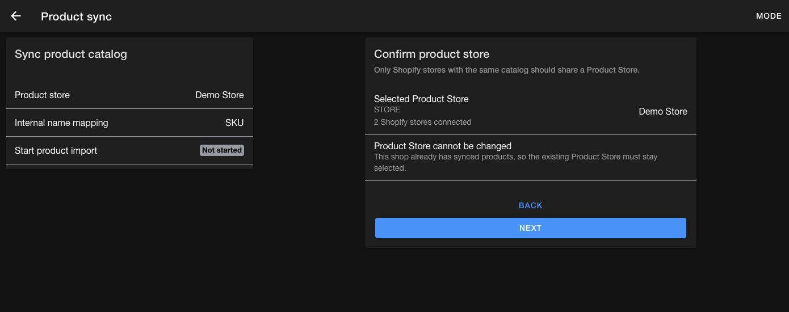
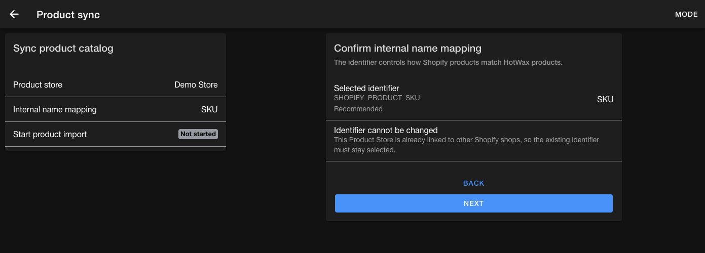
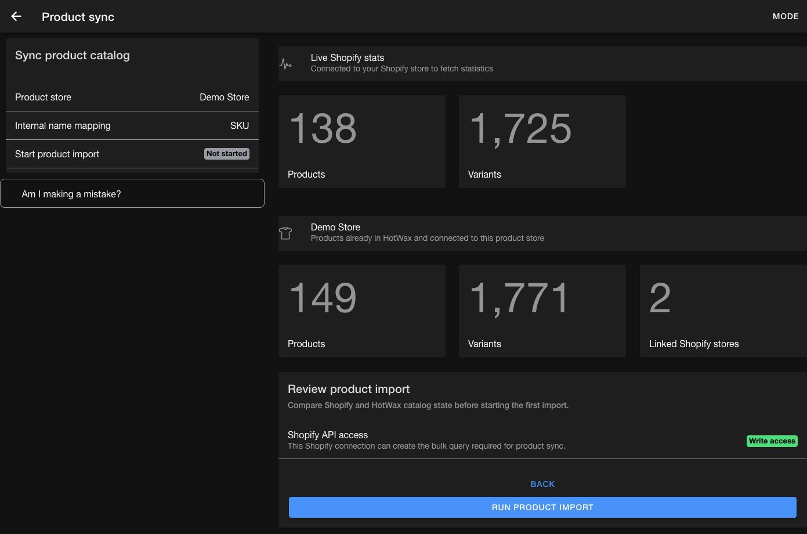
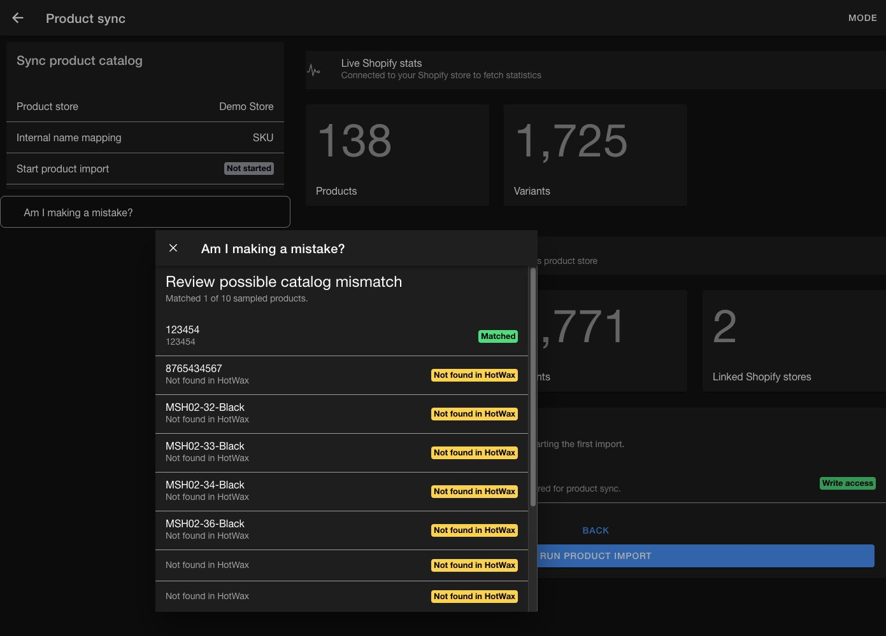
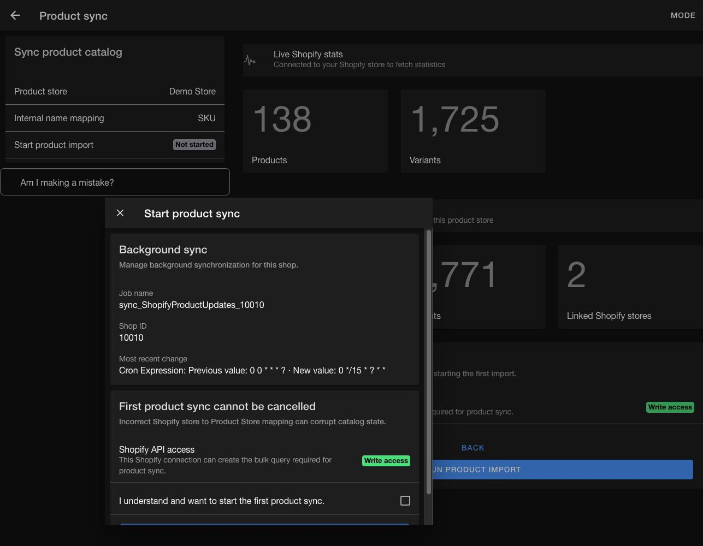
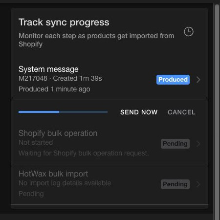

# Set up Shopify product sync

Use this guide when a Shopify connection shows `Setup new product sync`. The first-time flow confirms the product store and product identity rule before it imports the Shopify catalog.

## Before you begin

Check the following requirements before starting a shop's first product sync:

* Connect the Shopify shop to HotWax Commerce.
* Give the Shopify connection read-and-write access. Product sync needs write access to create a Shopify bulk query.
* Use the current `SHOP_RW_ACCESS` scope. Replace the older scope when the app displays `Update Shopify access scope`.
* Run HotWax Commerce release `v5.1.0` or later.
* You know which Shopify identifier should map to the HotWax internal product name.

Cancellation is unavailable after the first product sync starts. Verify the product store and internal name mapping before you confirm the import.

## Open product sync setup

1. Open the Company App from the HotWax Commerce Launchpad.
2. Select `Shopify` from the menu.
3. Select the Shopify connection that you want to manage.
4. Find the `Product sync` section on the connection details page.

The available entry point depends on the shop's current state:

| Entry point | What it means | Next action |
| --- | --- | --- |
| `Product sync` | The current sync is already active | Open the card to view the dashboard |
| `Setup new product sync` | The shop is compatible and ready for its first current sync | Open the setup flow |
| `Update Shopify access scope` | The connection uses a deprecated access scope | Update the connection before setup |
| `Shopify write access required` | The connection has read-only access | Reconnect Shopify with write access |
| `Upgrade required for new product sync` | The HotWax Commerce release is older than the supported release | Upgrade HotWax Commerce before setup |
| `Upgrade to new product sync` | A compatible shop still uses the legacy sync | Follow the [legacy product sync upgrade guide](upgrade-shopify-product-sync.md) |
| `Disable old product sync` | The current sync is active, but legacy sync artifacts remain | Follow the [legacy product sync upgrade guide](upgrade-shopify-product-sync.md) |

If the connection already shows the active `Product sync` card, setup is complete. Use [Monitor Shopify product sync](manage-shopify-product-sync.md) for day-to-day operations.

## Complete first-time setup

The setup flow confirms where the catalog belongs, how products match, and whether the import is safe to start.

### Confirm the product store

1. Open `Setup new product sync`.
2. Select `Review configurations`.
3. On `Confirm product store`, select the HotWax product store that owns the Shopify catalog.
4. Review any other Shopify shops linked to that product store. Only shops that share the same catalog should use the same product store.
5. Select `I have verified that these Shopify stores are part of the selected Product Store`.
6. Select `Next`.

The app locks the product store when the shop already has synced products. This lock keeps existing products in their original product store during setup.

<figure><figcaption>
Confirm the product store before starting the first import
</figcaption></figure>

### Confirm the internal name mapping

The internal name mapping tells HotWax Commerce which Shopify value represents the same sellable product or variant in the HotWax catalog. During the first import, HotWax compares the selected value with existing product internal names. A match links the Shopify product to the existing HotWax product. When no match exists, HotWax creates a new product record.

This setting controls product deduplication for every Shopify shop that shares the product store. Missing, reused, or inconsistent identifiers can produce two different problems:

* Two Shopify variants with the same identifier can link to the same HotWax product, even when they represent different sellable items.
* An existing item with a missing or changed identifier can fail to match and create another HotWax product.

Choose the identifier that the retailer treats as the stable source of product identity across Shopify, HotWax, and connected enterprise or warehouse systems.

| Identifier | Use it when | Deduplication impact |
| --- | --- | --- |
| `SKU` | Every sellable variant has a unique, stable stock keeping unit (SKU) shared across Shopify, HotWax, enterprise resource planning, warehouse, and point-of-sale systems | Recommended default for most retailers. Duplicate or missing SKUs can merge unrelated variants or create duplicate HotWax products. |
| `UPCA / Barcode` | The retailer manages a unique Global Trade Item Number (GTIN), such as a Universal Product Code (UPC), for every sellable variant and uses it across systems | Best fit for a GS1-governed catalog. Reused, missing, or supplier-specific barcodes weaken matching. |
| `Shopify internal id` | Shopify is the product identity authority and cross-shop or external-catalog deduplication is unnecessary | Shopify assigns IDs independently in each shop, so the same item receives a different identifier in each shop. This can create separate product links instead of one shared HotWax product. |

[Shopify recommends a unique SKU for every variant](https://help.shopify.com/en/manual/products/details/sku) and warns that duplicate SKUs can cause inventory and third-party integration issues. [GS1 defines the Global Trade Item Number (GTIN)](https://www.gs1.org/standards/id-keys/gtin), including UPC, as the global standard for identifying trade items. In practice, use `SKU` when the retailer has a well-governed cross-system SKU convention. Use `UPCA / Barcode` when GTIN is complete, unique, and authoritative for the catalog.

Before continuing, confirm that every variant has a value in the selected field, the catalog contains no duplicate values, and every connected system uses the same values.

1. On `Confirm internal name mapping`, review the available Shopify identifiers.
2. Select the identifier that follows the retailer's catalog convention.
3. Select `Next`.

The app locks the identifier when other Shopify shops already use the product store. All shops that share a catalog must use the same matching rule.

<figure><figcaption>
Confirm the identifier used to match Shopify variants with HotWax products
</figcaption></figure>

### Review the import

The review page compares the Shopify catalog with products already linked to the HotWax product store. Review the following values:

* Shopify product and variant counts
* HotWax product and variant counts
* Number of linked Shopify stores
* Shopify API access status

<figure><figcaption>
Compare the connected catalogs before running the first import
</figcaption></figure>

Select `Am I making a mistake?` to run a spot check against existing HotWax products. The check reads up to 10 Shopify variants and, for each variant, takes the value from the selected internal name mapping: SKU, barcode, or Shopify ID. It then finds the product connected to the same Shopify variant in the selected HotWax product store and compares that product's internal name with the Shopify value.

The result assigns one of the following statuses to each sampled variant:

* `Matched`: HotWax contains a product connected to the Shopify variant, and its internal name equals the selected Shopify identifier.
* `Conflict`: HotWax contains a product connected to the Shopify variant, but its internal name doesn't equal the selected Shopify identifier. This can indicate that the wrong internal name mapping was selected or that the existing product data uses a different identifier convention.
* `Not found in HotWax`: The selected product store has no product connected to that Shopify variant. This can be expected for new products, but many missing results can indicate that the wrong product store was selected.

When fewer than 70% of the sampled variants match, the page shows `Review possible catalog mismatch`. For a full 10-variant sample, this warning appears when fewer than seven variants match. Review the results, recheck the product store and internal name mapping, and continue only when the unmatched variants are expected. To continue from the warning, select `I reviewed the warning and want to continue`, then select `Continue to import`.

This review doesn't modify product data or start the import. It's a small sample, not a complete deduplication audit: it doesn't scan every variant or detect every duplicate SKU or barcode in the catalog.

<figure><figcaption>
Use the sampled matches to identify a possible catalog mismatch
</figcaption></figure>

### Start the first product sync

1. Select `Run product import`.
2. Review the `Background sync` job. When the shop-specific job is missing, select `Setup Job`.
3. Read the notice that cancellation is unavailable after the first product sync starts.
4. Select `I understand and want to start the first product sync`.
5. Select `Start product sync`.

<figure><figcaption>
Review the background job and final warning before starting the first sync
</figcaption></figure>

The progress page shows three stages:

| Stage | What happens |
| --- | --- |
| `Product export request payload` | HotWax creates a system message with the Shopify bulk query |
| `Pending bulk operations` | Shopify exports the requested products and variants |
| `Bulk file process` | HotWax Data Manager imports the exported file |

<figure><figcaption>
Track each stage of the product import
</figcaption></figure>

Wait for the import to reach a terminal status. If the page offers a next-step action, use that action to continue the current run. Avoid starting another full import while a Shopify bulk operation is running.

After the first import finishes, select `Finish setup`. The app schedules the recurring product sync every 15 minutes and opens the regular dashboard. If the job is already active, select `Open sync page`.

After setup, use [Monitor Shopify product sync](manage-shopify-product-sync.md) to review scheduled runs, pipeline health, errors, and custom requests.

