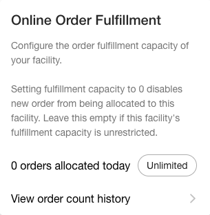
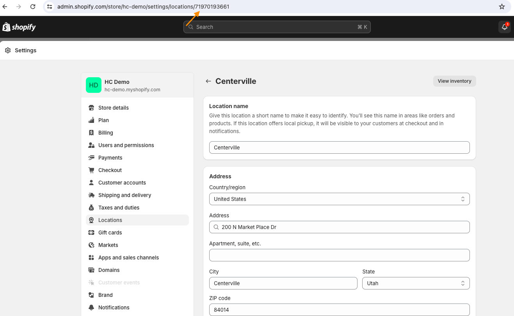

# Manage Facility Details

After creating a facility, retailers can manage most day-to-day configuration from the `Find Facilities` page and the `Facility details` page in the `Facilities App`. This includes updating basic details, address and contact information, operating hours, fulfillment settings, product store associations, and external mappings.

## Find a Facility

Retailers can locate and manage specific facilities by clicking `Facilities` on the app homepage.

There are two ways to locate a facility:

1. Search by facility name from the `Search facilities` bar on the top left of the page.
2. Use the `Product Store` and `Type` filters to narrow the list to a specific product store or facility type.


Video: Locate Facilities


## Update Basic Information

### Rename a Facility

You can rename a facility by clicking the `Edit` button next to the facility name. Update the name in the pop-up and click `Apply` to save it.


Video: Rename Facilities


### Change Facility Type

You can change the facility type from the `Facility details` page.


Video: Change Facility Type


## Address and Contact Details

Use the `Address and Contact Details` card on the `Facility details` page to maintain facility address, phone number, shipping name, and directions.

### Add or Update Address

1. Open the facility from the `Find Facilities` page.
2. Click `Add` on the Address card, or click `Edit` if an address already exists.
3. Enter or update `Address Line`, `City`, `Country`, `State`, and `Zip code`.
4. Click the `Save` icon to apply the changes.


HotWax Commerce uses zip codes in zone-based routing. If a facility does not have the correct zip code, orders may not be brokered to that facility.



Video: Add Facility Address


### Edit Contact Details

1. Open the facility from the `Find Facilities` page.
2. On the `Facility details` page, locate the `Address and Contact Details` card.
3. Click `Add` if contact details have not been configured yet, or click `Edit` to update the existing details.
4. Enter or update the `Phone number` field with the correct contact number for the facility.
5. Click the `Save` icon to apply the changes.


Shipping carriers may require a valid facility phone number for shipment notifications and label generation.


### Set Shipping Name

The shipping name can differ from the facility name and can be used to reflect the retailer's preferred brand name for shipments.

1. Open the facility from the `Find Facilities` page.
2. Locate the `Address and Contact Details` card on the `Facility details` page.
3. Click `Edit` to open the form.
4. Enter the `Shipping Name`.
5. Verify that the facility `Zip code` is present.
6. Click the `Save` icon to update the details.


Video: Set Shipping Name


### Add Directions

Directions can be used to capture nearby landmarks or other location notes that help staff and customers find the facility.

1. Open the facility from the `Find Facilities` page.
2. Locate the `Address and Contact Details` card.
3. Click `Add` or `Edit` to open the address form.
4. Enter the `Directions` value along with any other address updates.
5. Click the `Save` icon.


Video: Add Directions


## Latitude and Longitude

Latitude and longitude support store lookup and distance-based pickup experiences on Shopify Product Detail Page (PDP).

1. Open the facility from the `Find Facilities` page.
2. On the `Facility details` page, click `Add` on the `Latitude & Longitude` card.
3. Enter the coordinates manually, or use the `Generate` icon to derive them from the saved address.
4. Click the `Save` icon.


Video: Add Latitude & Longitude


## Map Link

Use the `Map Link` card to add a navigation link for a facility.

### Add or Update Map Link

1. Open the facility from the `Find Facilities` page.
2. Locate the `Map Link` card on the `Facility details` page.
3. Click `Add`, or click `Edit` if a link already exists.
4. Enter the map URL.
5. Click `Save`.

To verify the link, click `Preview` on the `Map Link` card and confirm the location opens correctly in a new tab.

### Remove Map Link

1. Locate the `Map Link` card on the `Facility details` page.
2. Click `Remove`.
3. Confirm the removal if prompted.


Video: Add Map Link


## Operating Hours and Time Zone

Operating hours help inform pickup availability and carrier communication.

### Manage Operating Hours

1. Select one of the existing calendars in the `Operating hours` card and click `Add Operating Hours`, or click `Custom Schedule` to create your own.
2. For a custom schedule, enter the schedule name, start time, and end time.
3. To set different hours by day, enable `Daily Timings` and enter the schedule for each day.
4. Click the `Save` icon.


Video: Manage Operating Hours


### Set Time Zone

1. Open the facility from the `Find Facilities` page.
2. Locate the `Operating Hours` card.
3. Click `Change`, or `Add` if no time zone is configured yet.
4. Select the browser default time zone or choose a different time zone from the list.


Video: Set Time Zone for Facility


## Product Stores

Facilities can be associated with one or more product stores.

1. Click `Add` on the `Product Stores` card.
2. Select one or more product stores from the list.
3. Click the `Save` icon.
4. Use the overflow menu on a linked product store to mark it as `Primary` or `Unlink` it from the facility.


Video: Manage Product Stores


## Online Fulfillment Settings

Use the `Sell inventory online` card and the `Online Order Fulfillment` card to define how the facility participates in fulfillment and inventory computation.

### Configure Fulfillment Settings

Users can configure the following settings for the facility:

* **Allow Pickup:** Controls whether the facility can support Buy Online, Pick-up In Store (BOPIS) and appear as a store pickup option.
* **Use Native Fulfillment App:** Indicates whether the facility uses HotWax Commerce's `Fulfillment App` or a third-party fulfillment system.
* **Generate Shipping Labels:** Controls whether shipping labels are generated through HotWax Commerce for the facility.
* **Days to Ship:** Sets the minimum number of days the facility requires to ship an order after brokering.


Video: Configure Fulfillment


### Configure Inventory Computation

Retailers can enable or disable sales-channel toggles for the facility to control whether its Available-to-Promise (ATP) is included in online inventory computation for each configured channel.

## Fulfillment Capacity

Fulfillment capacity determines how many orders can be allocated to a facility in a day.

1. On the `Online Order Fulfillment` card, open the overflow menu next to `number of orders allocated today`.
2. Choose one of the available options:
   * `Unlimited capacity`
   * `No capacity`
   * `Custom`
3. Click `Apply` to save the selected capacity.
4. Use `View order count history` on the same card to review recent order counts when setting capacity.

<figure><figcaption>
Image: Configure Fulfillment Capacity
</figcaption></figure>

## Facility Logins

If the facility uses the native fulfillment flow, you can create facility-specific logins from the retail or warehouse login card.

1. Click `Add` in the login card.
2. Enter the facility username, password, and reset password link.
3. Click the `Save` icon.

## External Mappings

Use external mappings to connect a HotWax Commerce facility with Shopify, ERP, or another external system.

1. Open the facility and go to the `External Mappings` tab at the bottom of the `Facility details` page.
2. Click `Map Facility to an External System`.
3. Choose the external system for the mapping.
4. Complete the required fields:
   * For `Shopify`, select the store and enter the location ID from Shopify Admin.
   * For `Custom`, enter the `Mapping ID`, `Mapping Name`, and `Mapping Value`.
5. Click the `Save` icon to create the mapping.
6. Use `Edit` to update a mapping or `Remove` to delete it.

<figure><figcaption>
Image: Location ID on Shopify
</figcaption></figure>
