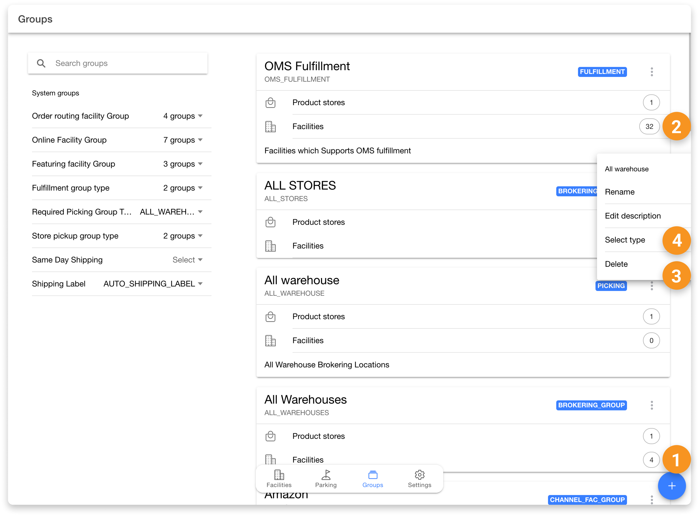

# Manage Groups

In HotWax Commerce, facility groups are used to define the scope and functionality of facilities for omnichannel order management. For example, including a facility in both the `Pickup` and `Same Day Shipping` groups indicates that the location supports Buy Online, Pickup In-Store (BOPIS) and same-day fulfillment.

Users can access facility groups by navigating to the `Group` tab in the **Facilities App**. From here, users can manage group settings, link product stores, and organize facilities.

### Search and filter groups

Users can search for specific groups using the search bar at the top left of the `Group` page. Groups can also be filtered using the `System Groups` section located below the search bar to narrow down the list based on predefined categories.

### Edit existing groups

Users can manage group details by clicking the overflow menu (three dots) on a group card. Available actions include:
- **Rename Group**: Change the display name of the group.
- **Edit Description**: Update the purpose or business context of the group.
- **Delete Group**: Permanently remove the group from the system.

### Link product stores with facility groups

HotWax Commerce allows retailers to create product stores to configure brand-specific settings. Linking product stores with facility groups defines which locations handle fulfillment for specific brands. This is critical for order brokering, as the engine ensures inventory allocation aligns with brand requirements. 

To link a product store, click the `number chip` next to the `Product Store` option on the group card.

### Create a new group

Retailers can create custom facility groups by clicking the `+` (plus) icon at the bottom right. A modal will prompt for the following:

- **Name**: The display name for the group.
- **Internal ID**: Automatically generated based on the name, but can be manually edited. This uniquely identifies the group.
- **Group Type**: Select a category from the dropdown (e.g., `BROKERING`, `PICKUP`).
- **Product Store**: Link the group to a product store for specific routing rules.
- **Description**: A brief explanation of the group's purpose.

> [!NOTE]
> All fields except the `Internal ID` can be modified after the group is created.

### Manage facilities in a group

The number on the group card indicates the total facilities in that group. Clicking this number opens the `Manage Facilities` page.

- **Add Facilities**: Select facilities from the list on the left and click the `add` icon. Use the `INCLUDE ALL` option to add all facilities at once.
- **Custom Sequence**: Drag and drop facilities to set a specific priority for order routing.
- **Remove Facilities**: Click the `remove` icon next to a facility to exclude it from the group.

Click the `Save` icon at the bottom to apply changes.

## System Facility Group Types

HotWax Commerce includes several default facility group types. Facilities must be assigned to these groups to define their operational scope.

- **Pickup**: Facilities in this group support BOPIS orders. Turning on the `Allow Pickup` toggle on a facility's details page automatically adds it to the `PICKUP` group. This ensures locations are visible as pickup options on Shopify.
- **Brokering Group**: Used to prioritize specific facilities during brokering runs. Facility groups with the `BROKERING` subtype are configurable within the `Order Routing` app.
- **Online Facility Group**: Controls which facilities participate in online inventory computation. Facilities under the `CHANNEL_FAC_GRP` (Online Channel Facility Group) subtype sync inventory with specific sales channels (e.g., Shopify, Amazon).
- **Generate Shipping Label**: Facilities in this group support HotWax native shipping label generation. If a location uses a 3rd-party app or incompatible carrier, it should be excluded from this group to avoid errors.
- **Same Day Shipping**: Includes facilities with the resources to meet fast turnaround times (pick-pack-ship). Locations with constraints can be excluded to prevent same-day orders from being routed there.
- **OMS Fulfillment**: Includes facilities that use the `HotWax Fulfillment` app. If fulfillment is handled exclusively via an ERP or external system, the facility should be removed to hide it from the app.

> [!TIP]
> Users can view groups linked to a specific facility on the **Facility Details** page and add facilities to groups directly via the **Link to Group** button in the **Groups** tab.

<figure><figcaption></figcaption></figure>
