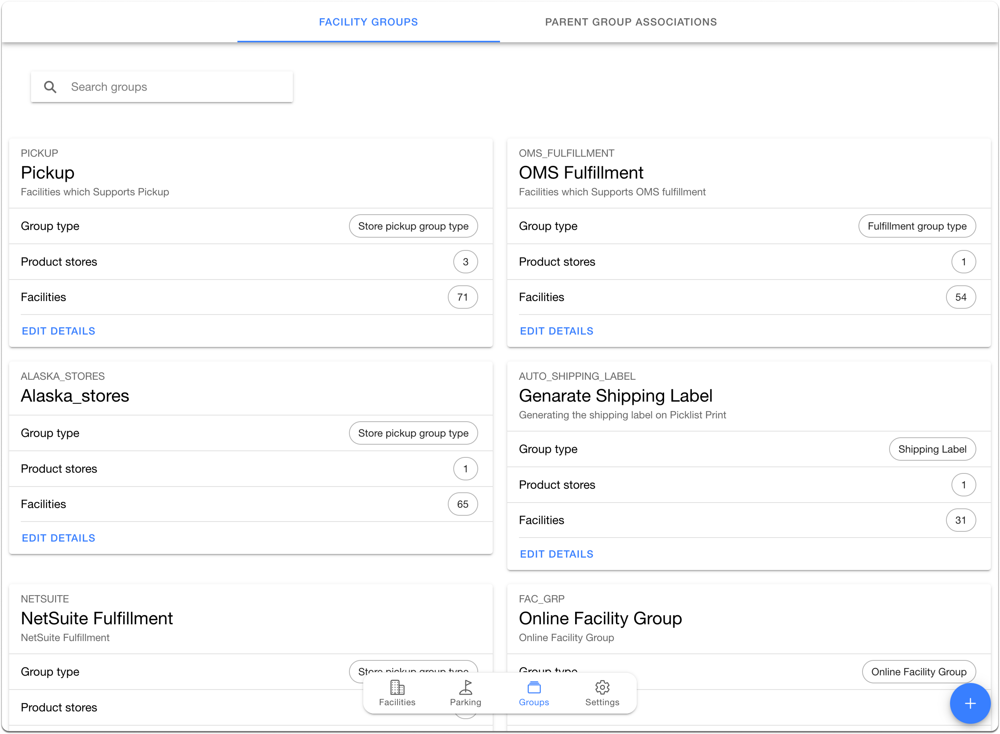

# Manage Groups

In Hotwax commerce facility groups are used to define the scope and functionality of the facility for omnichannel order management. For instance, including a facility in the Pickup and Same Day Shipping groups indicates that the facility accommodates both Buy Online, Pickup In-Store (BOPIS), and same-day shipping orders.

Users can find the Facility Groups by clicking on the `Group Tab` in the `Facilities App`. On the Facility Group page, users can perform various functions such as:

### Searching a Group

Users can search for the groups from the search bar on the top left of the `Group details` page. Users can filter the groups by the system groups section below the search menu.

### Editing Existing Group

Users can perform various actions on a specific group by accessing the overflow menu associated with the group card. This includes renaming the `Group`, `Editing its description`, and `Deleting` the group.

### Linking Product Store with Facility Groups

HotWax Commerce allows retailers to create product stores in HotWax Commerce to configure brand-specific settings across one or multiple Shopify stores. Retailers can link specific product stores with designated facility groups to define the scope and purpose of various facilities within a product store. This is specifically crucial when creating facility groups for brokering the brokering engine ensures that inventory allocation aligns with each brand's specific requirements. The product store can be linked to the facility group by clicking the `number chip` against the product store option.

### Creating a New Group

Retailers can create custom groups by clicking the plus icon at the bottom right of the Group tab. A modal window will appear asking for the following details:

- **Name**: Enter the name of the facility group being created.

- **Internal ID**: The Internal ID is automatically generated based on the group name. It is used in HotWax to uniquely identify a group and can be edited manually as well.

- **Group Type**: Each group can be assigned a type. Users need to select the relevant group type from the dropdown menu. This is optional.

- **Product Store**: Link facility groups to product stores if they need to be used for routing rules of that product store.

- **Description**: A short description of the facility group helps understand its purpose and business needs later. This field is optional.

These details can be modified even after the group is created, except for the Internal ID.

### Manage Facilities in a Group

The number displayed in front of the facilities on the group card represents the total count of facilities included in that group. Clicking on this number redirects to the Manage Facilities page, where users can view and manage all associated facilities for that group.

**List of Actions Users Can Perform on the Manage Facilities Page:**

- **Adding a Facility**: On the Manage Facilities page, users can view a list of all available facilities on the left side. They can add any facility as needed by clicking the add icon. Additionally, with the INCLUDE ALL option at the top, users can add all facilities to the group at once instead of manually selecting each facility.

- **Custom Sequence**: Users can drag and drop individual facilities to customize the facility sequence considered for order routing.

- **Removing a Facility**: Users can remove a facility from a group by clicking the remove icon next to the facility name. For example, in the “Same Day Shipping” group, if certain facilities are no longer eligible to ship orders on the same day, users can remove them using this button.

Click the save icon below to finalize the changes.

## System Facility Group Types

These are default facility group types, which are available when you deploy HotWax Commerce. All the group types have specific functions, The facility groups need to be added to the respective group type to define the scope of facilities.

* **Pickup**
  * Facilities managing BOPIS orders often require a designated staging area to ensure efficient order processing. Furthermore, given the urgency of same-day customer pickups, immediate picking and packing are essential. Only Facilities that have the capability to fulfill BOPIS orders can be added to this group. You can create a facility group with a `PICKUP` group type to ensure that facilities are available to the customer on Shopify PDP as a pickup option. For adding individual facilities, you can also go to the `Facility Details` page and turn the toggle on for `Allow Pickup`, which will automatically add the facility to the `PICKUP` facility group.
* **Brokering Group**
  * Retailers may opt not to facilitate order brokering for all stores, even if their facilities support order management system (OMS) fulfillment. This could be due to a preference to prioritize certain facilities during brokering runs. In such scenarios, retailers must establish facility groups for which they intend to broker orders simultaneously. These designated facility groups should be categorized with a `BROKERING` subtype. Once classified, facility groups with the `BROKERING` subtype become visible to users within the [Order Routing app](https://docs.hotwax.co/documents/retail-operations/orders/order-routing#configurable-order-routing-app) when establishing brokering rules.
* **Online Facility Group**
  * Facilities have the option to choose whether or not to participate in selling their inventory online. If a facility is capable of fulfilling orders and wants its inventory to be sold online, it can be added to a facility group with the `CHANNEL FAC GROUP` subtype. Conversely, if a facility decides not to sell its inventory online, it can be excluded from the group.
  * Retailers can have multiple online facility groups for different channels. If a retailer sells their inventory on different channels, For example, on Shopify and Amazon, they can have two Groups, one for each Amazon and Shopify with the `CHANNEL FAC GROUP` subtype. The facilities that are added to the Shopify facility group would be available to sell their inventory only on Shopify and Vice Versa. The facility group created with the `CHANNEL FAC GROUP` subtype will also be available as options in toggles in the `sell online` card on the `facility details` page which can be turned on to add the facility to the respective facility group.
* **Generate Shipping Label**
  * Facilities qualified for HotWax Commerce Shipping Label Generation are part of this group. If a facility relies on a third-party fulfillment app or if the shipping carrier used by the retailers lacks compatibility with Hotwax Commerce integration, the feature can be deactivated. Since the facility does not rely on HotWax commerce for the shipping label, clicking on the generated shipping label may result in an error, resulting in confusion for the store associates. You can add the facility from the facility group page or you can turn the toggle on to generate shipping labels in the facility details page.
* **Same day Shipping**
  * Fulfilling orders on the same day requires a faster turnaround time for the pick-pack-ship process. Facilities that can fulfill orders and have enough resources for a short lead time can be added to the same-day shipping groups. However, facilities facing any constraints preventing them from meeting this commitment can be excluded from the group so that same-day shipping orders won’t be brokered to these facilities.
* **OMS Fulfillment**
  * This group includes facilities that support store fulfillment for online orders from the HotWax Commerce Fulfillment app. If a retailer prefers to handle fulfillment through the ERP, those facilities can be removed from the group. Removed facilities and the orders brokered to them will no longer be visible in the `Fulfillment` app.


Users can see groups linked to specific facilities in the facilities' details page and also add individual facilities to a group by clicking on the `Link to Group` facility button in the `groups` tab.


<figure><figcaption></figcaption></figure>
