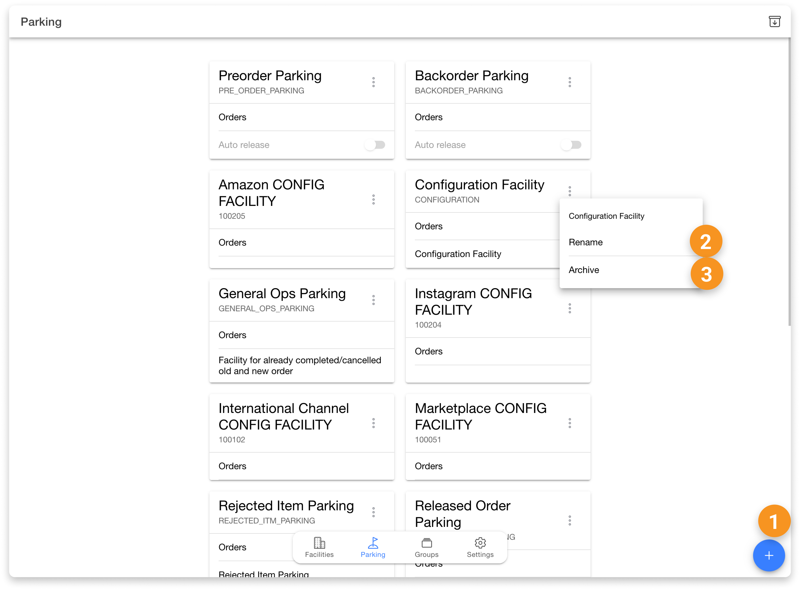
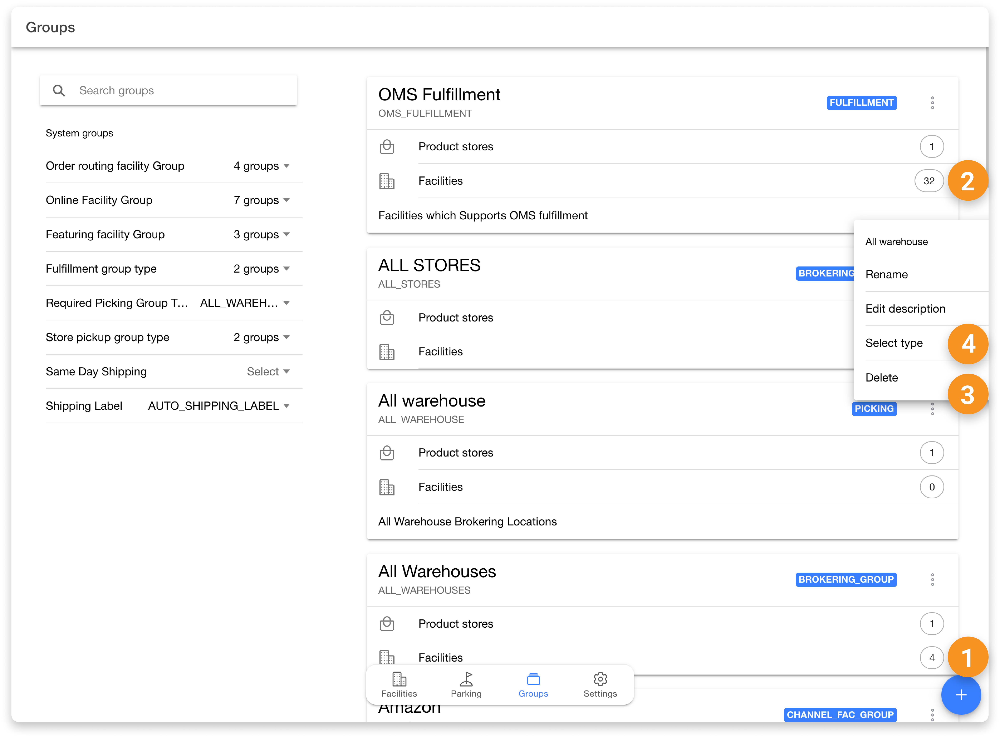
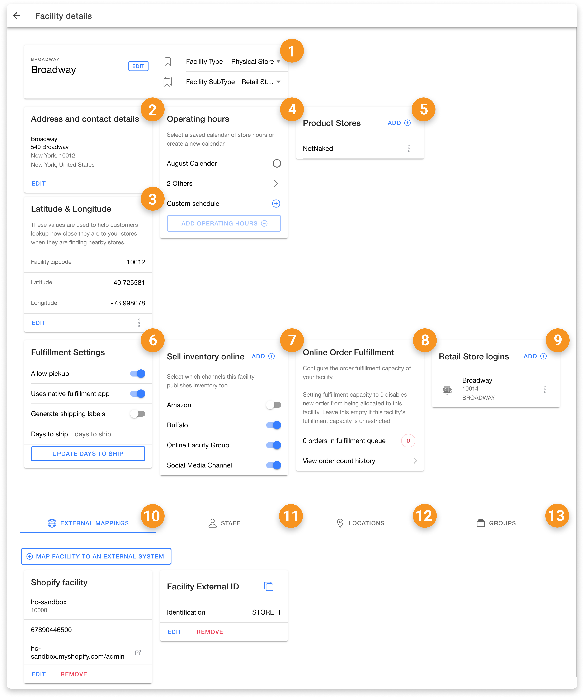

# Facilities App

The HotWax Commerce `Facilities` app is designed for specialized users such as admins and store heads. It facilitates the creation of new facilities within HotWax Commerce, mapping them with external systems, and managing their scope of participation in store fulfillment processes. Consequently, access to the Facilities App is restricted to specialized users only. To log in to the Facilities App, users must have the "FACILITIES\_APP\_VIEW" permission.

All actions within the `Facilities` App users with this permission level are unrestricted, as higher-level access is required to enter the app. Below is a summary of the actions available in the Facilities App:

## Find Facilities Page

| **Serial No.** | **Action**                | **Description**                                                                                 |
| -------------- | ------------------------- | ----------------------------------------------------------------------------------------------- |
| 1              | Search Facilities         | Allows users to search for specific facilities using various criteria such as name or location. |
| 2              | Create Facilities         | Enables users to set up new facilities within HotWax Commerce.                                  |
| 3              | Sell Online Chip          | Option to enable or manage online sales capabilities for a facility.                            |
| 4              | Daily Order Capacity Chip | Allows users to set or view the daily order capacity for a facility.                            |

<figure><figcaption></figcaption></figure>

## Parking Page

| **Serial No.** | **Action**                                 | **Description**                                                                  |
| -------------- | ------------------------------------------ | -------------------------------------------------------------------------------- |
| 1              | Create New Virtual Facility as Parking     | Allows users to create a virtual facility specifically for parking purposes.     |
| 2              | Rename Parking                             | Enables users to change the name of an existing parking virtual facility.        |
| 3              | Archive Unused Parking                     | Option to archive parking virtual facilities that are no longer in use.          |

<figure><figcaption></figcaption></figure>

## Facility Groups

| **Serial No.** | **Action**                  | **Description**                                                                                   |
| -------------- | --------------------------- | ------------------------------------------------------------------------------------------------- |
| 1              | Create New Facility Groups   | Allows users to set up new groups to organize multiple facilities.                                |
| 2              | Edit Facilities in Group     | Enables users to modify the facilities that belong to a specific group.                           |
| 3              | Edit/Delete Group            | Option to edit the details of or delete an existing facility group.                               |
| 4              | Change Facility Group Subtype| Allows users to change the subtype of a facility group to fit different needs or classifications.  |

<figure><figcaption></figcaption></figure>

## Facility Detail Page

| **Serial No.** | **Action**                               | **Description**                                                                                   |
| -------------- | ---------------------------------------- | ------------------------------------------------------------------------------------------------- |
| 1              | Change Facility Name and Type            | Enables users to update the name and type of a facility.                                          |
| 2              | Add Address and Contact Details          | Allows users to input or update the address and contact information for a facility.               |
| 3              | Add Latitude and Longitude               | Option to add geographical coordinates to a facility for accurate location tracking.              |
| 4              | Manage Operating Hours                   | Enables users to set or modify the operating hours for a facility.                                |
| 5              | Assign Product Store                     | Allows users to designate which products are handled by a specific facility.                      |
| 6              | Manage Fulfillment Settings              | Option to configure settings related to the fulfillment processes for a facility.                 |
| 7              | Select Online Sales Channels             | Enables users to specify which online sales channels are associated with a facility.              |
| 8              | Manage Online Order Fulfillment Capacity | Allows users to set or adjust the capacity for fulfilling online orders at a facility.            |
| 9              | Create Login for Store                   | Option to generate login credentials for store users who need access to the facility's functions. |
| 10             | Add Mappings                             | Allows users to create or update mappings between facilities and other systems or services.       |
| 11             | Add Staff                                | Enables users to assign staff members to a facility.                                              |
| 12             | Add Locations                            | Option to include additional locations or sub-areas within a facility.                            |
| 13             | Assign Groups                            | Allows users to assign a facility to one or more facility groups for better organization.         |

<figure><figcaption></figcaption></figure>
