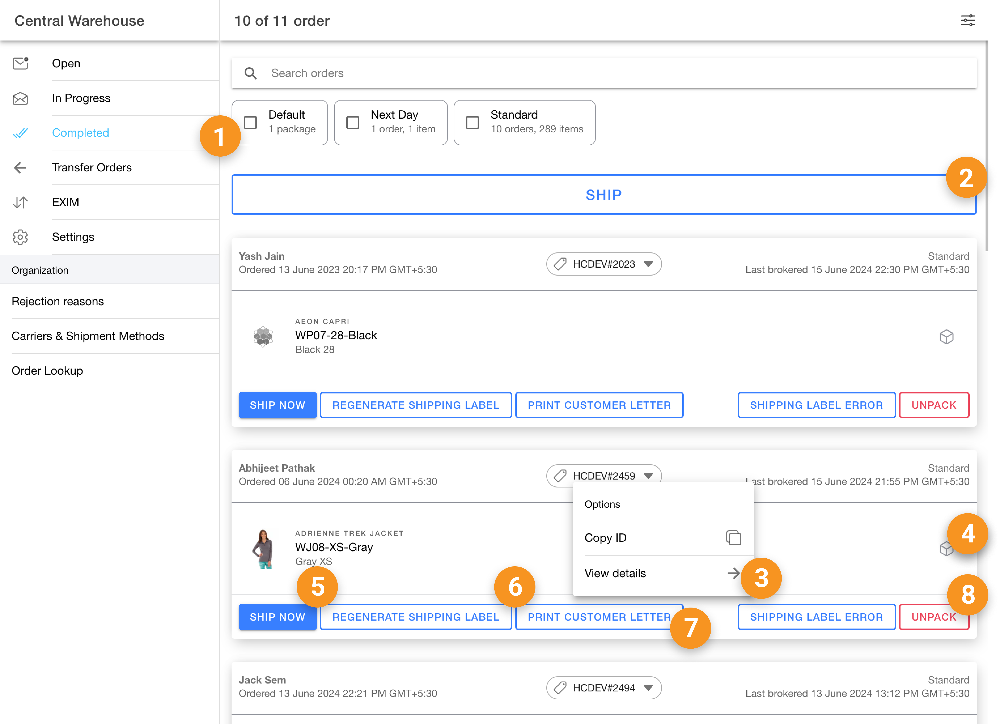
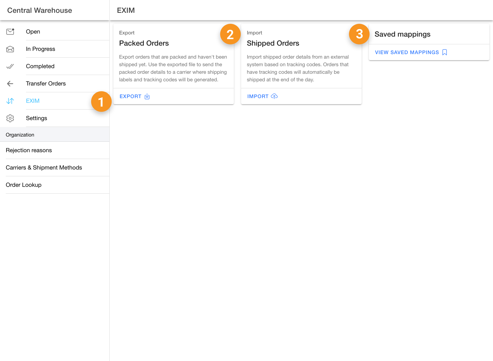
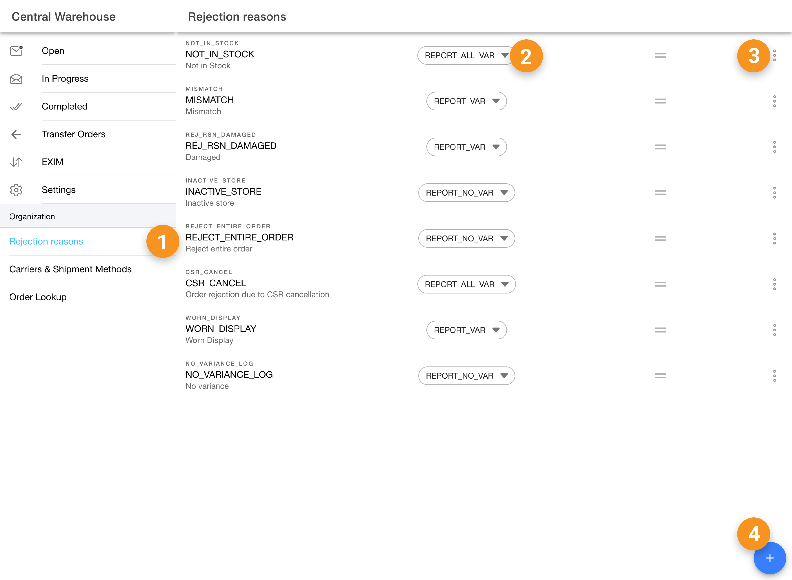

# Fulfillment App

The HotWax Commerce Fulfillment App is designed specifically for store fulfillment teams. It allows store users to carry out basic tasks such as picking and packing without special permissions, so access to the Fulfillment app is open for all users. However, sensitive actions like marking an item as shipped or altering fulfillment-related settings require higher-level permissions. Below is a list of all the actions available in the Fulfillment App, along with the specific permissions needed to perform them.

## Open Orders tab

| S.No | Action                                  | Permission    | Description                                                                                                                 |
| ---- | --------------------------------------- | ------------- | --------------------------------------------------------------------------------------------------------------------------- |
| 1    | Open orders view                        | -             | Permission to view the "Open Orders" page, displaying orders that are in an unprocessed state.                              |
| 2    | Reject all (Open Orders)                | COMMON\_ADMIN | Allows users to reject all orders that are in the open state, removing them from processing workflows.                      |
| 3    | Print picksheet                         | -             | Enables the printing of a picksheet that can be used to assign pickers to orders in bulk, streamlining the picking process. |
| 4    | Order actions Chip > Pick order         | -             | Allows users to assign a picker to a specific individual order, initiating the fulfillment process for that order.          |
| 5    | Order actions Chip > View Order details | -             | Routes the user to the detailed view of an individual order, where further actions can be taken or details can be reviewed. |
| 6    | View item QOH (Open Orders)             | -             | Displays the Quantity on Hand (QOH) for items in the order, helping users assess available stock for fulfillment.           |

<figure><figcaption></figcaption></figure>

## In Progress tab

| S.No | Action                                          | Permission    | Description                                                                                                                                                       |
| ---- | ----------------------------------------------- | ------------- | ----------------------------------------------------------------------------------------------------------------------------------------------------------------- |
| 1    | In Progress view                                | -             | Permission to view the "In Progress" orders page, where orders in various stages of processing are listed.                                                        |
| 2    | Reject all (In Progress)                        | COMMON\_ADMIN | Allows users to reject all orders that are in the "In Progress" state, stopping further processing.                                                               |
| 3    | Pack orders                                     | -             | Provides the ability to pack all listed orders. Users are asked to confirm additional information before completing the packing process.                          |
| 4    | Order actions Chip > View details (In Progress) | -             | Routes the user to the detailed view of an order currently in progress, where further actions can be taken or details can be reviewed.                            |
| 5    | Ready to pack                                   | -             | Allows users to select a box or container for an item during the packing process.                                                                                 |
| 6    | Report an issue                                 | -             | Provides the option for users to report issues encountered during the fulfillment process.                                                                        |
| 7    | View item QOH (In Progress)                     | -             | Displays the Quantity on Hand (QOH) for items in the order, helping users assess stock availability for completion.                                               |
| 8    | Pack Order                                      | -             | Opens a popover for users to pack individual orders. Additional confirmation may be required to ensure all information is accurate before completing the packing. |
| 9    | Shipping label error                            | -             | Alerts users to errors related to shipping labels, allowing them to address issues before proceeding with order fulfillment.                                      |

<figure><figcaption></figcaption></figure>

## Completed tab

| S.No | Action                                        | Permission    | Description                                                                                                                                                                                                                                                           |
| ---- | --------------------------------------------- | ------------- | --------------------------------------------------------------------------------------------------------------------------------------------------------------------------------------------------------------------------------------------------------------------- |
| 1    | Completed view                                | -             | Permission to view the "Completed" orders page, displaying orders that have been fully processed and are awaiting shipment.                                                                                                                                           |
| 2    | Ship                                          | COMMON\_ADMIN | Enables the user to ship all listed orders. Once an order is shipped, it cannot be unpacked or edited. The "Ship" button will be enabled if the order has at least one packed shipment and all required information is present, including tracking details if needed. |
| 3    | Order actions Chip > View details (Completed) | -             | Routes the user to the detailed view of an order that has been completed, where final actions can be reviewed.                                                                                                                                                        |
| 4    | View item QOH (Completed)                     | -             | Displays the Quantity on Hand (QOH) for items in completed orders, helping users confirm stock used in fulfillment.                                                                                                                                                   |
| 5    | Ship now                                      | COMMON\_ADMIN | Enables the user to ship packed orders once all shipment information is complete, including tracking information if applicable. If tracking is missing, users with the "force ship" permission can still proceed.                                                     |
| 6    | Regenerate Shipping Label                     | -             | Allows users to regenerate the shipping label for a completed order if necessary, ensuring proper labeling for shipment.                                                                                                                                              |
| 7    | Print Customer Letter                         | -             | Enables users to print the packing slip or customer letter associated with the order, ensuring documentation is provided with the shipment.                                                                                                                           |
| 8    | Unpack orders                                 | COMMON\_ADMIN | Provides users with the ability to unpack orders and send them back to the "In Progress" state if necessary. This action is only enabled when all required shipment and package information has been provided.                                                        |

<figure><figcaption></figcaption></figure>

## Transfer Order tab

| S.No | Action                                | Permission                                                                              | Description                                                                                                                                     |
| ---- | ------------------------------------- | --------------------------------------------------------------------------------------- | ----------------------------------------------------------------------------------------------------------------------------------------------- |
| 1    | Transfer Orders View tab              | APP\_TRANSFER\_ORDERS\_VIEW, ORD\_TRANSFER\_ORDER\_VIEW, or ORD\_TRANSFER\_ORDER\_ADMIN | Grants access to the "Transfer Orders" tab, allowing users to view and manage inventory transfer orders between facilities or stores.           |
| 2    | Transfer order detail tab             | ORD\_TRANSFER\_ORDER\_VIEW or ORD\_TRANSFER\_ORDER\_ADMIN                               | Provides permission to view detailed information on transfer orders, allowing users to review the status, contents, and actions for each order. |
| 3    | Scan item input                       | -                                                                                       | Allows users to manually enter the SKU of an item for scanning during the order transfer process.                                               |
| 4    | Scan item button (Barcode)            | -                                                                                       | Enables the barcode scanner functionality for quickly scanning items during transfer order processing.                                          |
| 5    | Open > Pick all                       | -                                                                                       | Allows users to pick all items in a transfer order when the "Pick All" button is enabled and no shipment ID has been assigned.                  |
| 6    | Completed > Regenerate shipping label | -                                                                                       | Provides the ability to regenerate shipping labels for transfer orders that have been completed.                                                |
| 7    | Create shipment                       | ORD\_TRANSFER\_ORDER\_CREATE or ORD\_TRANSFER\_ORDER\_ADMIN                             | Enables users to create a shipment for a transfer order, preparing it for dispatch to the receiving facility.                                   |

## EXIM tab

<figure><figcaption></figcaption></figure>

| S.No | Action                | Permission | Description                                                                                                                                       |
| ---- | --------------------- | ---------- | ------------------------------------------------------------------------------------------------------------------------------------------------- |
| 1    | EXIM view             | -          | Permission to view the "EXIM" page, providing visibility into export/import data and actions.                                                     |
| 2    | EXPORT Packed orders  | -          | Allows users to export data for orders that have been packed but not yet shipped, facilitating external tracking and reporting.                   |
| 3    | IMPORT Shipped orders | -          | Enables users to import shipped order data from an external system based on tracking codes, ensuring accurate record-keeping within the platform. |

## Rejection Reasons tab

| S.No | Action                          | Permission | Description                                                                                                                    |
| ---- | ------------------------------- | ---------- | ------------------------------------------------------------------------------------------------------------------------------ |
| 1    | Rejection reasons view          | SFA\_ADMIN | Grants access to the "Rejection Reasons" tab, where users can view and manage reasons for order rejections within the system.  |
| 2    | Variance type selection         | -          | Allows users to select a specific rejection reason from a predefined list when processing rejected orders.                     |
| 3    | Ellipsis button > Remove reason | -          | Provides the ability to remove a rejection reason from the system, ensuring the list of reasons remains relevant and accurate. |
| 4    | Add new Rejection reason        | -          | Opens a modal for users to create a new rejection reason, allowing customization of rejection types within the system.         |

<figure><figcaption></figcaption></figure>

## Carrier & Shipment Methods tab

| S.No | Action                                              | Permission           | Description                                                                                                                                                          |
| ---- | --------------------------------------------------- | -------------------- | -------------------------------------------------------------------------------------------------------------------------------------------------------------------- |
| 1    | Carrier View                                        | CARRIER\_SETUP\_VIEW | Grants access to the "Carrier & Shipment Methods" tab, where users can view and manage carriers and their associated shipping methods.                               |
| 2    | Create new Carrier                                  | CARRIER\_SETUP\_VIEW | Provides users with the ability to create a new carrier and configure its shipping methods, helping to ensure accurate shipping options are available in the system. |
| 3    | Create carrier > Setup methods > Setup methods page | CARRIER\_SETUP\_VIEW | Allows users to set up and configure shipping methods for carriers that have been created, ensuring all necessary options are available for order fulfillment.       |
| 4    | Carrier details view                                | CARRIER\_SETUP\_VIEW | Provides access to view the details of a specific carrier, including shipping methods and associated configurations.                                                 |

<figure><figcaption></figcaption></figure>

### Settings

| S.No | Action                         | Permission    | Description                                                                                                                                         |
| ---- | ------------------------------ | ------------- | --------------------------------------------------------------------------------------------------------------------------------------------------- |
| 1    | Order online fulfillment       | COMMON\_ADMIN | Allows users to configure the order fulfillment capacity of their facility, ensuring the system accurately reflects the facility's capabilities.    |
| 2    | Sell inventory online          | COMMON\_ADMIN | Controls whether the store's inventory is made available for online sales, allowing users to manage online inventory visibility.                    |
| 3    | Product Identifier selection   | -             | Allows users to choose a product identifier to view products using their preferred identification method, facilitating easier product management.   |
| 4    | Generate shipping label toggle | -             | Enables users to toggle the option to print supplementary documents, such as a shipping label, with the shipment for better package identification. |
| 5    | Generate packing slip toggle   | -             | Provides the ability to toggle the option to print a packing slip alongside the shipment, ensuring proper documentation is included with orders.    |

<figure><figcaption></figcaption></figure>

## Order Details Page

| S.No | Action                                           | Permission    | Description                                                                                                                                                                                                  |
| ---- | ------------------------------------------------ | ------------- | ------------------------------------------------------------------------------------------------------------------------------------------------------------------------------------------------------------ |
| 1    | Orders detail page > Ship now (Completed orders) | COMMON\_ADMIN | Allows users to ship a packed order, provided all shipment and package information is complete. The button will be enabled when tracking information is either provided or force ship permission is granted. |
| 2    | Orders detail page > View Details                | -             | Enables users to view the order details along with customer detailed information and the selected shipping carrier details                                                                                   |
| 3    | Orders detail page > Unpack (Completed orders)   | COMMON\_ADMIN | Provides the ability to unpack a completed order and send it back to the "In Progress" state. This action is only enabled when all required shipment and package information is present.                     |

<figure><figcaption></figcaption></figure>
